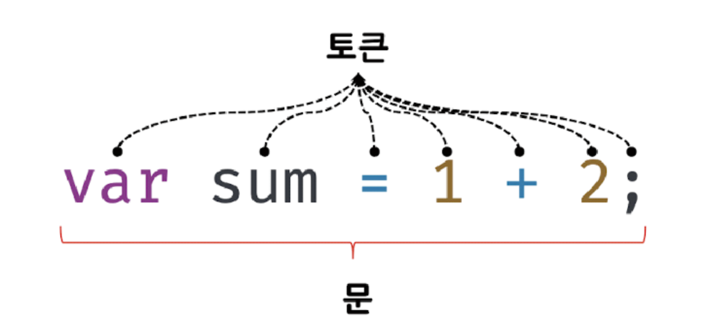

# 5장 표현식과 문

> 📌 프로그래밍에서 자주 사용하는 용어들에 대해 확실히 이해해보자  
> 📌 값 / 식 / 평가 / 리터럴 등등

## 5.1 값

> ✅ 값 : 식(표현식)이 평가되어 생성된 결과  
> ✅ 평가 : 식을 해석해서 값을 생성하거나 참조하는 것  
> ✅ 식(표현식) : 값으로 평가될 수 있는 "문" (문은 5.3장에)

- 값은 식이 평가되어 생성된 결과이다
  - 모든 값은 데이터타입을 가지며, 메모리에 2진수 즉 비트의 나열로 저장된다
    <br/>
- 변수에는 값이 할당된다
  - 변수란 하나의 값을 저장하기 위해 확보한 메모리 공간 또는 그 메모리 공간을 식별하기 위해 붙인 이름
    > 💡 즉 변수에 할당되는 것은 값이다

### 예제로 확인해보기

```javascript
var sum = 10 + 30;
```

- 변수에 할당되는 것은 10 + 30이 아닌 40이다

  - 변수 이름 sum이 기억하는 것은 10+30이 아니라, 값 40이다
  - 10 + 20은 할당 이전에 평가되어 값을 생성해야 한다

- 값을 만드는 방법에는 여러 방법이 있다
  - 위 예제처럼 으로 생성하는 방법도 있고
  - 가장 쉬운 방법은 리터럴을 사용하는 것

## 5.2 리터럴

> ✅ 리터럴 : 사람이 이핼 수 있는 문자, 또는 기호로 값을 생성하는 표기법
>
> 💡 리터럴 -> 값을 생성한다, 사람이 보기 좋게 표기한다

### 예제로 확인해보기

```javascript
//숫자 리터럴
3;
```

- 위 예제 3은 단순한 숫자가 아니라 숫자 리터럴이다

  - 사람이 이해하기 쉬운 아라비아 숫자를 사용해 숫자 리터럴 3을 코드에 기술하면, 자바스크립트 엔진이 이를 평가해 숫자 "값" 3을 생성한다
  - 리터럴은 평가되 값을 생성한다.

- 리터럴은 사람이 이해할 수 있는 문자로 표기한 코드이다.

  - {}, [], //, "" 등등
  - 자바스크립트 엔진은 런타임에 리터럴을 평가해 값을 생성한다
  - 리터럴은 값을 생성하기 위해 미리 약속한 표기법이다.

| 리터럴            | 예시            | 비고                    |
| ----------------- | --------------- | ----------------------- |
| 정수 리터럴       | 00              |                         |
| 부동소수점 리터럴 | 10.5            |                         |
| 2진수 리터럴      | 0b010000001     | 0b로 시작               |
| 8진수 리터럴      | 0o101           | 0o로 시작, ES6에서 도입 |
| 16진수 리터럴     | 0x41            | 0x로 시작, ES6에서 도입 |
| 문자열 리터럴     | '',"",``        |
| 불리언 리터럴     | true, false     |
| null 리터럴       | null            |
| undefined 리터럴  | undefined       |                         |
| 객체 리터럴       | { key : value } |
| 배열 리터럴       | [ ]             |
| 함수 리터럴       | function        |                         |
| 정규표현식 리터럴 | /[A-Z]+/g       |

## 5.3 표현식

> ✅ 식(표현식) : 값으로 평가될 수 있는 "문"
> 표현식이 평가되면 새로운 값을 생성하거나 기존값을 참조한다
> 리터럴은 값으로 평가되니까 리터럴도 표현식이다

### 예제로 살펴보기

```javascript
//예제 05-04
var score = 100;
//예제 05-05
var score = 50 + 50;
//예제 05-06
score;
```

- 예제 05-04  
  오른쪽의 100은 리터럴이고, 자바스크립트 엔진에 의해 값을 생성하므로 그 자체로 표현식이다

- 예제 05-06  
  오른쪽의 50+50은 리터럴과 연산자로 이루어져 있는데 이것 또한 50+50이 평가되어 숫자값 100을 생성하므로 표현식이다

- 예제 05-07  
  score은 이전 예제의 score의 값을 참조한다. 값을 생성하지는 않지만 참조하므로 표현식이다.

```javascript
//예제 05-07
//리터럴 표현식
10;
("hello");

//식별자 표현식( 이미 선언되었다고 가정)
sum;
person.name;
arr[1];

// 연산자 표현식
10 + 20;
sum = 10;
sum !== 10;

//함수, 메서드 호출 표현식(이미 표현되었다고 가정)
square();
person.getNam();
```

- 예제 5-7  
  모든 경우의 식들아 값으로 평가됨 (값을 생성하거나 참조)

```javascript
//예제 05-08
var x = 1 + 2;
x + 3; //x는 3으로 평가된다
```

- 예제 5-8  
  x+3은 표현식이다.
  - - 연산자는 좌항과 우항의 값을 산술연산하는 연산자, 좌항 우항에는 숫자값이 위치해야함.
  - 좌항 x는 **식별자 표현식**이다, 할당되어 있는 값 3으로 평가된다.
  - 따라서 숫자값의 위치에 표현식 x를 사용할 수있다

> 💡 값을 가지고 있는 것은 모두 표현 식

## 5.4 문

> 📌 문과 표현식이라는 용어를 구분할 수 있어야 한다
> ✅ 문 : 프로그램을 구성하는 기본 단위이자 최소 실행 단위
> ✅ 토큰 : 문법적으로 더이상 나눌 수 없는 코드의 기본요소

```javascript
|------- 문 -------|
var sum  =  1  +  2;
토큰 토큰 토큰 토큰토큰토큰토큰
```

;

- 문은 프로그램을 구성하는 기본 단위, 최소 실행 단위
  - 문이 모여서 프로그램이 된다
  - 문을 작성하소 순서에 맞게 나열하는 것이 프로그램이이다
- 토큰은 문법적으로 더이상 나눌 수 없는 기본 요소
  - 세미콜론, 마침표 등등은 문법적으로 더 나눌 수 없는 가장 기본요소, 토큰이다
- 문은 명령문이라고 부름
  - 컴퓨터에 내리는 명령이다
- 문은 선언문, 할당문, 조건문, 반복문 등으로 구분
  - 변수 선언문 : 변수 선언함
  - 할당문 : 값이 할당됨
  - 조건문 : 조건에 따라 실행할 코드 블록을 결정
  - 반복분 : 특정 코드 블록 반복 실행

```javascript
var x;

x = 5;

function foo() {}

if (x > 1) {
  console.log(x);
}

for (let i = 0; i < x; x++) {
  console.log(i);
}
```

## 5.5 세미콜론과 세미콜론 자동 삽입 기능

- 세미콜론은 문의 종료를 나타냄
  - 자바스크립트 엔진은 세미콜론으로 문이 종료한 위치를 파악하고 순차적으로 하나씩 문을 실행한다 -> 문을 끝낼때는 세미콜론 붙어야한다
- 0개 이상의 문을 중괄호로 묶은 코드블록 뒤에는 세미콜론 붙이지 않음

  - 코드블럭은 언제나 문의 종료를 의미하기 때문에

- 세미콜론은 옵션이다
  - 자바스크립트 엔진이 세미콜론을 자동으로 붙여주기 때문에
  - 하지만 개발자가 원하는대로 동작하지 않는 경우가 있음

```javascript
function foo() {
  return;
  {
  }
}
// 예측 return {};
// 결과 return; {};

/////
var bar = (function () {})(function () {})();
// 예측 function(){}; (function(){})();
// 결과 function(){}(function(){})(); ->타입에러
```

붙이자는 사람도 붙이지 말자는 사람도 있는데 esLint는 세미콜론 사용이 기본 ,ECMAScript 위원회도 세미콜론 사용을 권장함

## 5.6 표현식인 문과 표현식이 아닌 문

> 📌 표현식과 문은 비슷해서 구별하기 어려울 수 있지만 간단한 방법이 있다

 <center>
             💡💡💡💡💡💡💡💡💡💡    </br>
             💡 변수에 할당해보기 💡   </br>
             💡💡💡💡💡💡💡💡💡💡   
 </center>

- 변수에는 값을 할당하고, 표현식은 값으로 평가되기 때문에, 변수에 할당해보면 표현식인 문을 찾아 낼 수 있다
- 표현식이 아닌 문은 값으로 평가할 수 없음, 변수에 할당하면 에러가 발생함
- 표현식인 문은 값처럼 사용할 수 있다.

```javascript
var foo = (x = 100); // x = 100 는 표현식, 값처럼 사용;
console.log(foo); //foo는 표현식 값처럼 사용
```

- 할당문을 값처럼 변수에 할당할 수있다
  x = 100 는 값으로 평가됨, x는 변수에 할당한 값 100으로 평가된다.
