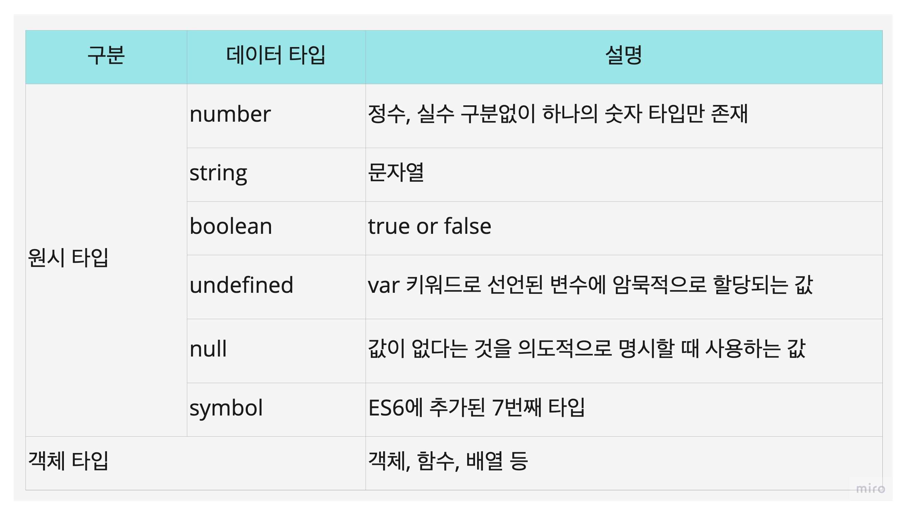

# 06장 데이터 타입

- 자바스크립트의 모든 값은 데이터 타입을 갖는다.
- ES6는 7개의 데이터 타입을 제공하는데, 원시 타입(primitive type)과 객체 타입(object/reference type)으로 분류할 수 있다.



## 6.1 숫자 타입

- C나 자바의 경우, 정수와 실수를 구분해서 int, long, float, double등과 같이 숫자 타입을 제공한다.
- 하지만 자바스크립트는 하나의 숫자 타입만 존재한다.
- ECMAScript사양에 따르면 숫자 타입의 값은 [64비트 부동소수점](https://en.wikipedia.org/wiki/Double-precision_floating-point_format) 형식을 따른다.

```js
// 모두 숫자 타입이다.
var integer = 10;
var double = 10.21;
var negative = -100;
```

- 또한 모든 숫자 타입은 실수로 처리된다.(부동소수점 형식으로 표현됨)

```js
console.log(1 == 1.0); // true
```

- 특별한 값
  - Infinity: 양의 무한대
  - -Infinity: 음의 무한대
  - NaN: Not a Number(산술 연산 불가)

```js
console.log(10 / 0); // Infinity
console.log(-10 / 0); // -Infinity
console.log(1 * 'string'); // NaN
```

## 6.2 문자열 타입

- 문자열 타입은 텍스트 데이터를 나타내는데 사용
- 문자열은 0개 이상의 [16비트 유니코드](https://ko.wikipedia.org/wiki/UTF-16) 문자의 집합
- 큰따옴표, 작은따옴표, 백틱으로 텍스트를 감쌈

```js
let string;
string = 'string';
string = 'string';
string = `string`;
```

- 따옴표로 감싸는 이유는 키워드나 식별자 같은 토큰과 구분하기 위해서이다.
  감싸지 않으면 자바스크립트 엔진은 hello를 키워드나 식별자 같은 토큰으로 인식한다.

```js
let string = hello; // ReferenceError: hello is not defined
```

- C는 문자열 타입이 따로 없어 문자의 배열로 문자열을 표현하고, Java는 문자열을 객체로 표현한다.
- 하지만 자바스크립트는 문자열을 원시타입으로 취급하며, 변경 불가능한 값(immutable value)이다.

## 6.3 템플릿 리터럴

- ES6부터 템플릿 리터럴이라고 하는 새로운 문자열 표기법이 도입되었다.
- 템플릿 리터럴은 **멀티라인 문자열, 표현식 삽입, 태그드 템플릿** 등 편리한 문자열 처리 기능을 제공해준다.
- 템플릿 리터럴은 **런타임에 문자열로 변환**되어 처리된다.

### 6.3.1 멀티라인 문자열

- 일반 문자열과 달리 템플릿 리터럴은 문자열 내 줄바꿈을 허용한다.

```js
var str1 = 'hello,
world'; // SyntaxError: Invalid or unexpected token

var str2 = `hello,
world`;
```

- 만약 일반 문자열에서도 줄바꿈을 해주고 싶다면 백슬래시(`\`)로 시작하는 escape sequence를 사용해야 한다.

```js
var str = 'hello, \nworld'.
```

### 6.3.2 표현식 삽입

- 문자열은 문자열 연산자를 사용해 연결할 수 있다.
- `+`연산자는 피연산자 중 하나 이상이 문자열인 경우 문자열 연결 연산자로 동작한다. 그 외의 경우는 덧셈 연산자로 동작한다.

```js
var result = 1 + '1';
console.log(result); // 11

var first = 'javascript';
var second = 'deep dive';

console.log('I read ' + first + ' ' + second + '.');
```

- 템플릿 리터럴 내에서는 표현식 삽입을 통해 간단한 문자열을 삽입할 수 있다.
- 표현식을 `${}`로 감싸면 안에 있는 표현식의 평가 결과가 (문자열이 아니어도) 문자열로 강제로 타입이 변환되어 삽입된다.

```js
var first = 'javascript';
var second = 'deep dive';

console.log(`I read ${first} ${second}`);

console.log(`1 + 2 = ${1 + 2}`); // 1 + 2 평가 결과가 문자열로 강제 형변환 된다.
```

## 6.4 불리언 타입

- 불리언 타입의 값은 참,거짓을 나타내는 `true`, `false` 뿐이다.

```js
let foo = true;
let bar = false;
```

## 6.5 undefined 타입

- undefined 타입의 값은 `undefined` 이 유일하다
- var 키워드로 선언한 변수는 암묵적으로 undefined로 초기화된다. 다시 말해, 변수 선언에 의해 확보된 메모리 공간을 처음 할당이 이루어질 때까지 쓰레기 값으로 두지 않고 자바스크립트 엔진이 `undefined`로 초기화한다.

```js
var foo;
console.log(foo); // undefined
```

- 이처럼 개발자가 의도적으로 undefined를 할당하기 위한 값이 아니라 자바스크립트 엔진이 변수를 초기화할 때 사용하는 값이다. 그러니 만약 **undefined로 초기화된 변수라면 선언 이후에 단 한번도 할당된 적이 없는 변수라는 것을 짐작**할 수 있다.

- 개발자가 의도적으로 값이 없음을 명시하고 싶다면 `undefined`보다는 `null`을 사용하는 것이 더 바람직하다.

## 6.6 null 타입

- null 타입의 값은 `null` 값이 유일하다.
- 프로그래밍 언어에서 `null`은 변수에 값이 없다는 것을 의도적으로 명시(intentional absence)할 때 사용한다.

```js
let foo = 'hello';

// 이전에 참조하던 값을 더이상 참조하지 않는다
// 이전에 참조하던 값을 아무도 참조하지 않는다면 가비지 콜렉션을 수행할 것이다.
foo = null;
```

## 6.7 심벌 타입

- ES6에서 추가된 7번째 타입으로, 변경 불가능한 원시 타입 값이다.
- 심벌 값은 다른 값과 중복되지 않는 유일무이한 값이다.
- 주로 이름 충돌 위험이 있는 객체의 유일한 프로퍼티 키를 만들 때 사용한다.

```js
// symbol생성
let key = Symbol('key');
let key2 = Symbol('key');
console.log(typeof key); // symbol

let obj = {};

// 충돌위험이 있는 프로퍼티 키를 symbol을 유일무이한 키로 만들 수 있다.
obj[key] = 'value';
obj[key2] = 'value';
console.log(obj); // {Symbol(key): 'value', Symbol(key): 'value'}
```

## 6.8 객체 타입

- 자바스크립트는 객체 기반의 언어이고, 자바스크립트를 이루고 있는 거의 모든 것이 객체이다.
- 원시 타입 이외의 값은 모두 객체 타입이다.

## 6.9 데이터 타입의 필요성

### 6.9.1 데이터 타입에 의한 메모리 공간의 확보와 참조

- **값은 메모리에 저장하고 참조할 수 있어야 한다.**
- **메모리에 값을 저장하는 경우** 먼저 메모리 공간의 크기를 결정해야 한다. 몇 바이트의 메모리 공간을 사용할지 말이다.

```js
var score = 100;
```

- 위 코드가 실행되면 컴퓨터는 숫자 값 100을 저장하기 위한 메모리 공간을 확보한 다음, 확보된 공간에 100을 2진수로 저장한다.
- 자바스크립트 엔진은 데이터 타입에 따라 정해진 크기의 메모리 공간을 확보한다.
- 자바스크립트는 64비트 부동소수점 형식을 사용하기 때문에 8바이트로 숫자를 표현한다.
- 즉, 100이라는 숫자를 저장하기 위해 8바이트의 메모리 공간을 확보해야 한다는 것이다.

- **값을 참조하는 하는 경우** 한 번에 읽어 들어야 할 메모리 공간의 크기(바이트 수)를 알아야 한다.
- 이 메모리 공간의 크기를 참조하려는 값의 데이터 타입에 따라 읽어들일 메모리 공간을 결정할 수 있다.

### 6.9.2 데이터 타입에 의한 값의 해석

- 모든 값은 데이터 타입을 가지며, 메모리에 2진수(비트의 나열)로 저장된다.
- 메모리에 저장된 값은 데이터에 따라 다르게 해석될 수 있다.
- 메모리에 저장된 값이 `0100 0001`을 숫자로 해석하면 65지만 문자열로 해석하면 'A'다.

## 6.10 동적 타이핑

### 6.10.1 동적 타입 언어와 정적 타입 언어

- 지금까지 자바스크립트의 값에 대한 데이터 타입을 보았고, 변수는 데이터 타입이 어떻게 결정될까?

#### 정적 타입(static/strong type) 언어

- C나 자바 같은 정적 타입 언어는 변수를 선언할 때 변수에 할당할 수 있는 값의 종류, 즉 데이터 타입을 사전에 선언해야 한다. 이를 **명시적 타입 선언(explicit type declaration)** 이라고 한다.
- 정적 타입 언어는 **컴파일 시점에 타입 체크를 수행한다.**

> 타입 체크: 선언한 데이터 타입에 맞는 값을 할당했는지 검사하는 것

#### 동적 타입(dynamic/weak type) 언어

- 자바스크립트 같은 언어는 변수를 선언할 때 따로 타입을 지정하지 않는다. 단지 var, let, const 키워드로 변수를 선언할 뿐이다.
- 즉, **정적 타입 언어와 달리 미리 선언한 데이터 타입의 값만 할당할 수 있는 것이 아니다. 어떠한 데이터 타입의 값이라도 자유롭게 할당할 수 있다.**

#### 정적 타입 vs 동적 타입

- 정적 타입 언어는 변수 **선언** 시점에 변수의 타입이 결정되고, **변수의 타입을 변경할 수 없다.**
- 정적 타입 언어는 컴파일 단계에서 타입 체크를 한다.
- 동적 타입 언어는 변수 **할당** 시점에 변수의 타입이 결정되고, **변수의 타입을 언제든지 변경할 수 있다.**
- 동적 타입 언어는 변수에 값을 할당할 때 타입이 결정되는데 이것을 **타입 추론(type inference)** 라고 한다.

### 6.10.2 동적 타입 언어와 변수

- 동적 타입 언어는 변수에 어떤 데이터 타입의 값이라도 할당할 수 있어 데이터 타입에 무감각해질 정도로 편리할 수 있다.
- 그러나 동적으로 변하는 타입의 변수값을 추척하는 것은 어려울 수 있다. 안정적은 프로그램을 만들기 위해 타입을 체크해야 하는 코드를 넣어 코드의 양이 증가할 우려가 있다.
- 즉, 유연성과 신뢰성의 트레이드오프가 존재한다.
