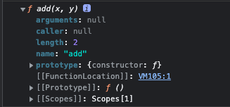

# 12장 함수

## 12.1 함수란?

- 스코프, 실행 컨텍스트, 클로저, 생성자 함수에 의한 객체 생성, 메서드, this, 프로토타입, 모듈화 등 함수와 깊은 관계가 있다.
- 함수는 일련의 과정을 문(statement)으로 구현하고 코드 블록으로 감싸서 하나의 실행 단위로 정의한 것이다.
- 함수 정의(function definition)는 다양한 방식으로 할 수 있다.(12.4에서 다룸)
- 함수 호출(function call/invoke): 함수 정의만으로 함수가 실행되는 것은 아니다. 실행하기 위해서는 함수에 필요한 인수(argument)를 매개변수를 통해 함수에 전달하면서 함수 실행을 명시적으로 지시해야 한다.

```js
// 함수 정의
function add(x, y) {
  return x + y;
}

// 함수 호출
add(2, 5);
```

## 12.2 함수를 사용하는 이유

- 코드의 재사용: 동일한 작업을 반복적으로 수행한다면 같은 코드를 중복해서 여러 번 작성하는 것이 아니라 정의된 함수를 재사용하는 것이 효율적이다.
- 유지보수 편의성: 같은 코드를 중복해서 여러 번 작성하면 그 코드를 수정해야 할 때 중복된 횟수만큼 수정해야 한다. 따라서 함수를 통해 코드의 중복을 줄여 유지보수성을 높인다.
- 코드의 신뢰성: 유지보수성이 높아지니 그만큼 실수도 줄어 코드의 신뢰성이 높아진다.
- 코드의 가독성: **함수는 객체 타입이다.** 따라서 식별자(이름)을 붙일 수 있다. 적절한 함수 이름은 함수의 내부 코드를 이해하지 않고도 함수의 역할을 파악할 수 있게 돕는다.

## 12.3 함수 리터럴

- 자바스크립트 함수는 객체 타입의 값이다.
- 함수를 함수 리터럴로 생성할 수 있다.

```js
// 변수 f에 함수 리터럴 할당
var f = function add(x, y) {
  return x + y;
};
```

> 리터럴은 사람이 이해할 수 있는 문자 또는 약속된 기호를 사용해 값을 생성하는 표기 방식이다.
> 리터럴은 값을 생성하기 위한 표기법으로 자바스크립트 엔진이 리터럴을 런타임에 평가하여 값을 생성한다.
> 함수 리터럴도 평가되어 값을 생성하는데 이 값은 **객체**다.

> 함수는 객체이지만 일반 객체와는 다르다. 일반객체는 호출할 수 없지만 함수는 호출할 수 있다.
> 일반객체에는 없는 함수객체만의 고유한 프로퍼티를 갖고 있다.

```js
function add(x, y) {
  return x + y;
}

console.dir(add);
```



```js
const obj = { a: 1, b: 2 };
console.dir(obj);
```


## 12.4 함수 정의

- 정의된 함수는 자바스크립트 엔진에 의해 평가되어 함수 객체가 된다.
- 함수를 정의하는 방법은 4가지가 있다.
  1. 함수 선언문
  ```js
  function add(x, y) {
    return x + y;
  }
  ```
  2. 함수 표현식
  ```js
  const add = function (x, y) {
    return x + y;
  };
  ```
  3. Function 생성자 함수
  ```js
  const add = new Function('x', 'y', 'return x + y');
  ```
  4. 화살표 함수(ES6)
  ```js
  const add = (x, y) => x + y;
  ```

### 12.4.1 함수 선언문

- 함수 선언문은 함수 이름을 생략할 수 없다.

```js
function (x, y) {
  return x + y;
}
// SyntaxError: Function statements require a function name
```

- 함수 선언문은 **표현식이 아닌 문**이다. 크롬 개발자 도구의 콘솔에서 함수 선언문을 실행하면 완료값(completion value)으로 `undefined`가 출력된다.


> 표현식 vs. 문
> 표현식(expression)은 값으로 평가될 수 있는 문(statement)이다.
> 문(statement)은 프로그램을 구성하는 기본 단위이자 최소 실행 단위다. 문은 여러 토큰(token)으로 구성된다.
>
> ```js
> // 토큰이란 문법적인 의미를 가지며, 문법적으로 더이상 나눌 수 없는 코드의 기본 요소
> // 키워드, 식별자, 연산자 리터럴, 세미콜론 등
> // 아래에서는 var, sum, 1, +, 2, ; 가 토큰이 된다.
> var sum = 1 + 2;
> ```
>
> 표현식인 문은 값으로 평가될 수 있는 문이고, 표현식이 아닌 문은 값으로 평가될 수 없는 문이다.
> 이 둘을 구분하는 쉬운 방법은 변수에 할당해보는 것이다.
>
> ```js
> // `var x` 는 표현식이 아닌 문이기 때문에 값처럼 사용할 수 없다.
> var foo = var x;
>
> // 표현식인 문은 값처럼 사용할 수 있다.
> // 할당문 `x = 100` 은 값으로 평가되어 변수에 할당할 수 있다.
> var bar = x = 100
> ```

- 자바스크립트 엔진은 함수 선언문을 해석해 함수 객체를 생성한다.
- 이때 함수 이름은 함수 몸체 내부에서만 유효한 식별자이므로 함수 이름과는 별도로 생성된 함수 객체를 가리키는 식별자가 필요하다.
- 함수 객체를 참조하기 위해 식별자가 필요한데, 자바스크립트 엔진은 생성된 함수를 호출하기 위해 함수 이름과 동일한 식별자를 암묵적으로 생성한다.
- 즉, 함수는 함수 이름으로 호출하는 것이 아니라 함수 객체를 가리키는 식별자로 호출한다.

<div style="display: flex; flex-direction: column; align-items: center;">
  
  <span><code>foo</code> 식별자를 자바스크립트 엔진이 암묵적으로 생성한다.</span>
</div>

### 12.4.2 함수 표현식

- 함수는 일급객체로 값처럼 변수에 할당할 수도 있고 프로퍼티 값이 될 수도 있으며 배열의 요소가 될 수도 있다.

> ### **일급객체(first-class object)**
>
> 다른 객체들에 일반적으로 적용 가능한 연산을 모두 지원하는 객체를 가리킨다. 보통 함수에 인수로 넘기기, 수정하기, 변수에 대입하기와 같은 연산을 지원할 때 일급 객체라고 한다.
>
> https://ko.wikipedia.org/wiki/%EC%9D%BC%EA%B8%89_%EA%B0%9D%EC%B2%B4

- 함수는 일급객체이므로 함수 리터럴로 생성한 함수 객체를 변수에 할당할 수 있다.

```js
// 함수 표현식으로 함수를 정의할 수 있다.
// 함수 리터럴의 함수 이름은 생략할 수 있다.
// 이를 익명함수(anonymous function)라고 한다.
var add = function (x, y) {
  return x + y;
};

console.log(add(2, 5)); // 7
```

- 앞서 함수는 함수 객체를 가리키는 식별자로 호출할 수 있다고 했다.

```js
var add = function foo(x, y) {
  return x + y;
};

// 함수 객체를 가리키는 식별자로 호출
console.log(add(2, 5)); // 7

// 함수 이름으로 호출하면 ReferenceError가 발생한다.
// 함수 이름은 함수 몸체 내부에서만 유효한 식별자다.
console.log(foo(2, 5)); // ReferenceError: foo is not defined
```

- 함수 선언문은 '표현식이 아닌 문'이고 함수 표현식은 '표현식인 문'이다.

### 12.4.3 함수 생성 시점과 함수 호이스팅

```js
console.dir(add); // ƒ add(x, y)
console.dir(sub); // undefined

console.log(add(4, 2)); // 6
console.log(sub(4, 2)); // TypeError: sub is not a function

function add(x, y) {
  return x + y;
}

var sub = function (x, y) {
  return x - y;
};

// Quiz! var 대신 const나 let으로 함수를 정의한다면 console.dir(sub)의 결과가 어떻게 될까요?
// const sub = function (x, y) {
//   return x - y;
// };
```

- 함수 선언문으로 정의한 함수(add함수)는 함수 선언문 이전에 호출할 수 있다.
- 함수 표현식으로 정의한 함수(sub함수)는 함수 표현식 이전에 호출할 수 없다.
- 함수 선언문과 함수 표현식으로 정의한 함수의 생성 시점이 다르기 때문이다.(4장 변수 참고)

> 함수 선언문
> 모든 선언문은 런타임 이전에 자바스크립트 엔진에 의해 한번 실행된다. 함수를 함수 선언문으로 정의하면 런타임 이전에 함수 객체가 먼저 생성된다. 그리고 함수 이름과 동일한 이름의 식별자를 암묵적으로 생성한다.
>
> **런타임 이전에 함수 객체 생성 + 함수 이름과 동일한 식별자 생성 -> 이미 함수 객체가 생성되어 런타임에 함수 선언문 전에 함수 객체를 참조할 수 있음** => 함수 호이스팅

> 함수 표현식
> var 키워드로 선언한 변수 sub가 런타임 이전에 undefined로 초기화하고 sub를 식별자로 등록한다.(변수 호이스팅) 런타임에 함수 리터럴을 평가해 함수 객체 생성한다. 따라서 런타임에 코드를 한줄한줄 실행할 때 함수 표현식 이전에 함수를 호출하기 위한 함수 객체는 존재하지 않는다.
>
> **런타임 이전에 var키워드로 선언한 변수가 undefined로 초기화 + 식별자로 등록 -> 런타임에 함수를 호출할 때(다른 말로 함수 객체를 참조할 때) 해당 함수 객체가 없다면 에러가 발생**

### 12.4.4 Function 생성자 함수

```js
var add = new Function('x', 'y', 'return x + y');
```

- Function 생성자 함수로 생성한 함수는 클로저를 만들지 않는다.

```js
var add1 = (function () {
  var a = 10;
  return function (x, y) {
    return x + y + a;
  };
})();

console.log(add1(2, 5)); // 17

var add2 = (function () {
  var a = 10; // a라는 변수를 참조할 수 없다.
  return new Function('x', 'y', 'return x + y + a');
})();

console.log(add2(2, 5)); // ReferenceError: a is not defined
```

- Function 생성자 함수로 생성한 함수는 클로저를 만들지 않아서 변수 `a` 를 참조할 수 없다.

### 12.4.5 화살표 함수

- ES6에 도입된 화살표 함수는 function 키워드 대신 화살표(`=>`)를 사용해서 함수를 선언할 수 있다.

```js
const add = (x, y) => x + y;
console.log(add(2, 5)); // 7
```

- 화살표 함수는 표현만 간결한 것이 아니라 내부 동작 또한 간단하게 만들어졌다.
  - 화살표 함수는 생성자 함수로 사용X
  - this 바인딩을 하지 않음
  - prototype 프로퍼티가 없음
  - arguments 객체 생성X

<div style='display: flex; justify-content: center; gap: 2rem'>
  <div style='display: flex; flex-direction: column; align-items: center;'>
    
    <span>함수 선언문으로 정의한 함수 객체</span>
  </div>
  <div style='display: flex; flex-direction: column; align-items: center;'>
    
    <span>화살표 함수로 정의한 함수 객체</span>
  </div>
</div>

## 12.5 함수 호출

- 함수를 가리키는 식별자와 소괄호(`()`, 함수 호출 연산자)로 호출한다.
- 함수 호출 연산자 내에 0개 이상의 인수를 쉽표로 구분한다.
- **함수를 호출하면 현재의 실행 흐름이 중단되고 호출된 함수로 실행 흐름을 옮긴다.**

### 12.5.1 매개변수와 인수

- 함수를 실행하기 위해 필요한 값을 전달해줄 때, 매개변수(parameter)를 통해 인수(argument)를 전달한다.
- 인수는 값으로 평가될 수 있는 표현식이다.

```js
// x, y - 매개변수
function add(x, y) {
  return x + y; // 반환값
}
// 2, 5 - 인수
// 인수를 전달한다.
add(2, 5);
```

- 함수는 매개변수의 개수와 인수의 개수가 일치하는지 체크하지 않는다. 즉, 인수를 전달하지 않아도 에러가 발생하지 않는다.
- 인수가 부족해서 인수가 할당되지 않은 매개변수의 값은 `undefined`이다
- 인수의 개수가 매개변수의 개수보다 많으면 arguments객체의 프로퍼티로 보관된다.(가변인자 함수를 구현할 때 유용)

```js
function add(x, y) {
  console.log(arguments);
  return x + y;
}
add(2); // 2 + undefined => NaN, Arguments [2, callee: ƒ, Symbol(Symbol.iterator): ƒ]
add(2, 5, 7); // 7, Arguments(3) [2, 5, 7, callee: ƒ, Symbol(Symbol.iterator): ƒ]
```

### 12.5.2 인수 확인

- 자바스크립트는 동적 타입 언어로 매개변수의 타입을 사전에 지정할 수 없다.

```js
function add(x, y) {
  if (typeof x !== 'number' || typeof y !== 'number') {
    throw new TypeError('인수가 모두 number타입이어야 합니다.');
  }
  return x + y;
}

add(2); // TypeError: 인수가 모두 number타입이어야 합니다.
add('a', 'b'); // TypeError: 인수가 모두 number타입이어야 합니다.
```

- 이처럼 **런타임에 에러**가 발생한다.
- 타입스크립트와 같은 정적 타입을 선언하여 **컴파일 시점**에 부적절한 호출을 방지할 수 있다.

### 12.5.3 매개변수의 최대 개수

- ECMAScript 사양에서는 매개변수의 최대개수를 제한하고 있지는 않다. 그러나 물리적인 한계로 최대 개수의 제한이 있을 것이다.
- 매개변수의 개수를 최대한 적게 만드는 것이 좋다.
- 인수의 개수가 많아진다면 객체로 묶어 인수로 전달할 수 있다.

```js
function foo(params) {
  // do something
}
foo({ name: 'ojj', age: 24, job: 'student' });
```

### 12.5.4 반환문

- return 키워드와 표현식으로 이뤄진 반환문을 사용해 실행 결과를 함수 외부로 반환한다.
- 반환문은 두가지 역할을 한다.

  1. 함수의 실행을 중단하고 함수 몸체에서 빠져나간다.

  ```js
  function foo(x, y) {
    return;
    // 실행되지 않음
    console.log(x + y);
  }
  ```

  2. return 키워드 뒤에 오는 표현식을 평가해 반환한다.

  ```js
  function foo() {
    return; // 표현식이 없다면 undefined 반환
  }
  function bar() {
    // 반환문을 생략하면 암묵적으로 undefined 반환
  }
  ```

## 12.6 참조에 의한 전달과 외부 상태의 변경

```js
function changeVal(primitive, obj) {
  primitive += 100;
  obj.name = 'Kim';
}

var num = 100;
var person = { name: 'ojj' };

console.log(num); // 100
console.log(person); // {name: 'ojj'}

// 원시 값은 값 자체가 복사된다.
// 객체는 참조가 전달된다.
changeVal(num, person);

// 원본이 보존됨
console.log(num); // 100

// 원본이 변경됨
console.log(person); // {name: 'Kim'}
```

- 원시값은 변경 불가능한 값(immutable value)이므로 직접 변경할 수 없기 때문에 재할당을 통해 할당된 원시 값을 새로운 원시 값으로 교체한다.
- 원시 타입 인수는 값 자체가 복사되어 매개변수로 전달되기 때문에 함수 몸체(function body)에서 그 값을 변경해도 원본은 바꾸지 않는다. -> 부수효과(side effect)가 발생하지 않는다.
- 객체는 변경 가능한 값(mutable value)이므로 직접 변경할 수 있다.
- 객체 타입 인수는 참조 값이 매개변수에 전달되기 때문에 함수 몸체에서 그 참조 값을 통해 원본 객체를 변경할 수 있다. -> 부수효과가 발생한다.

> 함수가 외부 상태를 변경하면 상태 변화를 추적하기 어려워진다.
> 이는 코드의 복잡성을 증가시키고 가독성을 해치게 된다. 왜냐하면 함수 내부의 동작을 유심히 관찰해서 외부 상태가 변하는지 아닌지 알아내야 하기 때문이다.

> 객체의 변경을 알기 힘들기 때문에 옵저버 패턴(Observer pttern)을 사용하여 객체의 변경을 감지하거나 불변 객체를 만들어 사용한다.
>
> - 옵저버 패턴
>   객체의 상태 변화를 관찰하는 관찰자들(Observer)의 목록을 객체에 등록하여 상태변화가 있을 때마다 메서드를 통해 객체가 직접 옵저버에게 통지하도록 하는 디자인 패턴
>   **핵심은 옵저버를 관찰 대상이 되는 객체에 등록시키는 것이다.**
>
>   https://ko.wikipedia.org/wiki/%EC%98%B5%EC%84%9C%EB%B2%84_%ED%8C%A8%ED%84%B4
>
> - 불변객체 만들기
>   객체의 복사본을 새롭게 생성하여 원시 값처럼 변경 불가능한 값으로 동작하게 만든다.
>   예시로 React에서는 객체 타입의 상태를 변경할 때 객체를 복사하여 상태를 변경한다.
>
>   https://beta.reactjs.org/learn/updating-objects-in-state
>
> ```jsx
> function Component() {
>   const [value, setValue] = useState({ name: 'ojj', age: 24 });
>
>   const onClick = (e) => {
>     // spread 문법을 이용해 value를 복사한 새로운 객체의 프로퍼티 name을 변경한다.
>     // 새로운 객체로 상태가 바뀌었으므로 React는 상태 변화를 감지하여 리렌더링한다.
>     setValue({ ...value, name: e.target.value });
>   };
> }
> ```

## 12.7 다양한 함수의 형태

### 12.7.1 즉시 실행 함수

- 함수 정의와 동시에 즉시 호출되는 함수를 즉시 실행 함수(IIFE, Immediately Invoked Function Expression)라고 한다.

```js
// 단 한 번만 호출되며 다시 호출할 수 없다.
// 익명함수로 작성할 수 있다.
(function () {
  var a = 2;
  var b = 3;
  return a * b;
})();
```

### 12.7.2 재귀 함수

- 함수가 자기 자신을 호출하는 것을 재귀 호출(recursive call)이라고 한다.

```js
function factorial(n) {
  if (n <= 1) return 1;
  return n * factorial(n - 1);
}
```

- 함수 표현식에서 함수 자기 자신을 호출할 때 함수이름 뿐만 아니라 식별자로 함수를 호출할 수 있다.

```js
// 함수를 가리키는 식별자로 자기 자신 호출 가능
var factorial = function foo(n) {
  if (n <= 1) return 1;
  return n * factorial(n - 1);
};

// 함수 이름으로 자기 자신 호출 가능
// var factorial = function foo(n) {
//   if (n <= 1) return 1;
//   return n * foo(n - 1);
// };

console.log(factorial(5)); // 120
```

### 12.7.3 중첩 함수

- ES6부터 함수 정의는 문이 위치할 수 있는 문맥이라면 어디든지 가능하다.

```js
// 외부 함수(outer function)
function outer() {
  var x = 1;
  // 중첩함수(nested function) or 내부 함수(inner function)
  function inner() {
    var y = 2;
    console.log(x + y);
  }
  inner();
}
outer();
```

### 12.7.4 콜백 함수

어떤 일을 반복하는 `repeat`함수를 정의해보자. 지역변수

```js
function repeat(n) {
  for (let i = 0; i < n; i++) console.log(i);
}
repeate(5);
```

위 `repeat`함수는 전달 받는 숫자만큼 `console.log(i)`를 호출한다. 하지만 `repeat`함수가 `console.log(i)`에 강하게 의존하고 있어 다른 일을 할 수 없다. `repeat` 함수의 반복문에서 다른 일을 하고 싶다면 새로운 `repeat` 함수를 정의해야 한다.

```js
function repeat1(n) {
  for (let i = 0; i < n; i++) console.log(i);
}
// 모든 수 출력
repeat1(5);

function repeat2(n) {
  for (let i = 0; i < n; i++) {
    if (i % 2) console.log(i);
  }
}
// 홀수 출력
repeat2(5);
```

`repeat1`과 `repeat2`함수는 반복하는 일은 동일하지만 반복할 행위는 다르다. 즉, 함수의 일부분만 다르기 때문에 매번 새로운 함수를 정의해아한다. 이 문제는 **함수를 합성하는 것**으로 해결할 수 있다. 함수의 변하지 않는 로직을 미리 정의해두고, 경우에 따라 변경되는 로직을 추상화하여 함수 외부에서 내부로 주입한다.

```js
function repeat(n, f) {
  for (let i = 0; i < n; i++) f(i);
}

// 모든 수 출력
repeat(5, function (i) {
  console.log(i);
});
// 홀수 출력
repeat(5, function (i) {
  if (i % 2) console.log(i);
});
```

`repeat`함수는 경우에 따라 변경되는 일을 함수 `f` 로 추상화했고 이를 외부에서 전달받는다. 즉, **`repeat`함수는 더이상 내부 로직에 강하게 의존하지 않고 외부에서 로직의 일부분을 함수로 전달받아 수행하므로 유연한 구조를 가지게 된다.**

> 자바스크립트 함수는 일급객체이므로 함수의 매개변수로 함수를 전달할 수 있다.

> 함수의 매개변수를 통해 다른 함수의 내부로 전달되는 함수를 콜백함수(callback function)이라고 한다.

> 매개변수를 통해 함수의 외부에서 콜백함수를 전달받는 함수를 고차 함수(Higher-Order function)이라고 한다.

> 특히 배열을 다룰 때 배열 고차 함수, 비동기 처리에서 콜백 함수를 자주 사용한다.

### 12.7.5 순수 함수와 비순수 함수

- 함수형 프로그래밍에서 어떤 외부 상태에 의존하지도 않고 변경하지도 않는, 즉 부수효과가 없는 함수를 **순수함수 pure function**라고 한다.
- 외부 상테에 의존하거나 외부 상태를 변경하는, 즉 부수효과가 있는 함수를 **비순수 함수 impure function**라고 한다.

- 순수 함수 예시

```js
var count = 0;

// 단지 전달된 인수에만 의존하여 반환값을 만든다.
// 동일한 인수에 언제나 동일한 값을 반환한다.
function increase(n) {
  // 함수 내에서 외부 상태를 변경하지 않는다.
  // 즉, 변수 count를 직접 변경하지 않는다.
  return ++n;
}

count = increase(count);
console.log(count); // 1
count = increase(count);
console.log(count); // 2
```

- 비순수 함수 예시

```js
var count = 0;

// 비순수 함수
function increase() {
  return ++count; // 외부 상태에 의존하여 외부 상태를 변경한다.
}

// 외부상태를 변경하므로 상태 변화를 추적하기 어려워진다.
increase();
console.log(count); // 1
increase();
console.log(count); // 2
```
