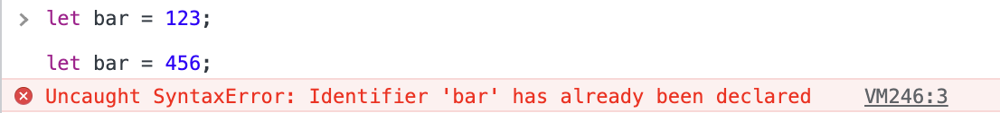
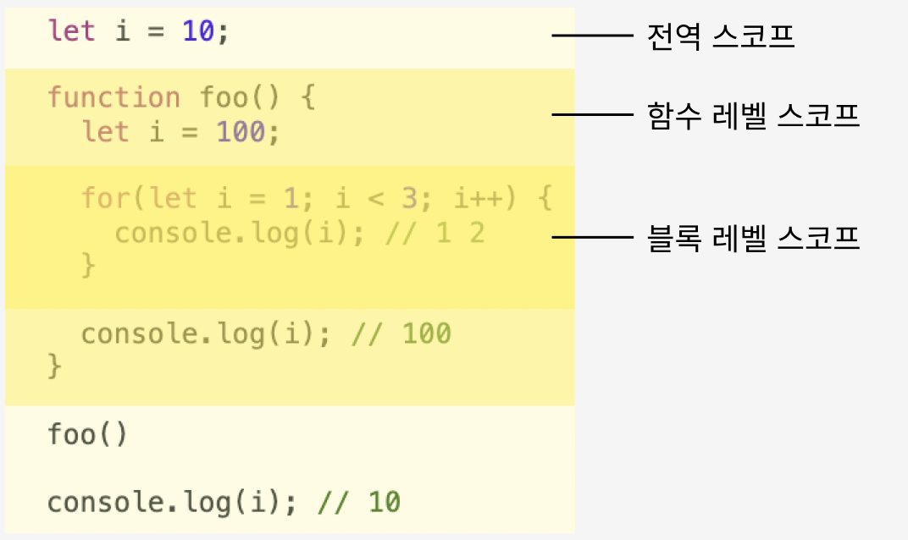

# 15장 let, const 키워드와 블록 레벨 스코프

## 15.1 var 키워드로 선언한 변수의 문제점

- ES5까지 변수를 선언할 수 있는 방법은 var 키워드를 사용하는 것이다.
- var 키워드로 선언한 변수는 독특한 특징을 가지고 있어 주의를 기울이지 않으면 심각한 문제를 발생시킬 수 있다.

### 15.1.1 변수 중복 선언 허용

```jsx
var x = 1;
var y = 1;

// 변수의 중복 선언을 허용한다.
// 초기화와 선언을 동시에 하면 자바스크리트 엔진에 의해 var 키워드가 없는 것처림 동작한다.
var x = 100; // x = 100; 처럼 동작
// 초기화문이 없는 변수 선언은 무시된다.
var y;

console.log(x); // 100
console.log(y); // 1
```

- 변수 x처럼 초기화문이 있는 변수 선언문은 자바스크립트 엔진에 의해 var 키워드가 없는 것처럼 동작한다.
- 변수 y처럼 초기화문이 없는 변수 선언문은 무시된다.
- var 키워드로 변수 중복 선언 시 **에러가 발생하지 않는다.**

### 15.1.2 함수 레벨 스코프

- var 키워드로 선언한 변수는 **함수의 코드 블록만을 지역 스코프로 인정**한다.(함수 레벨 스코프)

```jsx
var x = 1;

if (true) {
  // x는 전역변수다. 이미 전역변수 x가 있으므로 x 변수는 중복 선언된다.
  var x = 2;
}

console.log(x); // 2
```

for 문도 변수 선언문에서 var 키워드로 선언한 변수는 전역변수가 된다.

```jsx
var x = 10;

for (var i = 0; i < 5; i++) {
  console.log(i);
}

console.log(x); // 5
```

### 15.1.3 변수 호이스팅

- var 키워드로 변수를 선언하면 변수 호이스팅에 의해 **변수 선언문의 스코프가 선두로 끌어 올려진 것처럼 동작한**다.
- 즉, 호이스팅으로 인해 var 키워드로 선언한 변수 선언문 이전에 참조할 수 있다.

```jsx
// 호이스팅에 의해 이미 변수가 선언되었다. - 1. 선언 단계
// 변수 foo는 undefined로 초기화 된다. - 2. 초기화 단계
console.log(foo); // undefined

foo = 123; // 3. 할당 단계

console.log(foo); // 123

// 변수 선언문은 런타임 이전에 자바스크립트 엔진에 의해 실행된다.
var foo;
```

- 호이스팅은 에러를 발생시키지 않지만 프로그램의 흐름상 맞지 않을뿐더러 가독성을 떨어뜨리고 오류를 발생시킬 여지를 남긴다.

## 15.2 let 키워드

- var 키워드의 단점을 보완하기 위해 **ES6에서는 새로운 변수 선언 키워드인 let, const를 도입했다.**

### 15.2.1 변수 중복 선언 금지

- var 키워드로 중복 선언하면 아무 에러도 발생하지 않는다.
- 하지만 let 키워드로 이름이 같은 변수를 중복 선언하면 **SyntaxError**가 발생한다.
  

### 15.2.2 블록 레벨 스코프

- var 키워드로 선언한 변수는 오로지 함수의 코드 블록만을 지역 스코프로 인정하는 **함수 레벨 스코프**를 따른다.
- 하지만 let 키워드로 선언한 변수는 모든 코드 블록(함수, if 문, for 문, while 문, try/catch 문 등)을 지역 스코프로 인정하는 **블록 레벨 스코프**를 따른다.

```jsx
let foo = 1; // 전역 변수

{
  let foo = 2; // 지역 변수
  let bar = 3; // 지역 변수
}

console.log(foo); // 1
console.log(bar); // ReferenceError: bar is not defined
```

- 위 예제에서 코드 블록 내에서 선언된 foo, bar 변수는 지역변수이다.
- 즉 전역에 선언된 변수 foo와 지역변수 foo는 별개의 변수인 것이다.
- 변수 bar를 전역에서 참조할 수 없어 **ReferenceError**가 발생한다.



### 15.2.3 변수 호이스팅

- let 키워드로 선언한 변수는 호이스팅이 일어나지 않는 것처럼 보이지만 **사실은 호이스팅이 일어난다.**

```jsx
console.log(foo); // ReferenceError: foo is not defined
let foo;
```

- var 키워드로 선언한 변수는 런타임 이전에 자바스크립트 엔진에 의해 암묵적으로 '선언 단계'와 '초기화 단계'가 한번에 진행된다.(4.3절 "변수 선언")
- 즉, 선언 단계에서 스코프에 변수 식별자를 등록하고 `undefined` 로 즉시 초기화 한다.
- 따라서 변수 선언문 이전에 변수에 접근해도 스코프에 변수가 존재하기 때문에 에러가 발생하지 않는다.

```jsx
// var 키워드로 선언한 변수는 런타임 이전에 선언과 초기화가 동시에 일어난다.
console.log(foo); // undefined

var foo = 1;
```

- **let 키워드로 선언한 변수는 '선언 단계'와 '초기화 단계'가 분리되어 진행된다.**
- 즉, 런타임 이전에 선언 단계가 먼저 실행되지만 초기화 단계는 변수 선언문에 도달했을 때 실행된다.

```jsx
// 런타임 이전에 선언 단계만 실행된다.(초기화X)
console.log(foo); // ReferenceError: foo is not defined

// ⬆️ foo 변수 선언문(초기화 단계) 이전까지는 변수를 참조할 수 없다.
let foo; // 변수 선언문에서 초기화 단계가 실행된다.
console.log(foo); // undefined

foo = 1; // 할당 단계
console.log(foo); // 1
```

- 변수 선언문(초기화 단계) 이전까지는 변수를 참조할 수 없는데, 이를 **일시적 사각지대**(Temporal Dead Zone; TDZ)라고 부른다.

- let 키워드로 선언한 변수는 호이스팅이 발생하지 않는 것처럼 보이지만 호이스팅이 일어난다.

```jsx
var foo = 1; // 전역 변수

{
  console.log(foo); // ReferenceError: Cannot access 'foo' before initialization
  let foo = 2; // 지역 변수
}
```

- let 키워드로 선언한 지역 변수 foo가 호이스팅이 일어나지 않는다면 전역 변수 foo의 값을 출력해야 한다.
- 하지만 let 키워드로 선언한 변수도 호이스팅이 발생하기 때문에 초기화 이전에 참조할 수 없다는 에러가 발생하는 것이다.

### 15.2.4 전역 객체와 let

- var 키워드로 선언한 전역 변수/함수, 선언하지 않는 변수에 값을 할당하는 것은 전역 객체 window의 프로퍼티가 된다.

```jsx
var x = 1;

//선언하지 않는 변수에 값을 할당도 window 객체의 프로퍼티가 된다.
y = 2;

function foo() {
  console.log("I'm foo!");
}

console.log(window.x); // 1
console.log(x); // 1

console.log(window.y); // 2
console.log(y); // 2

window.foo(); // I'm foo!
foo(); // I'm foo!
```

- 위와 같이 전역에 선언한 변수 x, y, 함수 foo는 전역 객체 window의 프로퍼티가 된다.

```jsx
window
{
  ...

  x: 1,
  y: 2,
  foo: function () { ... }

  ...
}
```

- let 키워드로 선언한 전역 변수는 전역 객체의 프로퍼티가 되지 않는다.
- let 전역 변수는 **전역 렉시컬 환경의 선언적 환경 레코드**(23장 "실행 컨텍스트"에서 다룸)라는 곳에 존재하게 된다.

```jsx
let x = 1;

// let, const 로 선언한 전역 변수는 전역 객체 window의 프로퍼티가 되지 않는다.
console.log(window.x); // undefined
console.log(x); // 1
```

## 15.3 const 키워드

- const 키워드는 상수를 선언하기 위해 사용한다.
- let 키워드와 대부분 비슷한 특징을 가진다.
  - 변수 중복 선언 금지
  - 블록 레벨 스코프
  - 변수 호이스팅 발생
  - 전역 객체의 프로퍼티가 되지 않는다.

### 15.3.1 선언과 초기화

- const 키워드로 선언한 변수는 선언과 동시에 초기화해야 한다.

```jsx
const foo = 1;

const bar; // SyntaxError: Missing initializer in const declaration
```

- let 키워드로 선언한 변수와 똑같이 호이스팅이 발생한다.

```jsx
{
  // 호이스팅이 발생한다.
  console.log(foo); // ReferenceError: Cannot access 'foo' before initialization
  const foo = 1;
  console.log(foo); //1
}

// 블록 레벨 스코프를 가진다.
console.log(foo); // Uncaught ReferenceError: foo is not defined
```

### 15.3.2 재할당 금지

- var, let 키워드로 선언한 변수와 달리 재할당이 금지다.

```jsx
const foo = 1;
foo = 2; // TypeError: Assignment to constant variable.
```

### 15.3.3 상수

- const 키워드로 선언한 변수에 **원시 값을 할당한 경우 변수 값을 변경할 수 없다.**
- 왜냐하면 원시 값은 **변경 불가능한 값**(immutable value)이므로 재할당 없이는 변경할 수 없기 때문이다.

### 15.3.4 const 키워드와 객체

- const 키워드로 선언된 변수에 **객체를 할당한 경우 값을 변경할 수 있다.**
- 변경 가능한 값인 객체는 재할당 없이도 직접 변경이 가능하기 때문이다.

```jsx
const person = {
  name: 'Lee',
};

person.name = 'Kim';

console.log(person); // {name: 'Kim'}
```

- const 키워드는 재할당을 금지할 뿐 **불변을 의미하지는 않는다.**
- 즉, 새로운 값을 재할당하는 것은 불가능하지만, 객체 프로퍼티 동적생성/삭제/변경을 통해 객체의 변경은 가능하다!
- 이때 객체를 변경하더라도 변수에 할당된 객체의 참조 값은 변경되지 않는다.
- 위 예제에서 `person`의 `name` 프로퍼티를 변경했어도 `person`에 할당된 참조 값은 바뀌지 않는다.

## 15.4 var vs. let vs. const

- const 키워드를 사용하면 의도치 않는 재할당을 방지할 수 있다.
- 권장사항
  - ES6를 사용한다면 var 키워드를 사용하지 않는다.
  - 재할당이 필요한 경우에 한정해 let 키워드를 사용한다. 이때 변수의 스코프는 최대한 좁게 만든다.
  - 변경이 발생하지 않고 읽기 전용으로 사용하는(재할당이 필요 없는 상수) 원시 값과 객체에는 const 키워드를 사용한다. const 키워드는 재할당을 금지하므로 var, let 키워드보다 안전하다.
