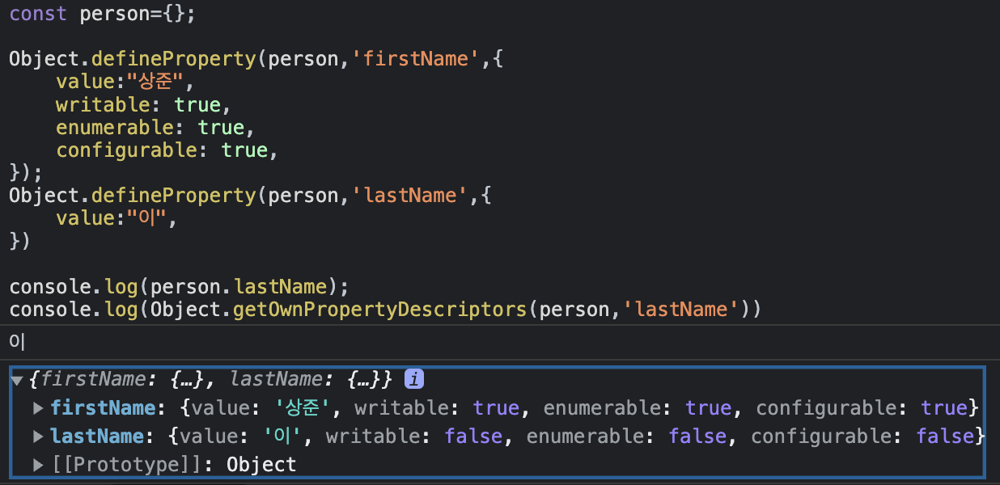
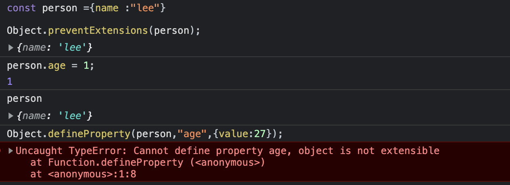
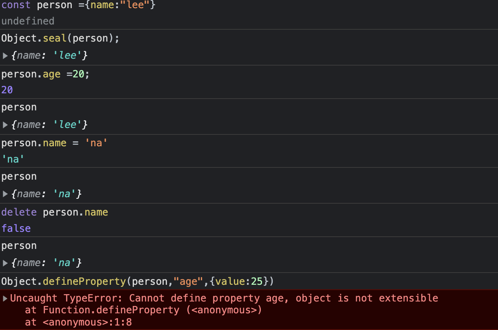
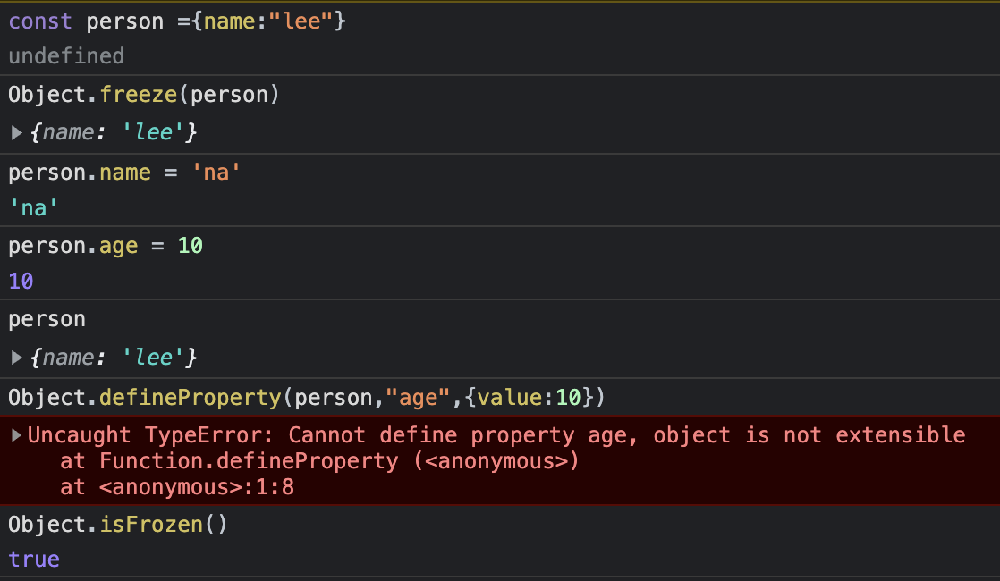
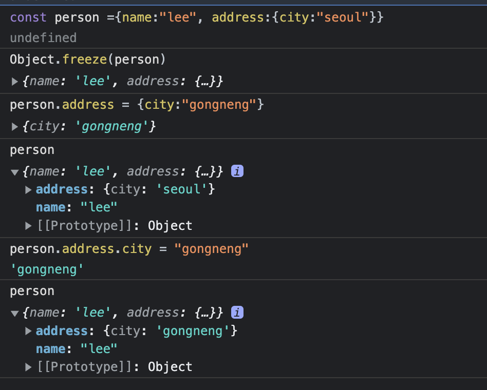

# 16장 프로퍼티 어트리뷰트

> ✅ 객체는 프로퍼티의 집합이며, 프로퍼티는 키와 값으로 구성된다. (p161)  
> ✅ 프로퍼티 : 객체 구성원 (개발자가 관리)  
> ✅ 어트리뷰트 : 프로퍼티의 상태 (엔진이 관리)

## 16.1 내부 슬롯과 내부 메소드

> 📌 앞으로 살펴볼 프로퍼티 어트리뷰트를 이해하기 전 알아야 할 개념.
> ECMAScript에서 사용하는 의사(pseudo) 프로퍼티와 의사 메서드이다.

- [[...]] 이중 대괄호로 감싸져 있는 이름들이 내부 슬롯과 내부 메서드이다
  - [ECMAScript 페이지](https://262.ecma-international.org/13.0/#sec-object-internal-methods-and-internal-slots)
- 내부 슬롯과 내부 메서드는 엔진의 내부 로직
  - ECMAScript 사양에 정의된대로 구현되어 실제로 동작하지만 개발자가 직접 접근하도록 외부로 공개되지는 않았음
  - 원칙적으로는 직접적으로 접근하거나 호출하는 방법을 제공하지 않는다
  - 간접적으로 접근하는 방법
    - [[Prototype]] 내부 슬롯의 경우 .**proto** 를 통해 간접적으로 접근할 수 있음

```javascript
    const a = {};

    a.[[Prototype]] // SyntaxError : Unexpected token '['

    //일부 내부 슬롯과 내부 메서드에 한하여 간접적으로 접근 가능
    a.__proto__ //Object.prototype
```

## 16.2 프로퍼티 어트리뷰트와 프로퍼티 디스크립터 객체

> 📌 자바스크립트 엔진은 프로퍼티를 생성할 때 프로퍼티의 상태를 나타내는 어트리뷰트를 기본값으로 자동으로 정의한다

- 프로퍼티 어트리뷰트
  - 자바스크립트 엔진이 관리하는 내부 상태값인 내부 슬롯
    - [[Value]] , [[Writeable]], [[Enumerable]] ,[Configurable]]
  - 프로퍼티의 어트리뷰트에 직접 접근할 수 없지만, 간접 접근 가능
    - Object.getOwnPropertyDescript 메서드를 사용하면 가능하다

```javascript
const person = {
    name : "lee"
}
person.age =2 0;

console.log(Object.getOwnPropertyDescriptors(person));
/*
    {
    name : {value : "lee", writable : true, enumerable : true, configurable : true},
    age : {value : 20, writable : true, enumerable : true,configurable : true}
    }
*/
```

## 16.3 데이터 프로퍼티와 접근자 프로퍼티

> 📌 프로퍼티 = 데이터 프로퍼티 or 접근자 프로퍼티

    * 데이터 프로퍼티
      - 키와 값으로 구성된 일반적인 프로퍼티, 여태까지 모든 프로퍼티는 데이터 프로퍼티
    * 접근자 프로퍼티
      - 자제척으로 값을 갖지 않고 다른 값을 읽거나 저장할 때 호출되는 접근자 함수로 구성된 프로퍼티

### 16.3.1 데이터 프로퍼티

| 프로퍼티 어트리뷰트 | 프로퍼티 디스크립터 객체의 프로퍼티 | 설명                                                                                                                                                                                                                                                                     |
| ------------------- | ----------------------------------- | ------------------------------------------------------------------------------------------------------------------------------------------------------------------------------------------------------------------------------------------------------------------------ |
| [[Value]]           | value                               | - 프로퍼티를 통해 값에 접근하면 반환되는 값 <br/> - 프로퍼티 키를 통해 값을 변경하면 [[Value]]에 값을 재할당한다.</br> - 이때 프로퍼티가 없으면 프로퍼티를 동적 생성하고 생성된 프로퍼티의[[Value]]에 값을 저장한다                                                      |
| [[Writeable]]       | writable                            | - 프로퍼티의 변경 가능 여부를 나타내며 불리언 값을 갖는다 <br/> - writable의 값이 false인 경우 해당 프로퍼티 [[Value]]의 값이 값을 변경할 수 없는 읽기 전용 프로퍼티가 된다                                                                                              |
| [[Enumerable]]      | enumerable                          | - 프로퍼티의 열거 가능 여부를 나타내며 불리언 값을 갖는다 <br/> [[Enumerable]]의 값이 false인 경우 해당 프로퍼티는 for ... in 문이나 Object.keys 메서드 등으로 열거할 수 없다                                                                                            |
| [[Configuable]]     | configurable                        | - 프로퍼티의 재정의 가능 여부를 나타내며 불리언 값을 가짐.<br/> -[[Configuable]] 값이 false인 경우, 해당 프로퍼티의 삭제, 프로퍼티 어트리뷰트 값의 변경이 금지된다.<br/> - 단, [[Writable]]이 true인 경우 [[Value]]의 변경과 [[Wrieable]]을 false로 변경하는건 허용한다. |

#### 예제에서 보기

```javascript
const person = {
  name: "lee",
};
console.log(Object.getOwnPropertyDescriptors(person));
/*  
    {
    name : {value : "lee", writable : true, enumerable : true, configurable : true},
    }
*/
```

- Object.getOwnPropertyDescriptors 가 반환한 프로퍼티 디스크립터 객체 살펴보기
  - value([[Value]]) : "Lee"
  - 나머지 어트리뷰트 : true  
    ✅ 프로퍼티가 생성될 때, [[Value]]는 프로퍼티 값으로, 나머지 값은 true로 초기화된다, 동적 추가를 해도 마찬가지

### 16.3.2 접근자 프로퍼티

| 프로퍼티 어트리뷰트 | 프로퍼티 디스크립터 객체의 프로퍼티 | 설명                                                                                                                                                                                                                                                                     |
| ------------------- | ----------------------------------- | ------------------------------------------------------------------------------------------------------------------------------------------------------------------------------------------------------------------------------------------------------------------------ |
| [[Get]]             | get                                 | - 접근자 프로퍼티를 통해 프로퍼티 값을 읽을 때 호출되는 접근자 함수 <br/> 접근자 프로퍼티 키로 프로퍼티에 접근하면, 프로퍼티 어트리뷰트 [[Get]]의 값, 즉 getter 함수가 호출되고, 그 결과가 값으로 반환됨                                                                 |
| [[Set]]             | set                                 | - 접근자 프로퍼티를 통해 데이터 프로퍼티와 값을 저장할 때 호출하는 접근자 함수. <br/> 접근자 프로퍼티로 값을 젖아하면 프로퍼티 어트리뷰트 [[Set]]의 값 즉 setter 함수가 호출되고 그 결과가 프로퍼티 값으로 저장된다                                                      |
| [[Enumerable]]      | enumerable                          | - 프로퍼티의 열거 가능 여부를 나타내며 불리언 값을 갖는다 <br/> [[Enumerable]]의 값이 false인 경우 해당 프로퍼티는 for ... in 문이나 Object.keys 메서드 등으로 열거할 수 없다                                                                                            |
| [[Configuable]]     | configurable                        | - 프로퍼티의 재정의 가능 여부를 나타내며 불리언 값을 가짐.<br/> -[[Configuable]] 값이 false인 경우, 해당 프로퍼티의 삭제, 프로퍼티 어트리뷰트 값의 변경이 금지된다.<br/> - 단, [[Writable]]이 true인 경우 [[Value]]의 변경과 [[Wrieable]]을 false로 변경하는건 허용한다. |

- 접근자 함수는 getter/setter 함수라고도 부름,
  - 접근자 프로퍼티는 getter와 setter 모두 정의할수도 있고 하나만 정의할 수도있다.
- 접근자 프로퍼티는 자제척으로 값을 가지지 않으며(프로퍼티 어트리뷰트[[Value]]) 데이터 프로퍼티 값을 읽거나 저장할 때 관여할 뿐임

  ```javascript
  const person = {
    firstName: "상준",
    lastName: "이",
    get fullName() {
      return `${this.firstName}${this.lastName}`;
    },
    set fullName(name) {
      [this.firstName, this.lastName] = name.split(" ");
    },
  };
  console.log(person.firstName, person.lastName); //데이터 프로퍼티 값 참조
  person.fullName = "정진 오"; //접근자 프로퍼티로 저장
  console.log(fullName); // 접근자프로퍼티로 접근

  console.log(Object.getOwnPropertyDescript(person, "firstName")); // 데이터 프로퍼티
  console.log(Object.getOwnPropertyDescriptors(person, fullName)); // 접근자 프로퍼티
  ```

  - 내부슬롯 / 메서드 관점에서 접근자 프로퍼티 보기
    - 접근자 프로퍼티(getter 함수)로 접근하여 프로퍼티 값에 접근하면? -> [[Get]] 내부 메서드 호출, 다음과 같이 동작한다.
      1. 프로퍼티 키"fullName"가 유효한지 확인, 키는 문자열이나 심벌이어야 함.
      2. 프로토 타입 체인에서 프로퍼티 검색, person 에 fullName 프로퍼티가 있음.
      3. 검색된 fullName프로퍼티가 데이터 프로퍼티인지 접근자 프로퍼티인지 확인.
      4. 접근자 프로퍼티 fullName의 프로퍼티 어트리뷰트 [[Get]]의 값 즉 getter 함수를 호출하여 그 결과를 반환한다.

## 16.4 프로퍼티 정의

> 📌 프로퍼티는 생성할 때 기본값을 가지고 있지만, 명시적으로 정의하거나 기존 프로퍼티 어트리뷰트를 재정의 할 수 있다
> 프로퍼티 정의를 통해 객체의 프로퍼티의 동작을 명확히 정의할 수 있음

✅ Object.defineProperty 메서드를 사용해서 정의할 수 있다!

```javascript
const person = {};

Object.defineProperty(person, "firstName", {
  value: "상준",
  writable: true,
  enumerable: true,
  configurable: true,
}); //두번째 인수로 설정 값을 넣어줄 수 있다
Object.defineProperty(person, "lastName", {
  value: "이",
}); //설정을 하지 않으면 나머지 기본값은 default, 접근자 프로퍼티의 [[Get]]과 [[Set]]은 undefined

console.log(person);
```

실제 콘솔에 찍어보면

이런식으로 정의할 수 있음

### 어트리뷰트 설정과 효과

- [[Enumerable]] false인 경우
  - for in 문이나 Object.keys로 열거할 수 없다
  - console.log(Object.keys(lastName)) // ['상준'] 만 나옴
- [[Wrieable]] false인 경우
  - lastName 프로퍼티 [[Value]] 값을 변경할 수 없다
  - 값을 변경하면 에러는 발생하지 않고 무시된다
- [[Configuable]] false인 경우
  - 해당 프로퍼티 삭제할 수 없다, delete로 삭제해도 에러를 발생하지 않고 무시된다.
  - 해당 프로퍼티를 재정의 할 수 없다. Object.defineProperty('lastName', {...})을 무시함
- Object.defineProperties로 여러개의 프로퍼티를 한번에 정의할 수 있음

## 16.5 객체 변경 방지

> 📌 객체는 변경 가능하므로, 재할당 없이 직접 변경 할 수 있다
> 프로퍼티 값 추가 삭제, 값 갱신, 어트리뷰트 재정의 가능.

- 객체의 변경을 방지하는 다양한 메서드들이 있다
- | 구분           | 메서드                   | 프로퍼티 추가 | 프로퍼티 삭제 | 프로퍼티 값 읽기 | 프로퍼티 값 쓰기 | 프로퍼티 어트리뷰트 재정의 |
  | -------------- | ------------------------ | ------------- | ------------- | ---------------- | ---------------- | -------------------------- |
  | 객체 확장 금지 | Object.preventExtensions | ❌            | ✅            | ✅               | ✅               | ✅                         |
  | 객체 밀봉      | Object.seal              | ❌            | ❌            | ✅               | ✅               | ❌                         |
  | 객체 동결      | Object.freeze            | ❌            | ❌            | ✅               | ❌               | ❌                         |

Object.freeze 가 제일 강력

---

### 16.5.1 객체 확장 금지

> Object.preventExtensions

- 프로퍼티 확장이 금지된다
  - 프로퍼티 동적 추가와 Object.defineProperty 둘다 불가능
  - 확장 가능 여부는 Object.isExtensible 메서드로 확인
  - 삭제는 가능



### 16.5.2 객체 밀봉

> Object.seal

- 읽기와 쓰기만 가능하다!
  - 프로퍼티 추가 삭제, 프로퍼티 어트리뷰트 재정의 금지
  - 이미 정의되어있는 프로퍼티의 읽기, 쓰기만 가능
  - Object.isSealed 메서드로 확인가능

;

## 16.5.3 객체 동결

> Object.freeze

- 읽기만 가능하다!
  - 프로퍼티 추가 삭제, 어트리뷰트 재정의, 프로퍼티 값 갱신 금지 그냥 읽기만 가능
  - Object.isFrozen 메서드로 확인할 수 있다.



### 16.5.4 불변객체

> 📌 객체 프로퍼티의 객체(중첩객체)들도 변경 방지를 하고 싶다면?
> 깊은 복사처럼 모든 프로퍼티에 Object.freeze 해주어야함.



```javascript
function deepFreeze(target) {
  if (target && typeof target !== "object" && !Object.freeze(target)) {
    Object.freeze(target);
  }
  Object.keys(target).forEach((key) => deepFreeze(target[key]));
  return target;
}
```
