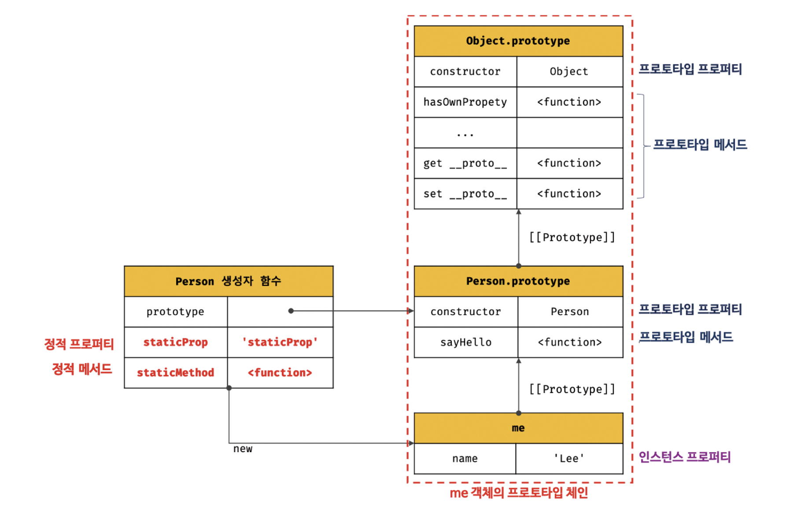

# 19장 프로토타입

- 자바스크립트는 명령형, 함수형, 프로토타입 기반 객체지향 프로그래밍을 지원하는 멀티 패러다임 프로그래밍 언어다.
- 간혹 C++, Java 같은 객체지향 프로그래밍 언어의 특징들이 없어서 자바스크립트는 객체지향 언어가 아니라고 오해하는 경우도 있다.
- 하지만, 자바스크립트는 클래스 기반 객체지향 프로그래밍 언어보다 효율적이며 강력한 객체지향 프로그래밍 능력을 지니고 있는 **프로토타입 기반의** 객체지향 프로그래밍 언어다.

> ES6에서 클래스가 도입되었다. 하지만 클래스도 함수이며, 기존 프로토타입 기반 패턴의 Syntatic Sugar라고 볼 수 있다.

- 자바스크립트는 객체 기반의 프로그래밍 언어이며 **자바스크립트를 이루고 있는 거의 "모든 것"이 객체**다.

## 19.1 객체지향 프로그래밍

- 객체지향 프로그래밍은 실세계의 실체를 인식하는 철학적 사고를 프로그래밍에 접목하려는 시도에서 시작한다.
- 실체는 특징이나 성질을 나타내는 **속성** 을 지니고 있다.
- 사람으로 예를 들면, 사람에게 있는 다양한 속성 중 "이름", "주소"만 필요하다고 가정해보자. 이처럼 다양한 속성 중 프로그램에 필요한 속성만 간추려 표현하는 것을 **추상화**라고 한다.
- "이름", "주소" 속성을 갖는 person이라는 객체를 자바스크립트로 표현하면 다음과 같다.

```js
// 이름과 주소 속성을 갖는 객체
const person = {
  name: "Lee",
  address: "Seoul",
};

console.log(person); // {name: "Lee", address: "Seoul"}
```

- **이처럼 속성을 통해 여러 개의 값을 하나의 단위로 구성한 복합적인 자료구조**를 객체라고 한다.
- 원이라는 개념을 객체로 만들어보자. 아래 예시에서 반지름은 원의 **상태를 나타내는 데이터**이며 원의 지름, 둘레, 넓이를 구하는 것은 **동작**이다.

```js
const circle = {
  radius: 5, // 반지름

  // 원의 지름: 2r
  getDiameter() {
    return 2 * this.radius;
  },

  // 원의 둘레: 2πr
  getPerimeter() {
    return 2 * Math.PI * this.radius;
  },

  // 원의 넓이: πrr
  getArea() {
    return Math.PI * this.radius ** 2;
  },
};

console.log(circle);
// {radius: 5, getDiameter: ƒ, getPerimeter: ƒ, getArea: ƒ}

console.log(circle.getDiameter()); // 10
console.log(circle.getPerimeter()); // 31.41592653589793
console.log(circle.getArea()); // 78.53981633974483
```

- 이처럼 객체지향 프로그래밍은 객체의 **상태**를 나타내는 데이터와 상태 데이터를 조작할 수 있는 **동작**을 하나의 논리적인단위로 묶어 생각한다.
- 따라서 **객체는 상태 데이터와 동작을 하나의 논리적인 단위로 묶은 복합적인 자료구조**라고 할 수 있다.

## 19.2 상속과 프로토타입

- 상속은 객체지향 프로그래밍의 핵심 개념으로, 어떤 객체의 프로퍼티 또는 메서드를 다른 객체가 상속받아 그대로 사용할 수 있는 것을 말한다.

```js
// 생성자 함수
function Circle(radius) {
  this.radius = radius;
  this.getArea = function () {
    // Math.PI는 원주율을 나타내는 상수다.
    return Math.PI * this.radius ** 2;
  };
}

// 반지름이 1인 인스턴스 생성
const circle1 = new Circle(1);
// 반지름이 2인 인스턴스 생성
const circle2 = new Circle(2);

// Circle 생성자 함수는 인스턴스를 생성할 때마다 동일한 동작을 하는
// getArea 메서드를 중복 생성하고 모든 인스턴스가 중복 소유한다.
// getArea 메서드는 하나만 생성하여 모든 인스턴스가 공유해서 사용하는 것이 바람직하다.
console.log(circle1.getArea === circle2.getArea); // false

console.log(circle1.getArea()); // 3.141592653589793
console.log(circle2.getArea()); // 12.566370614359172
```

- 위 예제의 생성자 함수는 문제가 있다.
- Circle 생성자 함수가 생성하는 모든 객체는 radius 프로퍼티와 getArea 메서드를 갖는다.
- radius 프로퍼티 값은 일반적으로 인스턴스마다 다르다. 하지만 getArea 메서드는 모든 인스턴스가 공유해서 사용하는 것이 바람직하다.
- 그런데 Circle 생성자 함수는 인스턴스를 생성할 때마다 getArea 메서드를 중복 생성하고 모든 인스턴스가 중복 소유한다.
- 이처럼 모든 인스턴스가 동일한 메서드를 중복 소유하는 것은 메모리를 불필요하게 낭비한다.
- 상속을 통해 불필요한 중복을 제거할 수 있다. **자바스크립트는 프로토타입을 기반으로 상속을 구현한다.**

```js
// 생성자 함수
function Circle(radius) {
  this.radius = radius;
}

// Circle 생성자 함수가 생성한 모든 인스턴스가 getArea 메서드를
// 공유해서 사용할 수 있도록 프로토타입에 추가한다.
// 프로토타입은 Circle 생성자 함수의 prototype 프로퍼티에 바인딩되어 있다.
Circle.prototype.getArea = function () {
  return Math.PI * this.radius ** 2;
};

// 인스턴스 생성
const circle1 = new Circle(1);
const circle2 = new Circle(2);

// Circle 생성자 함수가 생성한 모든 인스턴스는 부모 객체의 역할을 하는
// 프로토타입 Circle.prototype으로부터 getArea 메서드를 상속받는다.
// 즉, Circle 생성자 함수가 생성하는 모든 인스턴스는 하나의 getArea 메서드를 공유한다.
console.log(circle1.getArea === circle2.getArea); // true

console.log(circle1.getArea()); // 3.141592653589793
console.log(circle2.getArea()); // 12.566370614359172
```

- Cicle 생성자 함수가 생성한 모든 인스턴스는 상위 객체 역할을 하는 Circle.prototype의 모든 프로퍼티와 메서드를 상속받는다.

## 19.3 프로토타입 객체

- 프로토타입은 어떤 객체의 상위(부모) 객체 역할을 하는 객체로서 다른 객체에 공유 프로퍼티(메서드 포함)을 제공한다. 프로토타입을 상속 받은 하위(자식) 객체는 상위 객체의 프로퍼티를 자신의 프로퍼티처럼 자유롭게 사용할 수 있다.
- 모든 객체는 [[Prototype]]이라는 내부 슬롯을 가지며, 이 내부 슬롯의 값은 프로토타입의 참조다.
- [[Prototype]]에 저장되는 프로토타입은 객체 생성 방식에 의해 결정된다. 즉, 객체가 생성될 때 객체 생성 방식에 따라 프로토타입이 결정되고 [[Prototype]]에 저장된다.
- 모든 객체는 하나의 프로토타입을 갖는다. 그리고 모든 프로토타입은 생성자 함수와 연결되어 있다.
- [[Prototype]] 내부 슬롯에는 직접 접근할 수 없지만, `__proto__` 접근자를 통해 내부 슬롯이 가리키는 프로토타입에 간접적으로 접근할 수 있다.
- 그리고 프로토타입은 자신의 constructor 프로퍼티를 통해 생성자 함수에 접근할 수 있고, 생성자 함수는 자신의 prototype 프로퍼티를 통해 프로토타입에 접근할 수 있다.

### 19.3.1 `__proto__` 접근자 프로퍼티

- 모든 객체는 `__proto__` 접근자 프로퍼티를 통해 자신의 프로토타입, 즉 [[Prototype]]의 내부 슬롯에 간접적으로 접근할 수 있다.

#### `__proto__` 는 접근자 프로퍼티다.

> 16.1절 "내부 슬롯과 내부 메서드"에서 살펴보았듯이 내부 슬롯은 프로퍼티가 아니다.

- 접근자 프로퍼티는 자체적으로 값을 갖지 않고 다른 데이터 프로퍼티의 값을 읽거나 저장할 때 사용하는 접근자 함수, 즉 [[Get]], [[Set]] 프로퍼티 어트리뷰트로 구성된 프로퍼티다.
- `__proto__` 접근자 프로퍼티를 통해 프로토타입에 접근하면 내부적으로 getter함수인 [[Get]]이 호출된다.
- `__proto__` 접근자 프로퍼티를 통해 새로운 프로토타입을 할당하면 setter 함수인 [[Set]]이 호출된다.

```js
const obj = {};
const parent = { x: 1 };

// getter 함수인 get __proto__가 호출되어 obj 객체의 프로토타입을 취득
obj.__proto__;
// setter함수인 set __proto__가 호출되어 obj 객체의 프로토타입을 교체
obj.__proto__ = parent;

console.log(obj.x); // 1
```

#### `__proto__` 접근자 프로퍼티는 상속을 통해 사용된다.

- `__proto__` 접근자 프로퍼티는 객체가 직접 소유하는 프로퍼티가 아니라 Object.prototype 의 프로퍼티다. 모든 객체는 상속을 통해 `Object.prototype.__proto__` 접근자 프로퍼티를 사용할 수 있다.

```js
const person = { name: "Lee" };

// person 객체는 __proto__ 프로퍼티를 소유하지 않는다.
console.log(person.hasOwnProperty("__proto__")); // false

// __proto__ 프로퍼티는 모든 객체의 프로토타입 객체인 Object.prototype의 접근자 프로퍼티다.
console.log(Object.getOwnPropertyDescriptor(Object.prototype, "__proto__"));
// {get: ƒ, set: ƒ, enumerable: false, configurable: true}

// 모든 객체는 Object.prototype의 접근자 프로퍼티 __proto__를 상속받아 사용할 수 있다.
console.log({}.__proto__ === Object.prototype); // true
```

#### `__proto__` 접근자를 통해 프로토타입에 접근하는 이유

- [[Prototype]] 내부 슬롯의 값, 즉 프로토타입에 접근하기 위해 접근자 프로퍼티를 사용하는 이유는 상호 참조에 의해 프로토타입 체인이 생성되는 것을 방지하기 위해서다.

```js
const parent = {};
const child = {};

// child의 프로토타입을 parent로 설정
child.__proto__ = parent;
// parent의 프로토타입을 child로 설정
parent.__proto__ = child; // TypeError: Cyclic __proto__ value
```

- 위 예제의 코드가 정상적으로 처리되면 서로가 자신의 프로토타입이 되는 비정상적인 프로토타입 체인이 만들어지기 때문에 `__proto__` 접근자 프로퍼티는 에러를 발생시킨다.
- 순환 참조하는 프로토타입 체인이 만들어지면 프로토타입 체인 종점이 존재하지 않기 때문에 무한 루프에 빠진다.
- 따라서 아무 체크 없이 무조건적으로 프로토타입을 교체할 수 없도록 `__proto__` 접근자 프로퍼티를 통해 프로토타입에 접근하고 교체하도록 구현되어 있다.

#### `__proto__` 접근자 프로퍼티를 코드 내에서 직접 사용하는 것은 권장하지 않는다.

- 다음과 같이 Object.prototype을 상속받지 않는 객체를 생성할 수도 있기 때문에 `__proto__` 접근자 프로퍼티를 사용할 수 없는 경우가 있다.

```js
// obj는 프로토타입 체인의 종점이다. 따라서 Object.__proto__를 상속받을 수 없다.
const obj = Object.create(null);

// obj는 Object.__proto__를 상속받을 수 없다.
console.log(obj.__proto__); // undefined

// 따라서 Object.getPrototypeOf 메서드를 사용하는 편이 좋다.
console.log(Object.getPrototypeOf(obj)); // null
```

- 따라서 `__proto__` 접근자 프로퍼티 대신 프로토타입의 참조를 취득하고 싶은 경우에는 Object.getPrototypeOf 메서드를 사용하고, 프로토타입을 교체하고 싶은 경우에는 Object.setPrototypeOf 메서드를 사용할 것을 권장한다.

```js
const obj = {};
const parent = { x: 1 };

// obj 객체의 프로토타입을 취득
Object.getPrototypeOf(obj); // obj.__proto__;
// obj 객체의 프로토타입을 교체
Object.setPrototypeOf(obj, parent); // obj.__proto__ = parent;

console.log(obj.x); // 1
```

### 19.3.2 함수 객체의 prototype 프로퍼티

- **함수 객체만이 소유하는 prototype 프로퍼티는 생성자 함수가 생성할 인스턴스의 프로토타입을 가리킨다.**

```js
// 함수 객체는 prototype 프로퍼티를 소유한다.
(function () {}.hasOwnProperty("prototype")); // -> true

// 일반 객체는 prototype 프로퍼티를 소유하지 않는다.
({}.hasOwnProperty("prototype")); // -> false
```

- prototype 프로퍼티는 생성자 함수가 생성할 객체(인스턴스)의 프로토타입을 가리킨다.

- 따라서 생성자 함수로 호출할 수 없는 화살표 함수와 ES6 메서드 축약 표현으로 정의한 메서드는 prototype 프로퍼티를 소유하지 않으며 프로토타입도 생성하지 않는다.

```js
// 화살표 함수는 non-constructor다.
const Person = (name) => {
  this.name = name;
};

// non-constructor는 prototype 프로퍼티를 소유하지 않는다.
console.log(Person.hasOwnProperty("prototype")); // false

// non-constructor는 프로토타입을 생성하지 않는다.
console.log(Person.prototype); // undefined

// ES6의 메서드 축약 표현으로 정의한 메서드는 non-constructor다.
const obj = {
  foo() {},
};

// non-constructor는 prototype 프로퍼티를 소유하지 않는다.
console.log(obj.foo.hasOwnProperty("prototype")); // false

// non-constructor는 프로토타입을 생성하지 않는다.
console.log(obj.foo.prototype); // undefined
```

- **모든 객체가 가지고 있는 `__proto__` 접근자 프로퍼티와 함수 객체만이 가지고 있는 prototype 프로퍼티는 결국 동일한 프로토타입을 가리킨다.**
- 하지만 이들 프로퍼티를 사용하는 주체가 다르다.


|            구분             |    소유     |        값         |  사용 주체  |                                  사용 목적                                   |
| :-------------------------: | :---------: | :---------------: | :---------: | :--------------------------------------------------------------------------: |
| `__proto__` 접근자 프로퍼티 |  모든 객체  | 프로토타입의 참조 |  모든 객체  |           객체가 지신의 프로토타입에 접근 또는 교체하기 위해 사용            |
|     prototype 프로퍼티      | constructor | 프로토타입의 참조 | 생성자 함수 | 생성자 함수가 자신이 생성할 객체(인스턴스)의 프로토타입을 할당하기 위해 사용 |

- 생성자 함수로 객체를 생성한 후 `__proto__` 접근자 프로퍼티와 prototype 프로퍼티로 프로토타입 객체에 접근한 예시이다.

```js
// 생성자 함수
function Person(name) {
  this.name = name;
}

const me = new Person("Lee");

// 결국 Person.prototype과 me.__proto__는 결국 동일한 프로토타입을 가리킨다.
console.log(Person.prototype === me.__proto__); // true
```

- 위 예제에서 Person 생성자 함수는 me 객체를 생성했다. me 객체에는 constuctor 프로퍼티가 없지만 me 객체의 프로토타입인 Person.prototype에는 constructor 프로퍼티가 있다. 따라서 me 객체는 프로토타입인 Person.prototype의 constructor 프로퍼티를 상속받아 사용할 수 있다.

## 19.4 리터럴 표기법에 의해 생성된 객체의 생성자 함수와 프로토타입

- 생성자 함수에 의해 생성된 인스턴스는 프로토타입의 constructor 프로퍼티에 의해 생성자 함수와 연결된다.
- 이때 constructor 프로퍼티가 가리키는 생성자 함수는 인스턴스를 생성한 생성자 함수다.

```js
// obj 객체를 생성한 생성자 함수는 Object다.
const obj = new Object();
console.log(obj.constructor === Object); // true

// add 함수 객체를 생성한 생성자 함수는 Function이다.
const add = new Function("a", "b", "return a + b");
console.log(add.constructor === Function); // true

// 생성자 함수
function Person(name) {
  this.name = name;
}

// me 객체를 생성한 생성자 함수는 Person이다.
const me = new Person("Lee");
console.log(me.constructor === Person); // true
```

- 하지만 리터럴 표기법에 의한 객체 생성 방식과 같이 new 연산자와 함께 생성자 함수를 호출하여 인스턴스를 생성하지 않는 객체 생성 방식도 있다.

```js
// 객체 리터럴
const obj = {};

// 함수 리터럴
const add = function (a, b) {
  return a + b;
};

// 배열 리터럴
const arr = [1, 2, 3];

// 정규표현식 리터럴
const regexp = /is/gi;
```

- 리터럴 표기법에 의해 생성된 객체도 물론 프로토타입이 존재한다.
- 하지만 리터럴 표기법에 의해 생성된 객체의 경우 프로토타입 constructor 프로퍼티가 가리키는 생성자 함수가 반드시 객체를 생성한 생성자 함수라고 단정할 수는 없다.

```js
// obj 객체는 Object 생성자 함수로 생성한 객체가 아니라 객체 리터럴로 생성했다.
const obj = {};

// 하지만 obj 객체의 생성자 함수는 Object 생성자 함수다.
console.log(obj.constructor === Object); // true
```

- object 생성자 함수에 인수를 전달하지 않거나 undefined 또는 null을 인수로 전달하면서 호출하면 내부적으로Object.prototype을 프로토타입으로 갖는 빈 객체를 생성한다.

```js
// 2. Object 생성자 함수에 의한 객체 생성
// Object 생성자 함수는 new 연산자와 함께 호출하지 않아도 new 연산자와 함께 호출한 것과 동일하게 동작한다.
// 인수가 전달되지 않았을 때 추상 연산 OrdinaryObjectCreate를 호출하여 빈 객체를 생성한다.
let obj = new Object();
console.log(obj); // {}

// 1. new.target이 undefined나 Object가 아닌 경우
// 인스턴스 -> Foo.prototype -> Object.prototype 순으로 프로토타입 체인이 생성된다.
class Foo extends Object {}
new Foo(); // Foo {}

// 3. 인수가 전달된 경우에는 인수를 객체로 변환한다.
// Number 객체 생성
obj = new Object(123);
console.log(obj); // Number {123}

// String  객체 생성
obj = new Object("123");
console.log(obj); // String {"123"}
```

- 함수 객체의 경우 차이가 더 명확하다.

```js
// foo 함수는 Function 생성자 함수로 생성한 함수 객체가 아니라 함수 선언문으로 생성했다.
function foo() {}

// 하지만 constructor 프로퍼티를 통해 확인해보면 함수 foo의 생성자 함수는 Function 생성자 함수다.
console.log(foo.constructor === Function); // true
```

- 리터럴 표기법에 의해 생성된 객체도 상속을 위해 프로토타입이 필요하다.
- **프로토타입과 생성자 함수는 단독으로 존재할 수 없고 언제나 쌍으로 존재한다.**

## 19.5 프로토타입의 생성 시점

- **프로토타입은 생성자 함수가 생성되는 시점에 더불어 생성된다.**

### 19.5.1 사용자 정의 생성자 함수와 프로토타입 생성 시점

- **생성자 함수로서 호출할 수 있는 함수, 즉 constructor는 함수 정의가 평가되어 함수 객체를 생성하는 시점에 프로토타입도 더불어 생성된다.**

```js
// 함수 정의(constructor)가 평가되어 함수 객체를 생성하는 시점에 프로토타입도 더불어 생성된다.
console.log(Person.prototype); // {constructor: ƒ}

// 생성자 함수
function Person(name) {
  this.name = name;
}
```

- 생성자 함수로서 호출할수 없는 함수는 프로토타입이 생성되지 않는다.

```js
// 화살표 함수는 non-constructor다.
const Person = (name) => {
  this.name = name;
};

// non-constructor는 프로토타입이 생성되지 않는다.
console.log(Person.prototype); // undefined
```

### 19.5.2 빌트인 생성자 함수와 프로토타입 생성 시점

- Object, String, Number 등과 같은 모든 빌트인 생성자 함수는 전역 객체가 생성되는 시점에 생성된다.
- 생성된 프로토타입은 빌트인 생성자 함수의 prototype 프로퍼티에 바인딩된다.

- **이후 생성자 함수 또는 리터럴 표기법으로 객체를 생성하면 프로토타입은 생성된 객체의 [[Prototype]] 내부 슬롯에 할당된다.**

## 19.6 객체 생성 방식과 프로토타입의 결정

### 19.6.1 객체 리터럴에 의해 생성된 객체의 프로토타입

```js
const obj = { x: 1 };
```

- 객체 리터럴에 의해 생성된 obj 객체는 Object.prototype을 프로토타입으로 갖게 되며, 이로써 Object.prototype을 상속받는다.
- obj객체는 constructor 프로퍼티와 hasOwnProperty 메서드 등을 소유하지 않지만 프로토타입인 Object.prototype의 constructor 프로퍼티와 hasOwnProperty 메서드를 자유롭게 사용할 수 있다.
- 이는 obj 객체가 자신의 프로토타입인 Object.prototype 객체를 상속 받았기 때문이다.

```js
const obj = { x: 1 };

// 객체 리터럴에 의해 생성된 obj 객체는 Object.prototype을 상속받는다.
console.log(obj.constructor === Object); // true
console.log(obj.hasOwnProperty("x")); // true
```

### 19.6.2 Object 생성자 함수에 의해 생성된 객체의 프로토타입

```js
const obj = new Object();
obj.x = 1;
```

- Object 생성자 함수에 의해 생성된 obj 객체는 Object.prototype을 프로토타입으로 갖게 된다.

```js
const obj = new Object();
obj.x = 1;

// Object 생성자 함수에 의해 생성된 obj 객체는 Object.prototype을 상속받는다.
console.log(obj.constructor === Object); // true
console.log(obj.hasOwnProperty("x")); // true
```

### 19.6.3 생성자 함수에 의해 생성된 객체에 프로토타입

```js
function Person(name) {
  this.name = name;
}

const me = new Person("Lee");
```

- 생성자 함수에 의해 생성되는 객체의 프로토타입은 생성자 함수의 prototype 프로퍼티에 바인딩되어 있는 객체다.
- Person.prototype에 프로퍼티를 추가하여 하위 객체가 상속받을 수 있도록 구현할 수도 있다.

```js
function Person(name) {
  this.name = name;
}

// 프로토타입 메서드
Person.prototype.sayHello = function () {
  console.log(`Hi! My name is ${this.name}`);
};

const me = new Person("Lee");
const you = new Person("Kim");

me.sayHello(); // Hi! My name is Lee
you.sayHello(); // Hi! My name is Kim
```

- Person 생성자 함수를 통해 생성된 모든 객체는 프로토타입에 추가된 sayHello 메서드를 상속받아 자신의 메서드처럼 사용할 수 있다.

## 19.7 프로토타입 체인

```js
function Person(name) {
  this.name = name;
}

// 프로토타입 메서드
Person.prototype.sayHello = function () {
  console.log(`Hi! My name is ${this.name}`);
};

const me = new Person("Lee");

// hasOwnProperty는 Object.prototype의 메서드다.
console.log(me.hasOwnProperty("name")); // true
```

- Pesron 생성자 함수에 의해 생성된 me 객체는 Object.prototype의 메서드인 hasOwnProperty를 호출할 수 있다.
- 이것은 me 객체가 Person.prototype 뿐만 아니라 Object.prototype도 상속 받았다는 것을 의미한다.
- me 객체의 프로토타입은 Person.prototype이다.

```js
Object.getPrototypeOf(me) === Person.prototype; // -> true
```

- Person.prototpye의 프로토타입은 Object.prototype이다. 프로토타입의 프로토타입은 언제나 Object.prototype이다.

```js
Object.getPrototypeOf(Person.prototype) === Object.prototype; // -> true
```

- **자바스크립트는 객체의 프로퍼티에 접근하려고 할 때 해당 객체에 접근하려는 프로퍼티가 없다면 [[Prototype]] 내부 슬롯의 참조를 따라 자신의 부모 역할을 하는 프로토타입의 프로퍼티를 순차적으로 검색한다. 이를 프로토타입 체인이라고 한다. 프로토타입 체인은 자바스크립트가 객체지향 프로그래밍의 상속을 구현하는 매커니즘이다.**

```js
// hasOwnProperty는 Object.prototype의 메서드다.
// me 객체는 프로토타입 체인을 따라 hasOwnProperty 메서드를 검색하여 사용한다.
me.hasOwnProperty("name"); // -> true
```

- 프로토타입 체인의 최상위에 위치하는 객체는 언제나 Object.prototype이다. 따라서 모든 객체는 Object.prototype을 상속받는다.
- **Object.prototype을 프로토타입 체인의 종점(end of prototype chain)이라 한다.**
- Object.prototype의 프로토타입, 즉 [[Prototype]] 내부 슬롯의 값은 null이다.
- 프로토타입 체인의 종점인 Object.prototpye에서도 프로퍼티를 검색할 수 없는 경우 undefined를 반환한다.

```js
console.log(me.foo); // undefined
```

- **프로토타입 체인은 상속과 프로퍼티 검색을 위한 메커니즘** 이라고 할 수 있다.
- 이에 반해, 프로퍼티가 아닌 식별자는 스코프 체인에서 검색한다. 다시 말해, 자바스크립트 엔진은 함수의 중첩 관계로 이루어진 스코프의 계층적 구조에서 식별자를 검색한다.
- 따라서 **스코프 체인은 식별자 검색을 위한 메커니즘** 이라 할 수 있다.

```js
me.hasOwnProperty("name");
```

- 위 예제의 경우 다음 순서를 거친다.
  1. 먼저 스코프 체인에서 me 식별자를 먼저 검색한다.
  2. me 식별자는 전역에서 선언되었으므로 전역스코프에서 검색된다.
  3. me 객체의 프로토타입 체인에서 hasOwnProperty 메서드를 검색한다.
- 이처럼 **스코프 체인과 프로토타입 체인은 서로 연관없이 별도로 동작하는 것이 아니라 서로 협력하여 식별자와 프로퍼티를 검색하는데 사용된다.**

## 19.8 오버라이딩과 프로퍼티 섀도잉

예제 살펴보기

```javascript
const Person = (function(){
    function Person(name){
        this.name = name;
    }

    Person.prototype.sayHello = function () {
        console.log(`hi my name is ${this.name}`);
    }

    return Person;
})()

const me = new Person('Lee');

me.sayHello = function(){
    console.log(`HIHIHI my name is ${this.name}`)
}

me.sayHello();****
```

생성자 함수로 객체(인스턴스) 생성한 다음, 인스턴스에 메서드를 추가한 코드이다. 그림으로 다음과 같이 나타낼 수 있다!

</br>


**프로토타입 프로퍼티와 인스턴스 프로퍼티의 구분**

- 프로토타입이 소유한 프로퍼티(메서드 포함) : 프로토타입 프로퍼티
- 인스턴스가 소유한 프로퍼티 : 인스턴스 프로퍼티

**프로토타입 오버라이딩과 프로퍼티 섀도잉**

- 같은 이름의 프로퍼티를 인스턴스에 추가할 경우 프로토타입 프로퍼티를 덮어쓰지 않는다  
  ✅ 인스턴스 프로퍼티로 추가한다
- 인스턴스의 sayHello는 프로토타입의 sayHello를 오버라이딩.
- 상속관계에 의해 프로토타입의 sayHello가 가려지는 현상을 섀도잉 이라고함

      📌 오버라이딩과 오버로딩의 차이
      오버라이딩 : 상위 클래스의 메서드를 하위 클래스가 재정의해서 사용
      오버로딩 : 함수의 이름은 동일하지만, 매개변수 타입 또는 개수를 다르게 구현해서, 매개변수에 의해 메서드를 구별해서 호출하는 방식, 자바스크립트는 오버로딩 지원 x,arguments 객체를 사용해서 구현할 수는 있다.

예제

```javascript
const me = new Person("Lee");

delete me.sayHello(); //인스턴스 메서드 삭제
me.sayHello(); //hi my name is Lee -> 프로토타입 메서드

delete me.sayHello(); // 다시 삭제 시도
me.sayHello(); //hi my name is Lee -> 하위 객체를 통한 프로토타입 메서드는 향삭제 되지 않는다

delete me.prototype.sayHello(); //프로토타입 객체에 접근해서 프로퍼티 삭제
me.sayHello(); //TypeError : me.sayHello is not a fungion
```

**프로퍼티를 삭제할 때**

- 하위 객체에서 프로토타입 메서드를 삭제할 수 없다
  - 하위객체에서 get액세스느 허용되지만 set 액세스는 허용되지 않음
- 프로토타입 프로퍼티를 변경,삭제하려면 프로토타입 체인이 아닌 프로토타입에 직접 접근해야한다.
  - 인스턴스.prototype. 으로 프로토타입 객체에 접근해야 한다.

## 19.9 프로토타입의 교체

> 📌 프로토타입은 임의의 다른 객체로 변경할 수 있다  
> ( = 부모 객체의 프로토타입을 동적으로 변경할 수 있다)  
> 이러한 특징으로 객체간 상속 관계를 동적으로 변경할 수 있다
>
> 📌 프로토타입은 생성자 함수 또는 인스턴스에 의해 교체할 수 있다

### 19.9.1 생성자 함수에 의한 프로토타입의 교체

```javascript
const Person = (function () {
  function Person(name) {
    this.name = name;
  }

  //1️⃣ 생성자 함수 Person의 prototype 프로퍼티를 통해 Person 인스턴스의 프로토타입 교체
  Person.prototype = {
    sayHello() {
      console.log(`Hi My name is ${this.name}`);
    },
  };
  return Person;
})();

const me = new Person("Lee");

// 프로토타입 교체 시 constructor 프로퍼티와 생성자 함수간의 연결이 파괴
console.log(me.constructor === Person); // false

// 프로토타입 체인으로 Object.prototype의 counstructor 프로퍼티가 검색됨
console.log(me.constructor === Object); // false
```

;

프로토타입 프로퍼티를 통한 프로토타입 교체

- 1️⃣에서 Person.prototype에 객체 리터럴을 할당함
- 그림처럼 교체된 프로토타입에는 constructor 프로퍼티가 없음

  - constructor 프로퍼티는 자바스크립트 엔진이 프로토타입을 생성할 때 암묵적으로 추가하는 프로퍼티
  - 리터럴로 생성된 객체의 프로토타입 체인을 따라서 me 객체의 생성자 함수는 Person이 아닌 Object가 나온다.
      <details>
        <summary>consturctor 프로퍼티와 생성자 함수간의 연결을 살리려면?</summary>
       
       ```javascript
       const Person = (function(){
           function Person(name){
               this.name = name;
           }

           //1️⃣ 생성자 함수 Person의 prototype 프로퍼티를 통해 Person 인스턴스의 프로토타입 교체
           Person.prototype = {
               constructor:Person, // consturctor 프로퍼티에 생성자 함수를 추가해서 연결을 되살린다.
               sayHello(){
                   console.log(`Hi My name is ${this.name}`)
               }
           }
           return Person;
             }

          )()

          const me = new Person("Lee");
          // 프로토타입 교체 시 constructor 프로퍼티와 생성자 함수간의 연결이 파괴
          console.log(me.constructor === Person); // false

          // 프로토타입 체인으로 Object.prototype의 counstructor 프로퍼티가 검색됨
          console.log(me.constructor === Object); // false

  </details>

### 19.9.2 인스턴스에 의한 프로토타입의 교체

> 📌 프로토타입은 인스턴스의 \_\_proto\_\_ 접근자 프로퍼티 또는 Objecte.getPrototypeOf 메서드로 접근 가능하다  
> ( = 인스턴스에서 프로토타입을 교체할 수 있다.)

예제코드

```javascript
function Person(name) {
  this.name = name;
}

const me = new Person("Lee");

const parent = {
  sayHello() {
    console.log(`Hi My name is ${this.name}`);
  },
};

me.__proto__ = parent;
//Object.setProtoTypeOf(me, parent)와 동일하게 동작한다.

me.sayHello(); //Hi My name is Lee

// 프로토타입 교체 시 constructor 프로퍼티와 생성자 함수간의 연결이 파괴
console.log(me.constructor === Person); // false

// 프로토타입 체인으로 Object.prototype의 counstructor 프로퍼티가 검색됨
console.log(me.constructor === Object); // false
```

교체 결과


**둘의 차이는 무엇인가??**

- 교체 시기의 차이

  - 생성자 함수의 prototype 퍼티에 임의의 객체를 바인딩 하는것은, 미래의 인스턴스의 프로토타입을 교체
  - \_\_proto\_\_ 접근자 프로퍼티로 프로토타입을 교체하는것은 이미 생성된 인스턴스의 프로토타입을 교체

- 생성자 함수의 prototype 프로퍼티 차이, **_교체된 프로토타입 객체를 가리키는가?_**
  
  

- <details>
    <summary>인스턴스에서 프로토타입을 교체한 후 생성자 함수와 프로토타입 연결 되살려보기</summary>
    
        ```javascript
            function Person(name) {
                this.name = name;
            }

            const me = new Person("Lee");

            const parent = {
                // 객체 리터럴에 countructor 프로퍼티 추가
                consturctor:Person,
                sayHello() {
                    console.log(`Hi My name is ${this.name}`);
                },
            };
            //생성자함수의 protype 프로퍼티와, 프로토타입 연결
            Person.prototype == parent;

            // me 객체 프로토타입 교체
            me.__proto__ = parent;

            console.log(me.constructor === Person) //true
            console.log(me.constructor === Object) //false

            // 생성자함수의 prototype 프로퍼티가 교체된 프로토타입을 가리킴
            console.log(Person.prototype === Object.getPrototypeOf(me)); //true
        ```

    </details>
  - 프로토타입 교체를 통해 객체간의 상속을 동적으로 변경하는것은 까다롭다.. 직접 교체하지 않는것이 좋다
    - 상속을 인위적으로 설정하려면 19.11의 직접상속이 더 편리하다
    - ES6의 클래스를 사용해서 간편하고 직관적으로 상속할 수 있다.

## 19.10 instanceof 연산자

> 📌 객체 instanceof 생성자 함수  
> 💡 우변의 생성자 함수의 prototype에 바인딩된 객체가 좌변 **프로토타입 체인 상에** 존재하면 true아니면 false

```javascript
function Person(name) {
  this.name = name;
}
const me = new Person();

console.log(me instanceof Person); // true;
console.log(me instanceof Object); // true;
```

**프로토타입을 교체하면?**

```javascript
function Person(name) {
  this.name = name;
}

const me = new Person("Lee");

const parent = {};

//프로토타입 교체
me.__proto__ = parent;

console.log(Person.prototype === parent); //false
console.log(parent.constructor === Person); //false

//Person.prototype이 me 객체의 프로토타입 체인 상에 존재하지 않아서 false
console.log(me instanceof Person); //false
//Object.prototype이 me 객체의 프로토타입 체인 상에 존재 console.log(me instanceof Object) //true;
```

**교체된 프로토타입 객체를 바인딩 해준다면?**

```javascript
function Person(name) {
  this.name = name;
}

const me = new Person("Lee");

const parent = {};

//프로토타입 교체
me.__proto__ = parent;

//Person 생성자 함수는 parent 객체와 연결 되어있지 않음
console.log(Person.prototype === parent); //false
console.log(parent.constructor === Person); //false

// parent 객체를 Person 생성자 함수의 prototype 프로퍼티에 바인딩하면?
Person.prototype = parent;

//Person.prototype이 me 객체의 프로토타입 체인 상에 존재하므로 true
console.log(me instanceof Person); //true
//Object.prototype이 me 객체의 프로토타입 체인 상에 존재하므로 true;
console.log(me instanceof Object); //false
```

> 💡💡instanceof 연산자는 프로토타입의 constructor 프로퍼티가 가리키는 생성자 함수를 찾는게 아니라, 생성자 함수의 prototype에 바인딩 된 객체가 프토토타입 체인에 있는지 확인한다!!  
> 💡 생성자 함수에 의해 프로토타입이 교체되어 constructor 프로퍼티와 생성자 함수 간의 연결이 파괴되어도, 생성자 함수의 property와 프로토타입간의 연결이 파괴되지 않으므로 instaceof는 아무런 영향을 받지 않는다,

## 19.11 직접 상속

### 19.11.1 Object.create에 의한 직접 상속

> Object.create 메서드는 명시적으로 프로토타입을 지정하여 새로운 객체를 생성한다.
> Object.create 메서드도 다른 객체 생성 방식과 마찬가지로 추상 연산 OrdinaryObjectCreate를 호출한다

- Object.create 사용해보기

```javascript
/**
 * Object.create : 지정된 프로토타입 및 프로퍼티를 갖는 새로운 객체를 생성해서 반환한다.
 * (Object.prototype을 상속받지 않는 객체를 만든다)
 * @param {Object} prototype - 생성할 객체의 프로토타입으로 지정할 객체
 * @param {Object} [propertiesObject] - 생성할 객체의 프로퍼티를 갖는 객체
 * @returns {Object}
 */

Object.create(prototype[, propertiesObject]);
```

- 프로토타입이 null인 객체 생성하기

```javascript
// (상속관계) obj -> null
// 생성된 객체는 프로토타입 체인의 종점에 위치한다
let obj = Object.create(null);
console.log(Object.getPrototypeOf(obj) === null); //true
//Object.prototype을 상속받지 못한다.
console.log(obj.toString()); //TypeError : obj.string is no a function
```

- Object.prototype을 프로토타입으로 하는 객체 만들기

```javascript
//(상속관계) obj -> Object.prototype -> null
//let obj = {} 와 동일하다!!
let obj = Object.create(Object.prototype);
console.log(Object.getPrototypeOf(obj) === Object.prototype); //true

let obj = Object.create(Object.prototype, {
  x: { value: 1, writable: true, enumerable: true, configurable: true },
});
//위 코드는 아래와 동일하다
/*
 obj = Object.create(Object.prototype);
 obj.x = 1;
*/
console.log(obj.x); //1
console.log(Object.getPrototypeOf(obj) === Object.prototype); // true
```

- 임의의 객체를 직접 상속받기

```javascript
// (상속관계) obj -> myProto -> Object.prototype -> null
const myProto = { x: 10 };
obj = Object.create(myProto);
console.log(obj.x);
console.log(Object.getPrototypeOf(obj) === myProto); // true
```

- 생성자 함수를 프로토타입으로

```javascript
// (상속관계) obj -> Person.prototype -> Object.prototype -> null
// obj = new Person('Lee')와 동일하다!
function Person(name) {
  this.name = name;
}
obj = Object.create(Person.prototype);
obj.name = "lee";
console.log(obj.name);
console.log(Object.getPrototypeOf(obj) === Person.prototype); //true
```

> 💡 Object.create 메서드는 파라미터로 전달해준 객체의 프로토타입의 체인에 연결.
> 파라미터의 객체의 프로토타입에 속하는 객체를 생성한다.  
> 장점
>
> 1.  new 연산자 없이 객체를 생성할 수 있다
> 2.  프로토타입을 지정하면서 객체를 생성할 수 있다
> 3.  객체 리터럴에 의해 생성된 객체도 상속받을 수 있다.

- 참고사항
  Object.prototype의 빌트인 메서드 (hasOwnProperty, isPrototypeOf, propertyIsEnumerable 등) 직접 호출은 권장되지 않는다  
   -> Object.create()로 프로토타입 체인의 종점에 해당하는 객체를 생성할 수 있기 때문에, 에러가 날 수 있다. (프로토타입 체인 종점의 객체는 Object.prototype 빌트인 메서드를 사용할 수 없다)
  -> Object.protyotype.hasOwnProperty.call(obj) 같이 간접적으로 호출해서 사용하기

### 19.11.2 객체 리터럴 내부에서 \_\_proto\_\_ 에 의한 직접 상속

> 📌 Object.create 메서드에서 프로퍼티를 정의하기는 번거롭고, 객체 생성 후 프로퍼티를 추가하는 방법도 깔끔하지 않으므로 다음과 같이 상속을 구현할 수 있다.

```javascript
  const myProto  ={ x:10};

  //객체 리터럴로 객체를 생성하며 프로토타입을 지정해서 직접 상속받을 수 있다
  const obj = {
    y:20,
    __proto__ : myProto.
  };

  //아래 코드와 동일하다
  /*
  const obj = Object.create(myProto,{
    y:{value:20, writable : true, enumerable : true, configurable : true}
  })
  */

 console.log(obj.x, obj.y); //10 20
 console.log(Object.getPrototypeOf(obj)=== myProto) //true
```

## 19.12 정적 프로퍼티 / 메서드

> 📌 생성자 함수로 인스턴스를 생성하지 않아도 참조 / 호출할 수 있는 프로퍼티 / 메서드

```javascript
function Person(name) {
  this.name = name;
}

Person.prototype.sayHello = function () {
  console.log(`Hi My name is ${this.name}`);
};

Person.staticProp = "staticProp";
Person.staticMethod = function () {
  console.log("staticMethod");
};

const me = new Person("Lee");

Person.staticMethod(); //staticMethod
me.staticMethod(); //TypeError : me.staticMethod is not a function
```



- Person 생성자 함수도 객체
  - 자신의 프로퍼티 / 메서드를 소유할 수 있다.
    - 정적 프로퍼티, 메서드는 생성자 함수가 생성한 인스턴스로 참조/ 호출 불가능
- Object.create / Object.prototype.hasOwnProperty
  - Object.create : 정적 메서드, Object 생성자 함수가 생성한 객체로 호출 불가능하다
  - Object.prototype.hasOwnProperty : 모든 객체의 프토토타입 체인의 종점. Object.prototype의 메서드이므로 모든 객체가 호출 가능

## 19.13 프로퍼티 존재 확인

### 19.13.1 in 연산자

> 객체 내에 특정 프로퍼티가 존재하는지 여부 확인
> 💡 확인 대상 객체의 프로퍼티뿐만 아니라 모든 프로토타입 체인의 프로퍼티를 확인하므로 조심할것
> 사용방법

```javascript
key in object;
```

```javascript
const person = { name: "lee" };
console.log("name" in person); //true
console.log("age" in person); //false

// 주의사항, 프로토타입 체인 내의 모든 프로퍼티를 확인한다.
console.log("toString" in person); // true
```

### 19.13.2 Object.prototype.hasOwnProperty 메서드

> Object.prototype.hasOwnProperty 메서드로도 확인 가능하다
> 💡 인수로 전달받은 키가 객체 고유의 프로퍼티 키일 경우만 true 반환, 상속받은 프로퍼티의 키일경우 false 반환

사용방법

```javascript
obj.hasOwnProperty(params);
```

예제

```javascript
console.log(person.hasOwnProperty("name")); //true
```

```javascript
console.log(person.hasOwnProperty("toString")); //false
```

## 19.14 프로퍼티 열거

### 19.14.1 for ... in 문

> 객체의 모든 프로퍼티를 순회하며 열거하려면 for in 문을 사용한다

```javascript
const person = { name: "lee", address: "seoul" };

//person 안의 프로퍼티를 순회하며 실행
for (let key in person) {
  //key에는 peron 안의 프로퍼티 키가 할당된다.
  console.log(`${key} : ${person[key]}`);
}
//name : Lee
//address  seoul
```

- 주의사항
  - in 연산자 동작방식으로 작동함 상속받은 프로토타입의 프로퍼티까지 열거
  - Object.property가 열거되지 않는 이유는 Object.prototype 프로퍼티가 열거할수 없도록 정의되어있기 떄문이다.
  - 상속받은 프로퍼티를 제외하고 객체 자신의 프로퍼티만 열거하려면, Object.prototype.haswOwnProperty 메서드를 사용해야함.
  - 배열에서는 for of 또는 forEach 메서드를 사용할것을 추천
    - for of는 값을 할당해준다.
- 동작방식
  - 프로토타입 체인 내의 프로퍼티중에서 [[Enumerable]]이 true인 프로퍼티 순회하며 열거
  - 키가 심벌인 프로퍼티는 열거하지 않는다

### 19.14.2 Object.keys/values/entries 메서드

- Object.keys: 자신의 열거 가능([[Enumerable]]이 true)한 프로퍼티 키를 배열로 반환한다
- Object.values: 자신의 열거 가능([[Enumerable]]이 true)한 프로퍼티 값을를 배열로 반환한다
- Object.entries: 자신의 열거 가능([[Enumerable]]이 true)한 프로퍼ㅌ티 키, 값의 쌍을 배열에 담아 반환한다
