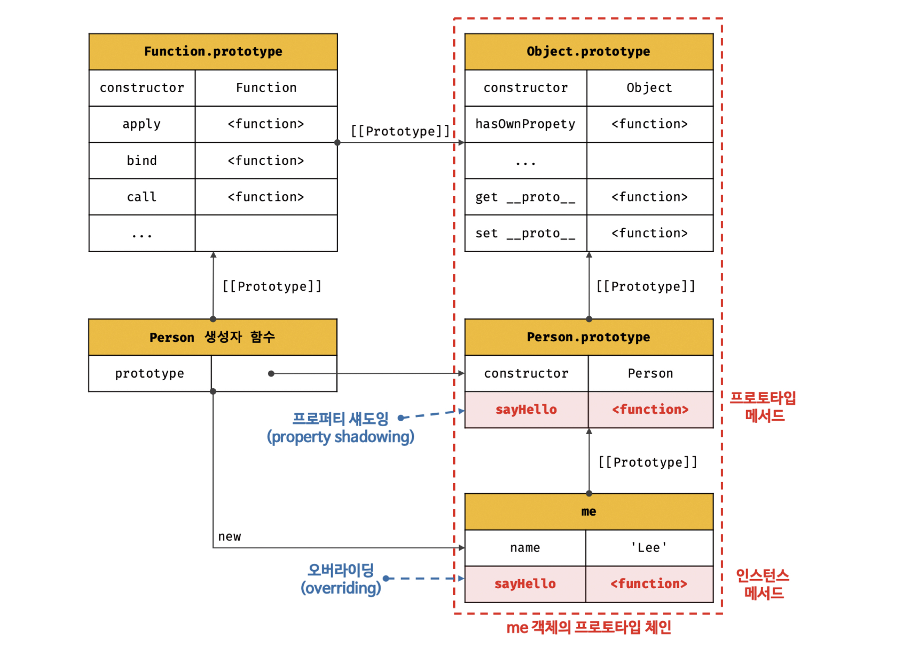
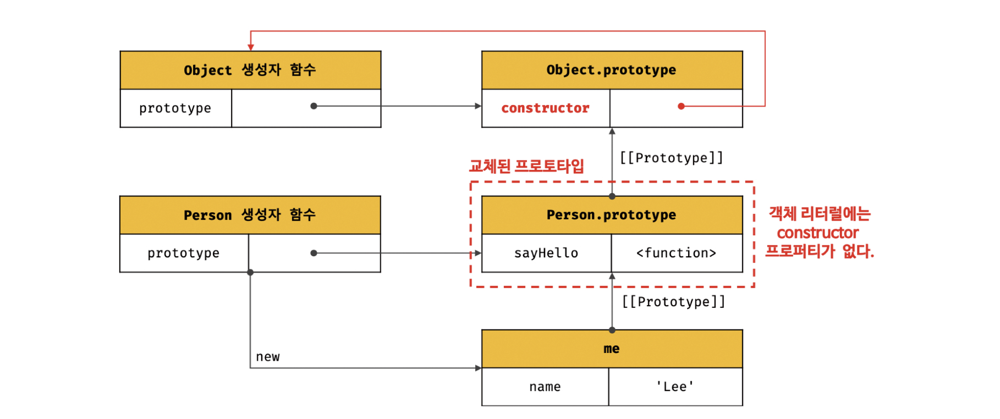
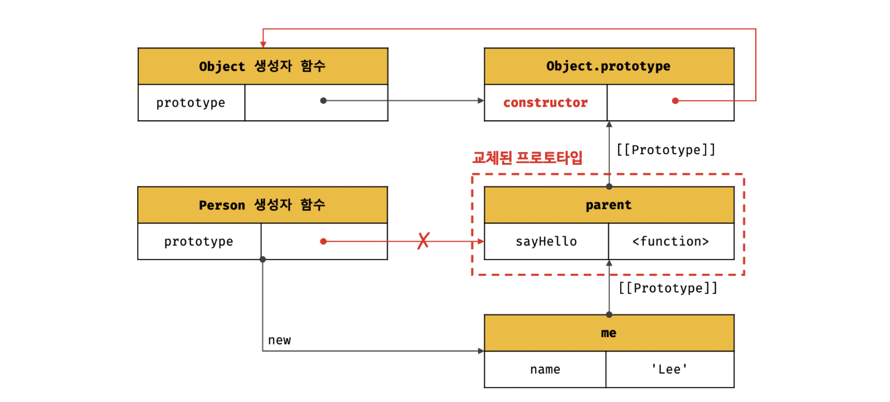
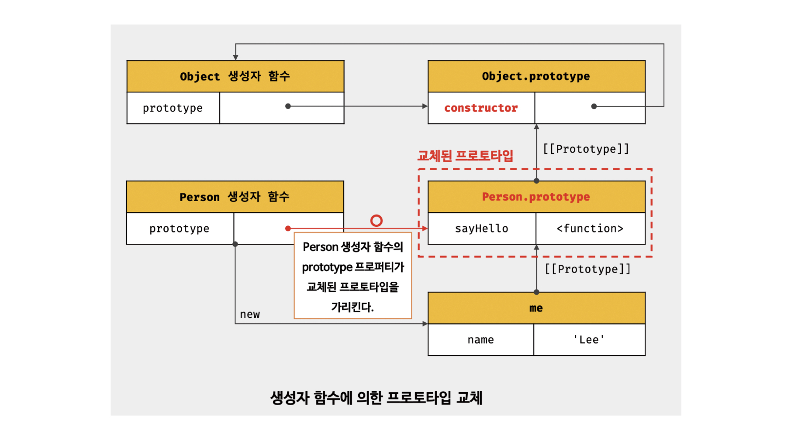
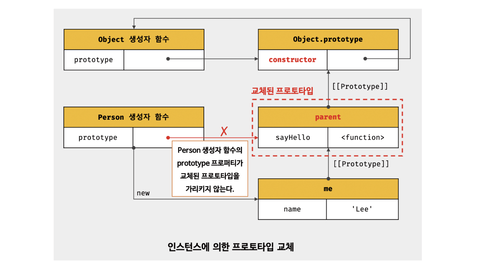
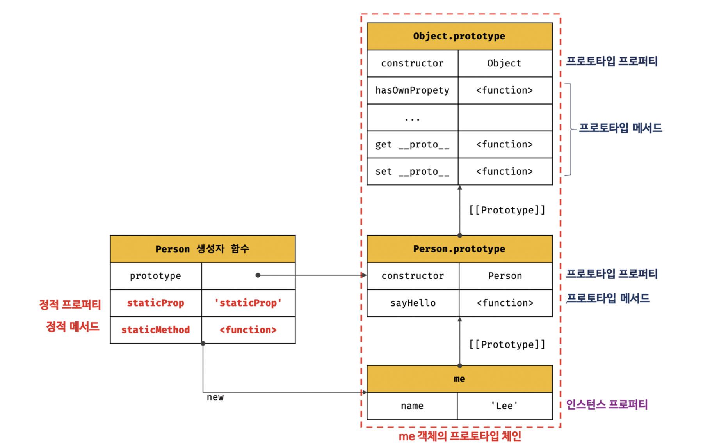

## 19.8 오버라이딩과 프로퍼티 섀도잉

예제 살펴보기

```javascript
const Person = (function(){
    function Person(name){
        this.name = name;
    }

    Person.prototype.sayHello = function () {
        console.log(`hi my name is ${this.name}`);
    }

    return Person;
})()

const me = new Person('Lee');

me.sayHello = function(){
    console.log(`HIHIHI my name is ${this.name}`)
}

me.sayHello();****
```

생성자 함수로 객체(인스턴스) 생성한 다음, 인스턴스에 메서드를 추가한 코드이다. 그림으로 다음과 같이 나타낼 수 있다!

</br>



**프로토타입 프로퍼티와 인스턴스 프로퍼티의 구분**

- 프로토타입이 소유한 프로퍼티(메서드 포함) : 프로토타입 프로퍼티
- 인스턴스가 소유한 프로퍼티 : 인스턴스 프로퍼티

**프로토타입 오버라이딩과 프로퍼티 섀도잉**

- 같은 이름의 프로퍼티를 인스턴스에 추가할 경우 프로토타입 프로퍼티를 덮어쓰지 않는다  
  ✅ 인스턴스 프로퍼티로 추가한다
- 인스턴스의 sayHello는 프로토타입의 sayHello를 오버라이딩.
- 상속관계에 의해 프로토타입의 sayHello가 가려지는 현상을 섀도잉 이라고함

      📌 오버라이딩과 오버로딩의 차이
      오버라이딩 : 상위 클래스의 메서드를 하위 클래스가 재정의해서 사용
      오버로딩 : 함수의 이름은 동일하지만, 매개변수 타입 또는 개수를 다르게 구현해서, 매개변수에 의해 메서드를 구별해서 호출하는 방식, 자바스크립트는 오버로딩 지원 x,arguments 객체를 사용해서 구현할 수는 있다.

예제

```javascript
const me = new Person("Lee");

delete me.sayHello(); //인스턴스 메서드 삭제
me.sayHello(); //hi my name is Lee -> 프로토타입 메서드

delete me.sayHello(); // 다시 삭제 시도
me.sayHello(); //hi my name is Lee -> 하위 객체를 통한 프로토타입 메서드는 향삭제 되지 않는다

delete me.prototype.sayHello(); //프로토타입 객체에 접근해서 프로퍼티 삭제
me.sayHello(); //TypeError : me.sayHello is not a fungion
```

**프로퍼티를 삭제할 때**

- 하위 객체에서 프로토타입 메서드를 삭제할 수 없다
  - 하위객체에서 get액세스느 허용되지만 set 액세스는 허용되지 않음
- 프로토타입 프로퍼티를 변경,삭제하려면 프로토타입 체인이 아닌 프로토타입에 직접 접근해야한다.
  - 인스턴스.prototype. 으로 프로토타입 객체에 접근해야 한다.

## 19.9 프로토타입의 교체

> 📌 프로토타입은 임의의 다른 객체로 변경할 수 있다  
> ( = 부모 객체의 프로토타입을 동적으로 변경할 수 있다)  
> 이러한 특징으로 객체간 상속 관계를 동적으로 변경할 수 있다
>
> 📌 프로토타입은 생성자 함수 또는 인스턴스에 의해 교체할 수 있다

### 19.9.1 생성자 함수에 의한 프로토타입의 교체

```javascript
const Person = (function () {
  function Person(name) {
    this.name = name;
  }

  //1️⃣ 생성자 함수 Person의 prototype 프로퍼티를 통해 Person 인스턴스의 프로토타입 교체
  Person.prototype = {
    sayHello() {
      console.log(`Hi My name is ${this.name}`);
    },
  };
  return Person;
})();

const me = new Person("Lee");

// 프로토타입 교체 시 constructor 프로퍼티와 생성자 함수간의 연결이 파괴
console.log(me.constructor === Person); // false

// 프로토타입 체인으로 Object.prototype의 counstructor 프로퍼티가 검색됨
console.log(me.constructor === Object); // false
```

;

프로토타입 프로퍼티를 통한 프로토타입 교체

- 1️⃣에서 Person.prototype에 객체 리터럴을 할당함
- 그림처럼 교체된 프로토타입에는 constructor 프로퍼티가 없음

  - constructor 프로퍼티는 자바스크립트 엔진이 프로토타입을 생성할 때 암묵적으로 추가하는 프로퍼티
  - 리터럴로 생성된 객체의 프로토타입 체인을 따라서 me 객체의 생성자 함수는 Person이 아닌 Object가 나온다.
      <details>
        <summary>consturctor 프로퍼티와 생성자 함수간의 연결을 살리려면?</summary>
       
       ```javascript
       const Person = (function(){
           function Person(name){
               this.name = name;
           }

           //1️⃣ 생성자 함수 Person의 prototype 프로퍼티를 통해 Person 인스턴스의 프로토타입 교체
           Person.prototype = {
               constructor:Person, // consturctor 프로퍼티에 생성자 함수를 추가해서 연결을 되살린다.
               sayHello(){
                   console.log(`Hi My name is ${this.name}`)
               }
           }
           return Person;
             }

          )()

          const me = new Person("Lee");
          // 프로토타입 교체 시 constructor 프로퍼티와 생성자 함수간의 연결이 파괴
          console.log(me.constructor === Person); // false

          // 프로토타입 체인으로 Object.prototype의 counstructor 프로퍼티가 검색됨
          console.log(me.constructor === Object); // false

  </details>

### 19.9.2 인스턴스에 의한 프로토타입의 교체

> 📌 프로토타입은 인스턴스의 \_\_proto\_\_ 접근자 프로퍼티 또는 Objecte.getPrototypeOf 메서드로 접근 가능하다  
> ( = 인스턴스에서 프로토타입을 교체할 수 있다.)

예제코드

```javascript
function Person(name) {
  this.name = name;
}

const me = new Person("Lee");

const parent = {
  sayHello() {
    console.log(`Hi My name is ${this.name}`);
  },
};

me.__proto__ = parent;
//Object.setProtoTypeOf(me, parent)와 동일하게 동작한다.

me.sayHello(); //Hi My name is Lee

// 프로토타입 교체 시 constructor 프로퍼티와 생성자 함수간의 연결이 파괴
console.log(me.constructor === Person); // false

// 프로토타입 체인으로 Object.prototype의 counstructor 프로퍼티가 검색됨
console.log(me.constructor === Object); // false
```

교체 결과


**둘의 차이는 무엇인가??**

- 교체 시기의 차이

  - 생성자 함수의 prototype 퍼티에 임의의 객체를 바인딩 하는것은, 미래의 인스턴스의 프로토타입을 교체
  - \_\_proto\_\_ 접근자 프로퍼티로 프로토타입을 교체하는것은 이미 생성된 인스턴스의 프로토타입을 교체

- 생성자 함수의 prototype 프로퍼티 차이, **_교체된 프로토타입 객체를 가리키는가?_**
  
  

- <details>
    <summary>인스턴스에서 프로토타입을 교체한 후 생성자 함수와 프로토타입 연결 되살려보기</summary>
    
        ```javascript
            function Person(name) {
                this.name = name;
            }

            const me = new Person("Lee");

            const parent = {
                // 객체 리터럴에 countructor 프로퍼티 추가
                consturctor:Person,
                sayHello() {
                    console.log(`Hi My name is ${this.name}`);
                },
            };
            //생성자함수의 protype 프로퍼티와, 프로토타입 연결
            Person.prototype == parent;

            // me 객체 프로토타입 교체
            me.__proto__ = parent;

            console.log(me.constructor === Person) //true
            console.log(me.constructor === Object) //false

            // 생성자함수의 prototype 프로퍼티가 교체된 프로토타입을 가리킴
            console.log(Person.prototype === Object.getPrototypeOf(me)); //true
        ```

    </details>
  - 프로토타입 교체를 통해 객체간의 상속을 동적으로 변경하는것은 까다롭다.. 직접 교체하지 않는것이 좋다
    - 상속을 인위적으로 설정하려면 19.11의 직접상속이 더 편리하다
    - ES6의 클래스를 사용해서 간편하고 직관적으로 상속할 수 있다.

## 19.10 instanceof 연산자

> 📌 객체 instanceof 생성자 함수  
> 💡 우변의 생성자 함수의 prototype에 바인딩된 객체가 좌변 **프로토타입 체인 상에** 존재하면 true아니면 false

```javascript
function Person(name) {
  this.name = name;
}
const me = new Person();

console.log(me instanceof Person); // true;
console.log(me instanceof Object); // true;
```

**프로토타입을 교체하면?**

```javascript
function Person(name) {
  this.name = name;
}

const me = new Person("Lee");

const parent = {};

//프로토타입 교체
me.__proto__ = parent;

console.log(Person.prototype === parent); //false
console.log(parent.constructor === Person); //false

//Person.prototype이 me 객체의 프로토타입 체인 상에 존재하지 않아서 false
console.log(me instanceof Person); //false
//Object.prototype이 me 객체의 프로토타입 체인 상에 존재 console.log(me instanceof Object) //true;
```

**교체된 프로토타입 객체를 바인딩 해준다면?**

```javascript
function Person(name) {
  this.name = name;
}

const me = new Person("Lee");

const parent = {};

//프로토타입 교체
me.__proto__ = parent;

//Person 생성자 함수는 parent 객체와 연결 되어있지 않음
console.log(Person.prototype === parent); //false
console.log(parent.constructor === Person); //false

// parent 객체를 Person 생성자 함수의 prototype 프로퍼티에 바인딩하면?
Person.prototype = parent;

//Person.prototype이 me 객체의 프로토타입 체인 상에 존재하므로 true
console.log(me instanceof Person); //true
//Object.prototype이 me 객체의 프로토타입 체인 상에 존재하므로 true;
console.log(me instanceof Object); //false
```

> 💡💡instanceof 연산자는 프로토타입의 constructor 프로퍼티가 가리키는 생성자 함수를 찾는게 아니라, 생성자 함수의 prototype에 바인딩 된 객체가 프토토타입 체인에 있는지 확인한다!!  
> 💡 생성자 함수에 의해 프로토타입이 교체되어 constructor 프로퍼티와 생성자 함수 간의 연결이 파괴되어도, 생성자 함수의 property와 프로토타입간의 연결이 파괴되지 않으므로 instaceof는 아무런 영향을 받지 않는다,

## 19.11 직접 상속

### 19.11.1 Object.create에 의한 직접 상속

### 19.11.2 객체 리터럴 내부에서 \_\_proto\_\_ 에 의한 직접 상속

## 19.12 정적 프로퍼티 / 메서드

> 📌 생성자 함수로 인스턴스를 생성하지 않아도 참조 / 호출할 수 있는 프로퍼티 / 메서드

```javascript
function Person(name) {
  this.name = name;
}

Person.prototype.sayHello = function () {
  console.log(`Hi My name is ${this.name}`);
};

Person.staticProp = "staticProp";
Person.staticMethod = function () {
  console.log("staticMethod");
};

const me = new Person("Lee");

Person.staticMethod(); //staticMethod
me.staticMethod(); //TypeError : me.staticMethod is not a function
```



- Person 생성자 함수도 객체
  - 자신의 프로퍼티 / 메서드를 소유할 수 있다.
    - 정적 프로퍼티, 메서드는 생성자 함수가 생성한 인스턴스로 참조/ 호출 불가능
- Object.create / Object.prototype.hasOwnProperty
  - Object.create : 정적 메서드, Object 생성자 함수가 생성한 객체로 호출 불가능하다
  - Object.prototype.hasOwnProperty : 모든 객체의 프토토타입 체인의 종점. Object.prototype의 메서드이므로 모든 객체가 호출 가능

## 19.13 프로퍼티 존재 확인

### 19.13.1 in 연산자

> 객체 내에 특정 프로퍼티가 존재하는지 여부 확인
> 💡 확인 대상 객체의 프로퍼티뿐만 아니라 모든 프로토타입 체인의 프로퍼티를 확인하므로 조심할것
> 사용방법

```javascript
key in object;
```

```javascript
const person = { name: "lee" };
console.log("name" in person); //true
console.log("age" in person); //false

// 주의사항, 프로토타입 체인 내의 모든 프로퍼티를 확인한다.
console.log("toString" in person); // true
```

### 19.13.2 Object.prototype.hasOwnProperty 메서드

> Object.prototype.hasOwnProperty 메서드로도 확인 가능하다
> 💡 인수로 전달받은 키가 객체 고유의 프로퍼티 키일 경우만 true 반환, 상속받은 프로퍼티의 키일경우 false 반환

사용방법

```javascript
obj.hasOwnProperty(params);
```

예제

```javascript
console.log(person.hasOwnProperty("name")); //true
```

```javascript
console.log(person.hasOwnProperty("toString")); //false
```

## 19.14 프로퍼티 열거

### 19.14.1 for ... in 문

> 객체의 모든 프로퍼티를 순회하며 열거하려면 for in 문을 사용한다

```javascript
const person = { name: "lee", address: "seoul" };

//person 안의 프로퍼티를 순회하며 실행
for (let key in person) {
  //key에는 peron 안의 프로퍼티 키가 할당된다.
  console.log(`${key} : ${person[key]}`);
}
//name : Lee
//address  seoul
```

- 주의사항
  - in 연산자 동작방식으로 작동함 상속받은 프로토타입의 프로퍼티까지 열거
  - Object.property가 열거되지 않는 이유는 Object.prototype 프로퍼티가 열거할수 없도록 정의되어있기 떄문이다.
  - 상속받은 프로퍼티를 제외하고 객체 자신의 프로퍼티만 열거하려면, Object.prototype.haswOwnProperty 메서드를 사용해야함.
  - 배열에서는 for of 또는 forEach 메서드를 사용할것을 추천
    - for of는 값을 할당해준다.
- 동작방식
  - 프로토타입 체인 내의 프로퍼티중에서 [[Enumerable]]이 true인 프로퍼티 순회하며 열거
  - 키가 심벌인 프로퍼티는 열거하지 않는다

### 19.14.2 Object.keys/values/entries 메서드

- Object.keys: 자신의 열거 가능([[Enumerable]]이 true)한 프로퍼티 키를 배열로 반환한다
- Object.values: 자신의 열거 가능([[Enumerable]]이 true)한 프로퍼티 값을를 배열로 반환한다
- Object.entries: 자신의 열거 가능([[Enumerable]]이 true)한 프로퍼ㅌ티 키, 값의 쌍을 배열에 담아 반환한다
