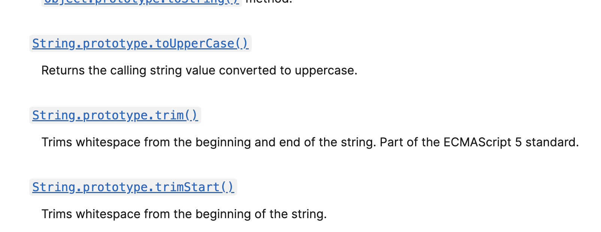
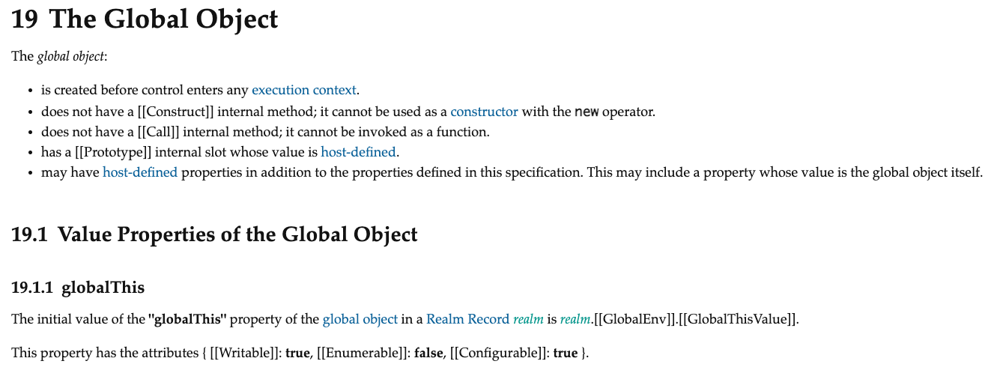

# 21장 빌트인 객체

## 21.1 자바스크립트 객체의 분류

- 표준 빌트인 객체(standard built-in objects/native objects/global objects)

  - ECMAScript 사양에 정의된 객체
  - 자바스크립트 실행환경에 관계없이 사용가능(브라우저든 Node.js 환경이든 상관없다.)
  - 전역 객체의 프로퍼티로 참조가능하다.

  ```js
  // Math는 표준 빌트인 객체로 전역 객체(globalThis,window 등)의 프로퍼티이다.
  console.log(Math.round(1.2));
  ```

- 호스트 객체(host objects)

  - ECMAScript 사양에는 정의되어 있지 않지만 자바스크립트 실행환경에서 추가로 제공하는 객체
  - 브라우저의 [WEB API](https://developer.mozilla.org/ko/docs/Web/API) : (DOM, BOM, XMLHttpRequest, SVG, Web storage, Web Component, Web worker ...)
  - Node.js 환경에서도 호스트 객체([참고](https://nodejs.org/api/repl.html))를 제공함

- 사용자 정의 객체(user-defined objects)
  - 사용자가 직접 정의하는 객체

## 21.2 표준 빌트인 객체

- Object, String, Number, Boolean, Symbol, Date, Math 등의 빌트인 객체를 제공한다.([MDN Global Objects](https://developer.mozilla.org/ko/docs/Web/JavaScript/Reference/Global_Objects))

```js
const strObj = new String('ojj');
console.log(typeof strObj); // object

const nubObj = new Number('ojj');
console.log(typeof nubObj); // object

const boolObj = new Boolean('ojj');
console.log(typeof boolObj); // object
```

- 생성자 함수인 표준 빌트인 객체가 생성한 인스턴스의 프로토타입은 표준 빌트인 객체의 prototype 프로퍼티에 바인딩된 객체이다.
- 생성자 함수 객체인 표준 빌트인 객체는 프로토타입 메서드와 정적 메서드를 제공한다.
- 생성자 함수 객체가 아닌 표준 빌트인 객체는 정적 메서드만 제공한다.(예 - `Math`, `JSON`)

```js
const strObj = new String('ojj');

// String 생성자 함수를 통해 만든 인스턴스 strObj의 프로토타입은 String.prototype이다.
console.log(Object.getPrototypeOf(strObj) === String.prototype); // true

// String.prototype에 있는 다양한 프로토타입 메서드를 strObj가 사용할 수 있다.
// 이와 같이 프로토타입 메서드를 모든 String 인스턴스가 상석을 통해 사용할 수 있다.
console.log(strObj.trim());

// 정적 메서드도 사용할 수 있다.
console.log(Number.isInteger(1.2)); // false
```

[MDN String](https://developer.mozilla.org/ko/docs/Web/JavaScript/Reference/Global_Objects/String)



## 21.3 원시값과 래퍼 객체

- 문자열, 숫자, 불리언 등은 원시값이 있는데 왜 String, Number, Boolean 등의 생성자 함수가 존재할까?

```js
const str = 'hello';

// 원시 타입인 문자열이 프로퍼티와 메서드를 갖는 객체처럼 동작한다.
console.log(str.length);
console.log(str.toUpperCase());
```

- 원시값의 경우 객체처럼 마침표 표기법으로 접근하면 자바스크립트 엔진이 일시적으로 원시값을 연관된 객체로 변환해준다.
- 즉, 원시값과 연관된 객체를 암묵적으로 생성하고 그 생성된 객체로 프로퍼티에 접근하거나 메서드를 호출하고 다시 원시값으로 되돌린다.
- 이처럼 **문자열, 숫자, 불리언 값에 대해 객체처럼 접근하면 생성되는 임시 객체를 래퍼 객체 wrapper object**라 한다.

```js
const str = 'hello';

// 원시 타입인 문자열이 프로퍼티와 메서드를 갖는 객체처럼 동작한다.
console.log(str.length);
console.log(str.toUpperCase());

// 래퍼 객체로 프로퍼티에 접근하거나 메서드로 호출한 후, 다시 원시값으로 되돌린다.
console.log(typeof str); // string
```

- **원시값과 레퍼객체**

  ```js
  // 1. 식별자 str은 문자열을 값으로 가지고 있다.
  const str = 'hello';

  // 2. 식별자 str은 암묵적으로 생성된 래퍼 객체를 가리킨다.
  str.name = 'ojj';

  // 3. 식별자 str은 다시 원래의 문자열을 갖게 된다.
  // 2에서 생성한 래퍼 객체를 아무도 참조하지 않으므로 가비지 컬렉션의 대상이 된다.

  // 4. 식별자 str은 새롭게 암묵적으로 생성된 래퍼 객체를 가리킨다.
  // 2에서 생성된 래퍼객체와는 다른 래퍼 객체로 str.name을 참조하게 되면 이전의 래퍼 객체가 아닌 새로 만든 래퍼 객체를 참조하게 된다.
  console.log(str.name); // undefined

  // 5. 식별자 str은 다시 원래의 문자열을 갖게 된다.
  // 4에서 생성한 래퍼 객체를 아무도 참조하지 않으므로 가비지 컬렉션의 대상이 된다.
  console.log(typeof str, str); // string, hello
  ```

## 21.4 전역 객체

- 전역 객체는 코드가 실행되기 이전 단계에 자바스크립트 엔진에 의해 어떤 객체보다도 먼저 생성되는 특수한 객체이며 최상위 객체이다.

[https://262.ecma-international.org/13.0/#sec-global-object](https://262.ecma-international.org/13.0/#sec-global-object)


- 전역 객체는 표준 빌트인 객체와 호스트 객체(host-defined object), var키워드로 선언한 전역 변수와 전역 함수를 프로퍼티로 가진다.
- 전역 객체의 특진

  - 개발자가 의도적으로 전역 객체를 생성할 수 없다. 생성자 함수를 제공하지 않는다.
  - 전역 객체의 프로퍼티를 잠조할 때 window(또는 global)을 생략하 수 있다.
  - 전역 객체는 표준 빌트임 프로퍼티를 가진다. 또한 호스트 객체(브라우저에서는 WEB API를 가짐)
  - var 키워드로 선언한 전역 변수와 전역함수, var 키워드로 선언하지 않은 변수에 값을 할당한 암묵적 전역은 전역 객체의 프로퍼티가 된다.
    (주의: let, const 키워드로 선언한 전역 변수와 함수는 전역 객체의 프로퍼티가 아니다.)

  ```js
  // 전역변수
  var foo = 1;
  console.log(window.foo); // 1

  // 암묵적 전역
  bar = 2;
  console.log(window.bar); // 2

  // 전역변수
  function func() {
    funcVal = 3;
    // 암묵적 전역
    console.log(window.funcVal);
  }

  window.func(); // 3

  // 전역함수
  function baz() {
    return 4;
  }
  console.log(window.baz()); // 4
  ```

### 21.4.1 빌트인 전역 프로퍼티

- 빌트인 전역 프로퍼티(built-in global property)는 전역 객체의 프로퍼티를 의미한다.
- `Infinity`

  ```js
  console.log(window.Infinity === Infinity); // ture

  console.log(3 / 0); // Infinity
  console.log(-3 / 0); // -Infinity

  // Infinity는 숫자값이다.
  console.log(typeof Infinity); // number
  ```

- `NaN` -> Not-a-Number

  ```js
  console.log(window.NaN); // NaN
  console.log(Number('asdf')); // NaN
  console.log(1 * 'str'); // NaN
  console.log(typeof NaN); // number

  console.log(NaN === NaN);
  ```

- `undefined`
  ```js
  console.log(window.undefined); // undefined
  console.log(typeof undefined); // undefined
  ```

### 21.4.2 빌트인 전역 함수

- 빌트인 전역 함수(built-in global function)은 전역에서 호출할 수 있는 빌트인 함수로 전역 객체의 메서드이다.
- `eval`, `isFinite`, `isNaN`, `parseFloat`, `parseInt`, `encodeURI`/`decodeURI`, `encodeURIComponent`/`decodeURIComponent` 가 빌트인 전역 함수에 해당한다.
- 자세한 사용법은 모던 자바스크립트 deep dive p.329-339 에 있다.

### 21.4.3 암묵적 전역

```js
var x = 10;

function foo() {
  // 선언하지 않은 식별자에 값 할당 -> 전역 객체의 프로퍼티가 됨
  // window.y -> 20
  y = 20;
}
foo();

console.log(x + y); // 30
```

- y는 선언하지 않은 식별자임에도 불구하고 y를 참조하게 되면 에러가 발생하지 않는다.
- 선언하지 않은 식별자에 값을 할당하면(`y = 20`) 전역 객체의 프로퍼티가 되기 때문이다.
- 이러한 현상을 암묵적 전역이라고 한다. 자바스크립트 엔진이 y라는 변수에 값을 할당하기 위해 스코프 체인을 통해 선언된 변수가 있는지 확인한다.
- 하지만 `y = 20`을 `window.y = 20` 으로 해석하여 전역 객체의 프로퍼티를 **동적으로 생성**한다.
- y는 변수 선언을 하지 않고 단지 전역 객체의 프로퍼티를 동적으로 생성한 것이기 때문에 호이스팅이 발생하지 않는다.
  ```js
  console.log(y); // ReferenceError: y is not defined
  y = 20;
  ```
