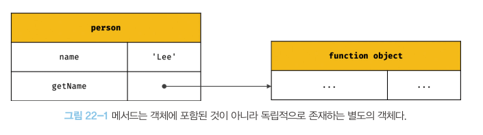

# 22장 this
```jsx
const circle ={
	radius : 5,
	getDiameter() {
		return 2 * circle.radius;
	}
};

console.log(circle.getDiameter()); // 10
```

- 위 예제의 경우 객체 리터럴의 평가가 완료되어 객체가 생성되었고, circle 식별자에 생성된 객체가 할당된 이후이기 때문에 메서드 내에서 circle 식별자를 참조할 수 있다.
- 하지만 재귀적으로 객체를 참조하는 방식은 일반적이지도 않고 바람직하지 않다.

<aside>
💡  자신이 속한 객체 또는 자신이 생성할 인스턴스를 가리키는 특수한 식별자가 필요하고, `this`가 바로 그 식별자이다.

</aside>

## 22.1 this 키워드

- 자바스크립트의 일반적인 함수들은 this라는 변수를 가지고 있다.
- this는 해당 함수를 메서드로 가지고 있는 객체 또는 해당 함수가 생성할 객체를 참조하는 변수이다.
- this는 암묵적으로 생성되고, 코드 어디서든 참조 가능하다.
- this는 함수 내에서 쓰일 때 의미가 있지만 전역에서도 참조할 수는 있다.
- this가 가리키는 값, 즉 this 바인딩은 함수 호출 방식에 의해 동적으로 결정된다.
- this를 전역에서 참조할 경우 다음과 같이 동작한다.
    - 브라우저에서 동작할 경우 this는 전역 객체인 window를 참조한다.
    - node REPL에서 this는 전역 객체인 global을 참조한다.
    - commonJS의 모듈 시스템을 따르는 node 환경에서는 module.exports를 의미한다.
    - 브라우저 환경일 때, strict mode라면 undefined가 할당된다.
    

## 22.2 함수 호출 방식과 this 바인딩

this 바인딩은 함수 호출 방식, 즉 함수가 어떻게 호출되었는지에 따라 동적으로 결정된다.

주의할 것은 동일한 함수도 다양한 방식으로 호출할 수 있다는 것이다.

### 22.2.1 일반 함수 호출

- 기본적으로 this에는 전역객체가 바인딩 된다.
- 객체를 생성하지 않는 일반함수에서의 this는 의미가 없다.
- strict mode가 적용된 일반함수 내부의 this에는 undefined가 바인딩된다.

```jsx
function foo() {
	console.log("foo's this: ", this); //window
	function bar() {
	console.log("bar's this: ", this); //window
	}
	bar();
}

foo();
```

- 콜백 함수가 일반 함수로 호출된다면 콜백 함수 내부의 this에도 전역객체가 바인딩된다.
- 하지만 메서드 내에서 정의한 중첩함수 또는 메서드에게 전달한 콜백함수가 일반함수로 호출될 때 그 함수들의 this가 전역 객체를 바인딩하는 것은 문제가 있다.
- 외부 함수인 메서드와 중첩함수 도는 콜백 함수의 this가 일치하지 않는다는 것은 중첩, 콜백 함수를 헬퍼함수로서 동작하기 어렵게 한다.

**해결책**

1. this 바인딩을 다른 변수에 할당

```jsx
var value = 1;

const obj = {
  value: 100,
  foo() {
    const that = this;
    setTimeout(function () {
      console.log(that.value);
    }, 100);
  },
};

obj.foo();
```

1. 콜백함수에 명시적으로 this를 바인딩

```jsx
var value = 1;

const obj = {
  value: 100,
  foo() {
    setTimeout(function () {
      console.log(this.value);
    }.bind(this), 100);
  },
};

obj.foo();
```

1. 화살표 함수 이용

화살표 함수 내부의 this는 상위 스코프의 this를 가리킨다.

```jsx
var value = 1;

const obj = {
  value: 100,
  foo() {
    setTimeout(()=>console.log(this.value), 100);
  }
};

obj.foo();
```

### 22.2.2 메서드 호출

```jsx
const person = {
    name: 'Lee',
    getName() {
        return this.name;
    }
};

console.log(person.getName()); //Lee
```

위 예제에 getName 메서드는 person 객체의 메서드로 정의되었다. 

- 메서드는 프로퍼티에 바인딩된 함수이기에 getName프로퍼티가 가리키는 함수 객체는 person에 포함된 것이 아닌, 독립적으로 존재하는 별도의 객체이다.
- 따라서 메서드 내부의 this는 프로퍼티로 메서드를 가리키는 객체와 상관 없고, 메서드를 호출한 객체에 바인딩 된다.



- 프로토타입 메서드 내부에서 사용된 this도 일반 메서드와 마찬가지로 해당 메서드를 호출한 객체에 바인딩 된다.

### 22.2.3 생성자 함수 호출

- new 연산자와 함께 호출되는 경우 함수는 생성자로써 호출된다.
- 생성자 함수 내부에서 this는 생성할 객체를 의미한다.
- 생성자 함수의 동작을 간단히 나타내면 다음과 같다.
    
    
    ```jsx
    function Circle(radius) {
    
        this.radius = radius;
        this.getDiameter = function() {
            return 2*this.radius;
        };
    }
    
    const circle1 = new Circle(5);
    const circle2 = new Circle(10);
    
    console.log(circle1.getDiameter()); //10
    console.log(circle2.getDiameter()); //20
    
    //new 연산자 없이 호출되면 일반적인 함수 호출이다
    const circle3 = Circle(15);
    console.log(circle3); //undefined
    
    //일반 함수로 호출된 Circle 내부의 this는 전역객체를 가리킨다.
    console.log(radius); //15
    ```
    

### 22.2.4 Function.prototype.apply/call/bind 메서드에 의한 간접 호출

apply, call,bind 메서드는 Function.prototype의 메서드이다. 즉 모든 함수가 이를 상속받아 사용할 수 있다.

1. **apply, call**
    - **apply**와 **call** 메서드는 호출할 함수에 인수를 전달하는 방식만 다를 뿐 동일하게 동작한다.
    - **apply** 메서드는 호출할 함수의 인수를 배열로 묶어 전달한다.
    - **call** 메서드는 호출할 함수의 인수를 쉼표로 구분하는 리스트 형식으로 전달한다.
    - 대표적인 용도는 arguments 객체와 같은 유사 배열 객체에 배열 메서드를 사용하는 경우다.
    - arguments 객체는 배열이 아니기때문에 slice 메서드같은 배열의 메서드를 사용할 수 없다.
    
    ```jsx
    function getThisBinding() {
      console.log(arguments);
      return this;
    }
    
    const thisArgs = { a: 1 };
    
    //apply 메서드는 배열 형식
    console.log(getThisBinding.apply(thisArgs, [1, 2, 3]));
    //call 메서드는 리스트 형식
    console.log(getThisBinding.call(thisArgs, 1, 2, 3));
    ```
    
2. **bind**
    - bind메서드는 apply, call 메서드와 달리 함수를 호출하지 않는다. 다만 첫 번째 인수로 전달한 값으로 this 바인딩이 교체된 함수를 새롭게 생성해 반환한다.
    
    ```
    function getThisBinding() {
      return this;
    }
    
    const thisArgs = { a: 1 };
    
    console.log(getThisBinding.bind(thisArgs)); //getThisBinding
    
    //bind 메서드는 함수를 호출하지 않으므로 명시적으로 호출해야한다.
    console.log(getThisBinding.bind(thisArgs)()); //{ a: 1 }
    ```
    
    - bind 메서드는 메서드의 this와 메서드 내부의 중첩 함수 또는 콜백 함수의 this가 불일치하는 문제를 해결하기위해 사용된다.
    
    ```jsx
    const person = {
        name : 'Lee',
        foo(callback){
            setTimeout(callback, 100);
        }
    };
    
    person.foo(function(){
        console.log(`Hi my name is ${this.name}.`); //Hi my name is .
        //브라우저 환경 상에서 window.name은 브라우저 창의 이름을 나타내는 
    		//빌트인 프로퍼티이며 기본 값은 ''이다.
    })
    ```
    
    ```jsx
    const person = {
        name : 'Lee',
        foo(callback){
    				//bind 메서드로 콜백함수 내부의 this 바인딩을 전달.
            setTimeout(callback.bind(this), 100);
        }
    };
    
    person.foo(function(){
        console.log(`Hi my name is ${this.name}.`); //Hi my name is Lee.
       
    })
    ```
    
    