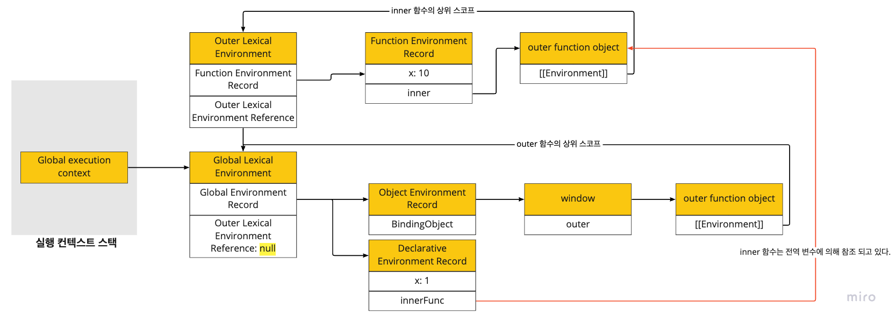

# 24장 클로저

- 실행 컨텍스트에 대한 내용이 선행되어야 한다.
- 클로저는 자바스크립트 고유의 개념이 아니다.
  - 함수를 일급 객체로 취급하는 언어(Haskell, Lisp, Erlang, Scala)에서 사용하는 중요한 특성이다.
- [MDN](https://developer.mozilla.org/en-US/docs/Web/JavaScript/Closures)에서는 클로저를 다음과 같이 정의하고 있다.
  > A closure is the combination of a function bundled together (enclosed) with references to its surrounding state (the lexical environment). In other words, a closure gives you access to an outer function’s scope from an inner function.
  > 클로저는 그것을 둘러싸는 상태(렉시컬 환경)에 대한 참조와 함께 묶여진(닫혀진) 함수의 조합이다. 다시 말해 클로저는 내부 함수로부터 외부 함수의 스코프에 접근하도록 해준다.
- 위 정의에 중요한 키워드는 *“surrounding state (the lexical environment)”*으로 이 의미를 알아야 한다.

```jsx
const x = 1;

function outerFunc() {
  const x = 10;
  function innerFunc() {
    console.log(x); // 10
  }
  innerFunc();
}

outerFunc();
```

- outerFunc 함수 내부에 중첩 함수로 innerFunc 함수를 정의하고 있는데, 이때 innerFunc 함수의 상위스코프는 외부 함수 outerFunc의 스코프다.
- innerFunc 함수는 outerFunc의 스코프에 있으므로 outerFunc의 x 변수에 접근할 수 있다.

```jsx
const x = 1;

function outerFunc() {
  const x = 10;
  innerFunc();
}

function innerFunc() {
  console.log(x); // Q. 무엇이 출력될까요?
}

outerFunc();
```

- 이번에는 outerFunc 함수 외부에 innerFunc 함수를 정의했다.
- innerFunc 함수를 outerFunc 함수 외부에 ‘정의’했기 때문에 innerFunc 함수의 상위 스코프는 전역 스코프가 된다. 즉, outerFunc 함수의 스코프에 있는 변수에는 접근할 수 없는 것이다.
- outerFunc 함수 안에서 innerFunc 함수를 호출하더라도 innerFunc 함수의 스코프는 전역 스코프이므로 innerFunc 함수에서 x 변수를 전역 스코프에서 참조할 것이다. **이런 현상이 발생하는 이유는 자바스크립트가 렉시컬 스코프를 따르는 언어이기 때문이다.**
- 따라서 출력은 1 이 나온다.

## 24.1 렉시컬 스코프

- 렉시컬 스코프(정적 스코프): 함수를 어디서 호출했는지가 아니라 **함수를 어디에 정의했는지에 따라 상위 스코프를 결정하는 것**
- 실행 컨텍스트 내용과 함께 생각해보면,(책 367쪽 `그림23-7`, 380쪽 `그림23-22` 같이 보기)
  - 스코프의 실체는 실행 컨텍스트의 렉시컬 환경이다.
  - 이 렉시컬 환경은 ‘외부 렉시컬 환경에 대한 참조 Outer Lexical Environment Reference’를 통해 상위 렉시컬 환경과 연결되는데 이것이 스코프 체인이다.
  - 함수의 “상위 스코프를 결정하는 것”은 “렉시컬 환경의 외부 렉시컬 환경에 대한 참조값을 결정”하는 말과 동일하다.
  - **렉시컬 환경의 “외부 렉시컬 환경에 대한 참조”에 저장할 참조값, 즉 상위 스코프에 대한 참조는 함수 정의가 평가되는 시점에 함수가 정의된 환경에 의해 결정된다. 이것이 렉시컬 스코프다.**

## 24.2 함수 객체의 내부 슬롯 [[Environment]]

```jsx
const x = 1;

function foo() {
  const x = 10;
  bar();
}

function bar() {
  console.log(x);
}

foo(); // ?
bar(); // ?
```

foo와 bar 함수는 전역함수이므로 상위 스코프는 전역이다. 두 함수는 전역 코드가 평가될 때 함수 객체가 만들어지고, 두 함수는 내부 슬롯 `[[Environment]]` 에 현재 실행 중인 실행 컨텍스트 즉, 전역 실행 컨텍스트의 렉시컬 환경을 기억하게 된다.

왜 `[[Environment]]` 가 현재 실행중인 실행컨텍스트의 렉시컬 환경을 가리키는걸까?

**함수 객체가 생성되는 시점은 함수가 정의된 환경, 즉 상위 함수가 평가되거나 실행되고 있는 시점이며, 이때 현재 실행 중인 실행 컨텍스트는 상위 함수(또는 전역 코드)의 실행 컨텍스트이기 때문이다.**

bar 함수가 호출되어 함수 코드가 평가될 때, bar함수의 렉시컬 환경의 **외부 렉시컬 환경에 대한 참조에 함수 객체가 만들어질 때의 내부 슬롯 `[[Environment]]` 에 저장된 렉시컬 환경의 참조가 할당**된다. 즉, 내부 슬롯 `[[Environment]]` 에 저장된 렉시컬 환경의 참조가 bar 함수의 상위 스코프인 것이다.

bar 함수 코드가 실행될 때, 변수 x의 식별자를 검색하기 위해 상위 스코프로 이동하면서 검색한다. bar 함수의 상위 스코프는 전역이므로 x에 1이라는 값이 바인딩된다.

## 24.3 클로저와 렉시컬 환경

```jsx
const x = 3;

// (1)
function outer() {
  const x = 10;
  const inner = function () {
    console.log(x);
  }; // (2)
  return inner;
}

const innerFunc = outer(); // (3)
innerFunc(); // (4)
```

- (3)에서 outer함수는 중첩 함수 inner를 반환하고 생명 주기를 마감한다.
- 즉, outer 함수의 호출이 종료하면 outer 함수의 실행 컨텍스트는 실행 컨텍스트 스택(콜 스택)에서 pop된다.
- 이때 outer 함수 실행 컨텍스트가 제거되었으므로 내부의 지역변수 x도 함께 제거될 것이다. outer 함수가 종료했으므로 지역변수 x에 접근할 수 없다.
- 하지만 (4)의 실행결과 10이 출력되는 것을 확인할 수 있다.
- outer함수가 종료하였지만 x변수에 접근하여 값을 참조하고 있음을 알 수 있다.

**이처럼 외부 함수(outer)보다 중첩 함수(inner)가 더 오래 유지되는 경우 중첩 함수는 이미 생명 주기를 종료한 외부 함수의 변수를 참조할 수 있다. 이러한 중첩 함수를 클로저라고 한다.**

MDN의 클로저 정의에서 “_surrounding state (the lexical environment)”_ 이라는 것은 **함수가 정의된 위치의 스코프 즉, 상위 스코프를 의미하는 실행 컨텍스트의 렉시컬 환경**을 말한다.

inner 함수는 outer 함수가 실행될 때 평가된다.(1) inner 함수가 평가될 때 함수 객체가 만들어지고 내부 슬롯 `[[Environment]]`에 현재 실행 중인 실행 컨텍스트 즉, outer 함수 실행 컨텍스트의 렉시컬 환경이 저장된다. 이것이 inner 함수가 상위 스코프를 기억하는 방식이다.

outer 함수가 호출되고 종료되어도 outer 함수의 렉시컬 환경은 사라지지 않는다. outer 함수의 렉시컬 환경은 inner 함수 객체의 `[[Environment]]` 내부 슬롯이 참조하고 있고 inner 함수는 전역 변수 innerFunc에 의해 참조되고 있으므로 GC의 대상이 되지 않는다.(그림 참고)



outer 함수의 렉시컬 환경이 GC의 대상이 되지 않는다.

outer 함수가 호출되면(2) inner 함수를 반환한다. 그리고 innerFunc 함수를 호출하게 되면 inner 함수 실행 컨텍스트가 스택에 push 된다. 그리고 inner 함수의 렉시컬 환경의 외부 렉시컬 환경에 대한 참조에는 inner 함수 객체의 `[[Environment]]` 내부 슬롯에 저장되어 있는 참조값이 할당된다.

inner 함수가 outer 함수보다 오래 생존했다. 이때 함수는 외부 함수의 생존 여부(실행 컨텍스트의 생존 여부)와 상관없이 해당 함수가 정의된 위치에 의해 결정된 상위 스코프를 기억하는 것이다.

## 24.4 클로저의 활용

- **클로저는 상태(state)를 안전하게 변경하고 유지하기 위해 사용한다.** 상태가 의도치 않게 변경되지 않도록 상태를 **안전하게 은닉(information hiding)하고 특정 함수에서만 상태 변경을 허용**하기 위해 사용한다.

함수가 호출될 때마다 그 호출 횟수를 반환하는 함수를 만든다고 해보자.

```jsx
let num = 0;

const increase = function () {
  return ++num;
};

console.log(increase()); // 1
console.log(increase()); // 2
console.log(increase()); // 3
```

- 위 코드는 의도대로 동작은 하지만 다음과 같은 이유로 안전하지 않은 코드이다.

  - num 변수는 전역 변수로 언제든지 접근하고 변경할 수 있다.

- 카운트 상태(num 변수)는 increase 함수가 호출되기 전까지 변경되지 않고 유지되어야 하는데 num이 전역 변수여서 언제든지 접근하고 변경가능하다.
- 의도치 않게 num을 수정할 수 있어 오류가 많은 코드이다.
- 카운트 상태를 안전하게 변경하고 유지하기 위해서는 increase함수만이 num변수를 참조하고 변경할 수 있도록 해야한다. 즉, 전역 변수가 아니라 increase 함수의 지역변수로 바꾸어 준다.

```jsx
const increase = function () {
  let num = 0;

  return ++num;
};

console.log(increase()); // 1
console.log(increase()); // 1
console.log(increase()); // 1
```

- num을 전역변수에서 지역변수로 바꾸어 의도치 않은 변경을 방지했다. 즉, increase 함수만이 num의 상태를 바꿀 수 있는 것이다.
- 하지만 increase 함수가 호출될 때마다 지역변수 num은 다시 선언되어 0으로 초기화되기 때문에 호출할 때마다 1이 출력된다. 다시 말해 상태가 변경되기 이전 상태를 유지하지 못한다.
- 이전 상태를 유지할 수 있도록 클로저를 사용해보면

```jsx
const increase = (function () {
  let num = 0;

  return function () {
    return ++num;
  };
})();

console.log(increase()); // 1
console.log(increase()); // 2
console.log(increase()); // 3
```

- 즉시 실행 함수(IIFE)가 호출되고 즉시 실행 함수가 반환하는 함수가 increase 변수에 할당된다.
- **increase 변수에 할당된 함수는 자신이 정의된 위치에 의해 결정된 상위 스코프인 즉시 실행 함수의 렉시컬 환경을 기억하는 클로저이다.**
- 즉시 실행 함수는 종료하지만 즉시 실행 함수가 반환하는 클로저는 increase 변수에 할당되는데, 이 클로저는 자신이 정의된 상위 스코프인 즉시 실행 함수의 렉시컬 환경을 기억한다.
- 따라거 즉시 실행 함수가 반환한 클로저는 카운트 상태를 유지하기 위한 **자유 변수** num을 언제 어디서든 호출하든지 참조하고 변경할 수 있다.
- 자유 변수(free variable): 클로저에 의해 참조되는 상위 스코프의 변수
- num 변수는 외부에서 접근할 수 없는 private 변수로 전역 변수를 사용했을 때와는 다르게 의도치 않게 변경되지 않는다.
- 이처럼 클로저는 **상태가 의도치 않게 변경되지 않도록 상태를 안전하게 은닉(information hiding)하고 특정 함수에서만 상태 변경을 허용한다.**

### 함수형 프로그래밍

- 변수 값은 누군가에 의해 언제든지 변경될 수 있어 오류 발생의 원인이 될 수 있다.
- 상태 변경이나 가변(mutable) 데이터를 피하고 불변성(immutability)을 지향하는 함수형 프로그래밍에서 부수 효과를 최대한 억제하여 오류를 피하고 프로그램의 안정성을 높이기 위해 클로저가 적극적으로 사용된다.

```jsx
// 함수를 인자로 전달받고 함수를 반환하는 고차함수
function makeCounter(predicate) {
  let counter = 0;

  return function () {
    counter = predicate(counter);
    return counter;
  };
}

function increase(n) {
  return n + 1;
}
function decrease(n) {
  return n - 1;
}

const increaser = makeCounter(increase); // (1)
console.log(increaser()); // 1
console.log(increaser()); // 2

// 주의!
// increaser 함수와는 별개의 렉시컬 환경을 갖기 때문에 카운터 상태가 연동되지 않음
const decreaser = makeCounter(decrease); // (2)
console.log(decreaser()); // -1
console.log(decreaser()); // -2
```

- 위 예제에서 카운터 상태가 연동되기를 기대했지만 그러지 못하다.
- 왜냐하면 (1)에서 반환된 함수의 렉시컬 환경과 (2)에서 반환된 함수의 렉시컬 환경이 서로 다르기 때문이다.(책 408쪽 그림 24-10을 보면 `makeCounter Lexical Environment`가 두개 있는 것을 볼 수 있다.)
- 렉시컬 환경이 두 개로 서로 다르니 카운터 상태를 연동하지 못하는 것이다.
- **반대로 말하면 카운터 상태를 연동하기 위해서는 렉시컬 환경을 하나로 공유하는 클로저를 만들어야 한다.**
- 쉽게 makeCounter를 두번 호출하지 않으면 된다.

```jsx
const counter = (function () {
  let counter = 0;

  return function (predicate) {
    counter = predicate(counter);
    return counter;
  };
})();

function increase(n) {
  return n + 1;
}
function decrease(n) {
  return n - 1;
}

console.log(counter(increase)); // 1
console.log(counter(increase)); // 2

console.log(counter(decrease)); // 1
console.log(counter(decrease)); // 0
```

## 24.5 캡슐화와 정보 은닉

- 캡슐화(encpsulation)는 객체의 **상태(state)**를 나타내는 프로퍼티와 프로퍼티를 참조하고 조작할 수 있는 **동작(behavior)**인 메서드를 하나로 묶는 것이다.
- 캡술화는 객체의 특정 프로퍼티나 메서드를 감출 목적으로 사용하기도 하는데 이를 정보 은닉(information hiding)이라 한다.
- OOP(Object-oriented Programming) 언어는 클래스를 정의하고 그 클래스를 구성하는 멤버에 대해 public, private, protected 같은 접근 제어자(access modifier)를 선언하여 프로퍼티나 메서드의 공개 범위를 한정할 수 있다.
- 자바스크립트는 객체의 모든 프로퍼티와 메서드가 기본적으로 외부에 공개되어 있다.
- 현재 자바스크립트는 접근 제어자를 제공해주고 있으나 접근 제어자가 없었던 이전에는 어떻게 이를 구현하려고 했을까?
  - [Private](https://developer.mozilla.org/en-US/docs/Web/JavaScript/Reference/Classes/Private_class_fields)
  - [Public](https://developer.mozilla.org/en-US/docs/Web/JavaScript/Reference/Classes/Public_class_fields)

```jsx
function Person(name, age) {
  this.name = name; // public
  let _age = age; // private

  this.sayHi = function () {
    console.log(`Hi! I am ${this.name}. I am ${_age}`);
  };
}

const me = new Person('ojj', 24);
me.sayHi();
console.log(me.name, me._age);

const you = new Person('Kim', 34);
you.sayHi();
console.log(you.name, you._age);
```

```jsx
function Person(name, age) {
  this.name = name; // public
  let _age = age; // private
}
Person.prototype.sayHi = function () {
  console.log(`Hi! I am ${this.name}. I am ${_age}`);
};
// _age를 참조할 수 없는 문제가 발생한다.
```

```jsx
const Person = (function () {
  let _age = 0; // private

  function Person(name, age) {
    this.name = name; // public
    _age = age;
  }

  // 프로토타입 메서드
  Person.prototype.sayHi = function () {
    console.log(`Hi! I am ${this.name}. I am ${_age}`);
  };

  return Person;
})();

const me = new Person('ojj', 24);
me.sayHi(); // Hi! I am ojj. I am 24
console.log(me.name, me._age); // ojj undefined

const you = new Person('Kim', 34);
you.sayHi(); // Hi! I am Kim. I am 34
console.log(you.name, you._age); // Kim undefined

// 주의!
// _age 변수 값이 바뀌었다!
// 이유가 무엇일까요?
me.sayHi(); // Hi! I am ojj. I am 34
```

## 24.6 자주 발생하는 실수

```jsx
var funcs = [];

for (var i = 0; i < 3; i++) {
  funcs[i] = function () {
    return i;
  }; // (1)
}

for (var j = 0; j < funcs.length; j++) {
  console.log(funcs[j]()); // (2) 어떻게 출력이 될까?
}
```

- 결론부터 말하면 (2)에서 모두 3이 출력된다.
- var는 함수 레벨 스코프를 가지기 때문에 변수 i는 전역변수이다. 물론 변수 j도 전역변수이다.
- `i`값이 0, 1, 2로 바뀌다가 마지막에 3으로 바뀌기 때문에 funcs 배열 요소로 추가한 함수를 호출했을 때 참조하는 `i` 는 전역변수 `i`인 것이다.

해결책1

```jsx
var funcs = [];

// let을 사용하자
// let은 블록 레벨 스코프를 가지기 때문이다
for (let i = 0; i < 3; i++) {
  funcs[i] = function () {
    return i;
  }; // (1)
}

for (let j = 0; j < funcs.length; j++) {
  console.log(funcs[j]()); // 0 1 2
}
```

해결책2

```jsx
var funcs = [];

// 클로저를 이용해 넘어온 인자를 매개변수 id에 할당한 후 중첩함수를 반환한다.
// 반환된 중첩함수 즉 클로저가 funcs 배열의 각 요소에 할당되는데, 할당되는 함수는 id값을 참조할 수 있다.
for (var i = 0; i < 3; i++) {
  funcs[i] = (function (id) {
    return function () {
      return id;
    };
  })(i);
}

for (var j = 0; j < funcs.length; j++) {
  console.log(funcs[j]()); // 0 1 2
}
```
