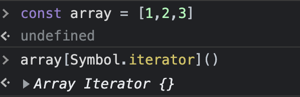

# 33장 7번째 데이터 타입 Symbol

## 33.1 심벌이란?

> ✅ ES6에 도입된 7번째 데이터타입, 변경 불가능한 원시 타입의 값  
> ✅ 다른 값과 중복되지 않는 유일무이한 값이다  
> 💡 중복되지 않는 상수값을 생성, 기존 코드에 영향을 주지 않고 새로운 프로퍼티를 추가하기 위한 하위 호환성을 보장하기 위해 도입

- 주로 사용하는 곳 : 충돌 위험이 없는 유일한 프로퍼티를 만들기 위해 사용한다  
   (프로퍼티 키로 사용할 수 있는 값은 빈 문자열을 포함한 모든 문자열 또는 심벌값)

## 33.2 심벌 값의 생성

### 33.2.1 Symbol 함수

심벌 값은 Symbol 함수를 호출하여 생성한다.

- 다른 원시 값들은 리터럴 표기법을 통해 값을 생성할 수 있지만 Symbol값은 Symbol 함수를 호출하여 생성해야 한다.
- 이때 생성된 심벌 값은 외부로 노출되지 않아 확인할 수 없으며, ❗️**다른 값과 절대 중복되지 않는 유일무이한 값이다**

```javascript
//Symbol 함수를 호출하여 유일무이한 값 생성.
const mySymbol = Symbol();
console.log(typeof mySymbol); //symbol

//심벌 값은 외부로 노출되지 않아 확인할수 없음
console.log(mySymbol); //Symbol

// new 연산자로 생성 불가능, symbol 값은 객체(인스턴스)가 아니라 변경불가능한 원시값이다
new Symbol(); //TypeError: symbol is not a constructor
```

- Symbol 함수에는 선택적으로 문자열을 전달할 수 있다.
  - 이 문자열은 생성된 심벌에 대한 설명, 디버깅 용도로만 사용되며 심벌값 생성에 어떠한 영향도 주지 않는다.
  - 심벌값에 대한 설명이 같더라도 생성된 심벌값은 유일무이한 값이다

```javascript
//심벌 값에 대한 설명 문자열로 전달 가능, 설명이 같더라도 심벌한수는 유일무이한 값을 생성한다
const mySymbol1 = Symbol("mySymbol");
const mySymbol2 = Symbol("mySymbol");

console.log(mySymbol1 === mySymbol2); //false
```

- 심벌값도 문자열, 숫자, 불리언과 같이 객체처럼 접근하면 암묵적으로 래퍼객체를 생성한다.

```javascript
const mySymbol = Symnbol("mySymbol");

// 심벌도 암묵적으로 래퍼 객체를 생성한다.
console.log(mySymbol.description); // mySymbol
console.log(mySymbol.toString()); // Symbol(mySymbol)
// description 프로퍼티와 toString 메서드는 Symbol.prototype의 프로퍼티이다
```

- 심벌값은 암묵적으로 숫자나 문자열로 변환되지 않는다, 단 불리언으로는 암묵적으로 타입 변환된다

```javascript
const mySymbol = Symnbol("mySymbol");

// 심벌은 숫자, 문자열로 변환되지 않는다
console.log(mySymbol + ""); //TypeError : Cannot convert a Symbol value to a string
console.log(+mySymbol); //TypeError : Cannot convert a Symbol value to a string

// 심벌은 불리언 값으로는 암묵적으로 변환된다
console.log(!!myStmbol); //true

// 불리언으로 타입변환되므로 if문에서 존재 확인이 가능하다
if (mySmbol) console.log("mySymbol is no empty");
```

### 33.2.2 Symbol.for / Symbol.keyFor 메서드

- Symbol.for 메서드
  Symbol.for 메서드는 인수로 전달받은 문자열로 키와 심벌 값의 쌍들이 저장된 전역 심벌 레지스트리에서 심벌값을 검색한다.

  1. 검색에 성공하면 새로운 심벌값을 생성하지 않고 검색 된 심벌 값을 반환한다
  2. 검색에 실패하면 새로운 심벌값을 생성하여 전달받은 문자열을 키로 전역 심벌 레지스트리에 저장한 후 그 값을 반환한다.

  ```javascript
  // 검색 실패, 전역 심벌 레지스트리에 mySymbol을 키값으로 하는 새로운 심벌값을 생성.
  const s1 = Symbol.for("mySymbol");
  // 검색 성공, 전역 심벌 레지스트리에서 mySymbol을 키값으로 하는 심벌값을 반환
  const s2 = Symbol.for("mySymbol");

  console.log(s1 === s2); //true
  ```

  - Symbol()과 Symbol.for의 차이점

    > key값을 통해 전역 심벌 레지스트리에서 관리 하느냐 마느냐의 차이!

    Symbol 함수는 호출될 때마다 매번 유일무이한 심벌값을 생성함, 전역 심벌 레지스트리에 등록, 관리되지 않음.
    Symbol.for 메서드는 인수로 전달해주는 문자열을 키값으로 하는 Symbol을 단 하나만 생성하여 공유함

- Symbol.keyFor 메서드
  Symbol.keyFor 메서드를 사용하면 전역 심벌 레지스트리에서 저장된 심벌 값의 키를 추출할 수 있다

  ```javascript
  //전역 심벌 레지스트리에 mySymbol이라는 키값으로 새로운 심벌값 생성
  const s1 = Symbol.for("mySymbol");
  //전역 심벌 레지스트리에서 심벌값으로 key값을 추출
  Symbol.keyFor(s1); //mySymbol;

  //Symbol() 함수로 심벌 생성하는 경우 전역 레지스트리에서 관리하지 않는다.
  const s2 = Symbol("foo");
  Symbol.keyFor(s2); //undefined;
  ```

## 33.3 심벌과 상수

위 아래 왼쪽 오른쪽 4방향을 나타내는 상수를 정의한다고 생각해보자

```javascript
// 위, 아래, 왼쪽, 오른쪽을 나타내는 상수를 정의
// 값 1, 2, 3, 4에는 특별한 의미가 없고 상수 이름에 의미가 있음
const Direction = {
  UP: 1,
  DOWN: 2,
  LEFT: 3,
  RIGHT: 4,
};

//변수에 상수를 할당 , 위쪽을 가리킨다고 하면
const myDirection = Direction.UP;
//사용하는 방식
if (myDirection === Direction.UP) {
  console.log("올라올라가");
}
```

위의 예제처럼 값에는 특별한 의미가 없고, 상수 이름 자체에 의미가 있을 경우가 있음

문제점 1. 상수에 해당하는 값 1, 2, 3, 4가 변경될 수 있다  
 문제점 2. 다른 변수 값과 중복될 수 있다.

이러한 경우에 변경/중복될 수 있는 무의미한 상수 대신 없는 유일무이한 심벌값을 사용할 수 있다

```javascript
// 위, 아래, 왼쪽, 오른쪽을 나타내는 상수를 정의
// 중복 될 수 없는 심벌값으로 상수값 생성
const Direction = {
  UP: Symbol("up"),
  DOWN: Symbol("down"),
  LEFT: Symbol("left"),
  RIGHT: Symbol("right"),
};

const myDirection = Direction.UP;
// if문 또는 다른 방식으로 방향을 체크할 때 확실한 상수로 방향을 체크할 수 있음
if (myDirection === Direction.UP) {
  console.log("올라올라가");
}
```

- enum
  명명된 숫자상수 집합, 열거형이라고 부른다, C, java, python, 등 다른 프로그래밍 언어와 typescript에서 지원한다.  
  자바스크립트에서 enum을 흉내내어 사용하려면 객체를 동결하는 Object.freeze 메서드와 Symbol값을 사용한다

  ```javascript
  // js식 enum
  // Directrion 객체는 불변 객체이고 프로퍼티 값은 유일무이한 값이다.
  const Direction = Object.freeze({
    UP: Symbol("up"),
    DOWN: Symbol("down"),
    LEFT: Symbol("left"),
    RIGHT: Symbol("right"),
  });

  const myDirection = Direction.UP;

  if (myDirection === Direction.UP) {
    console.log("올라올라가");
  }
  ```

## 33.4 심벌과 프로퍼티 키

객체 프로퍼티 키는 빈 문자열 포함 모든 문자열 / 심벌 값으로 만들 수 있다.

- 심벌 값을 프로퍼티 키로 하는 객체 프로퍼티 동적으로 만들기

  ```javascript
  // 대괄호를 사용해 심벌값을 키로 사용가능, [심벌값] : value 로 프로퍼티 생성
  const obj = {
    [Symbol.for("mySymbol")]: 1,
  };

  // 대괄호로 프로퍼티에 접근 가능, obj[심벌값] 으로 프로퍼티에 접근
  console.log(obj[Symbol.for("mySymbol")]); // 1
  ```

> 왜 이렇게까지 하나..??  
> ✅ 심벌값은 유일무이한 값으로, 심벌값으로 프로퍼티 키를 만들면 다른 프로퍼티 키와 절대 충돌하지 않는다!  
> ❗️ 기존 프로퍼티 키와 충돌하지 않을 뿐더러 미래에 추가될 어떤 프로퍼티 키와도 충돌할 위험이 없다  
> 💡 프로퍼티를 안전하게 보호 가능 실수로라도 삭제, 수정 될 일이 없음

## 33.5 심벌과 프로퍼티 은닉

심벌 값을 프로퍼티 키로 사용한 프로퍼티는 for ...in 문이나 Object.keys, Object.getOwnPropertyNames 등등의 메서드로 찾을 수 없다.

- 심벌값을 프로퍼티 키로 사용하여 프로퍼티를 생성하면, 외부에 노출할 필요가 없는 프로퍼티를 은닉할 수 있다.

```javascript
const obj = {
  [Symbol.for("mySymbol")]: 1,
};

for (const key in obj) {
  console.log(key); //아무것도 출력되지 않음
}

console.log(Object.keys(obj)); //[];
console.log(Object.getOwnPropertyNames(obj)); //[];
```

- 하지만 완전하게 숨길수는 없다. ES6에서 도입된 Object.getOwnPropertySymbols 메서드로 접근하면 심벌값을 프로퍼티키로 사용한 프로퍼티 조회 가능.

  ```javascript
  const obj = {
    [Symbol.for("mySymbol")]: 1,
  };

  //getOwnPropertySymbols는 객체의 심벌 프로퍼티 키를 배열로 반환
  console.log(Object.getOwnPropertySymbols(obj)); //[Symbol(MySymbol)]

  //getOwnPropertySymbols 메서드로 객체에 저장된 밸류도 찾을수 있다.
  const symbolKey1 = Object.getOwnPropertySymbols(obj)[0];
  console.log(obj[symbolKey1]); // 1;
  ```

## 33.6 심벌과 표준 빌트인 객체 확장

> 심벌로 키값을 정하게 되면 절대 충돌하지 않는 프로퍼티를 만들 수 있으므로, 표준 빌트인 객체 확장도 가능  
> 하지만 표준 빌트인 객체는 읽기 전용으로 사용하는게 좋다..

- 심볼을 사용하지 않고 빌트인 객체를 확장했을 때의 문제점, 미래의 표준 사양으로 추가될 메서드 이름이 중복될 가능성이 있다.

  - ex) Array.prototype.find 메서드는 ES6에서 도입되었다. 그 전에 Array.prototype에 find라는 이름의 메서드를 사용자가 임의로 만들어 추가했다면, ES6 에서 도입된 Array.prototype.find 메서드가 이름이 중복되어, ES6의 메서드를 사용자 정의 메서드가 덮어쓰게 된다. 표준 빌트인 메서드를 사용자 정의 메서드가 덮어쓴다면 문제가 된다

  - 심벌을 사용해서 안전하게 표준 빌트인 객체 확장하기

  ```javascript

  // 이런 방식으로 하지 말고
  Array.prototype.sum = function () {
    return this.reduce((acc, cur) => acc + cur, 0);
  };

  [1, 2].sum(); // 3

  // 이런 방식으로
  Array.prototype.[Symbol.for('sum')] = function(){
    return this.reduce((acc, cur) => acc + cur, 0);
  }

  [1, 2][Symbol.for('sum')](); //3
  ```

## 33.7 Well-known Symbol

자바스크립가 기본으로 제공하는 빌트인 심벌 값이 있다. 빌트인 심벌 값은 Symbol 함수의 프로퍼티에 할당되어 있음


자바스크립트가 기본 제공하는 빌트인 심벌 값을 ECMAScript 사양에서는 Well-known Symbol이라고 부른다
Well-known Symbol은 자바스크립트 엔진 내부 알고리즘에 사용된다

- 사용예시 - for ... of 문으로 순회 가능한 빌트인 이터러블
  Array, String, Map, Set, TypedArray, arguments, NodeList, HTMLCollection 등등은 for ... of 문으로 순회 가능한 빌트인 이터러블인데 Well-known Symbol인 **Symbol.iterator**을 키로 갖는 메서드를 가진다.  
  Symbol.iterator 메서드를 호출하게 되면, 이터레이터를 반환하도록 ECMAScript사양에 규정되어 있다.
  
  빌트인 이터러블은 이 규정, 즉 이터레이션 프로토콜을 준수한다.

- 일반 객체를 이터러블처럼 동작하도록 구현하려면, 이터레이션 프로토콜을 따르면 된다
  -> ECMAScript 사양에 규정된 대로, Well-known Symbol인 Symbol.iterator을 키로 갖는 메서드를 객체에 추가하고, 이터레이터를 반환하도록 구현하면 그 객체는 이터러블이 된다

  ```javascript
  // 1~5 범위의 정수로 이루어진 이터러블
  const iterable = {
    //Symbol.iterator 메서드를 구현하여 이터러블 프로토콜 준수
    [Symbol.iterator]() {
      let cur = 1;
      const max = 5;
      //Symbol.iterator 메서드는 next 메서드를 소유한 이터레이터를 반환
      return {
        next() {
          return { value: cur++, done: cur > max + 1 };
        },
      };
    },
  };

  for (const num of iterable) {
    console.log(num); // 1, 2, 3. 4, 5
  }
  ```

  이때 이터레이션 프로토콜을 준수하기 위해 일반 객체에 추가한 메서드의 키 Symbol.iterator는 기존 프로퍼티 키, 또는 미래에 추카될 프로퍼티 키와 중복되지 않을것.

이처럼 심벌은 중복되지 않는 상수값을 생성하는 것은 물론, 기존 코드에 영향을 주지 않고 새로운 프로퍼티를 추가하기 위한, 즉 하위 호환성을 보장하기 위해 도입되었음!
