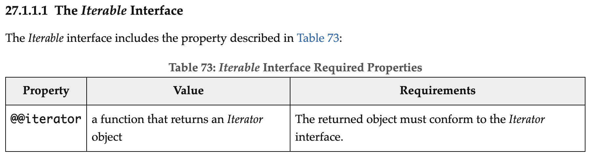
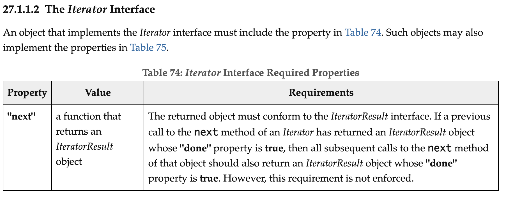
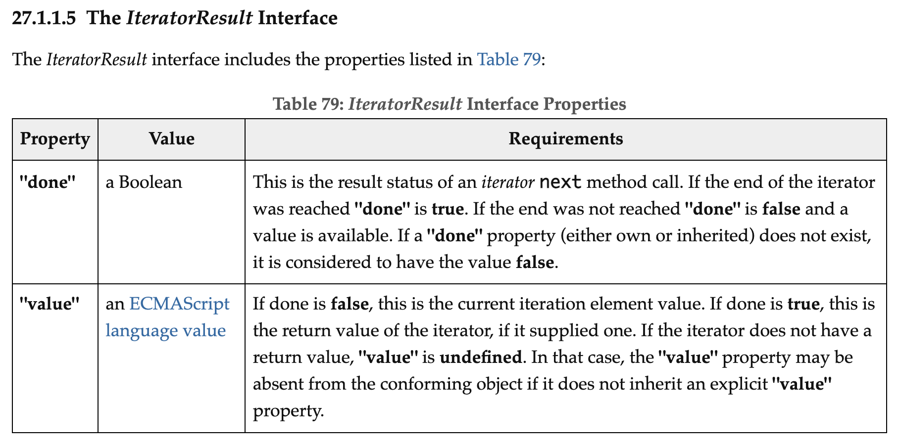
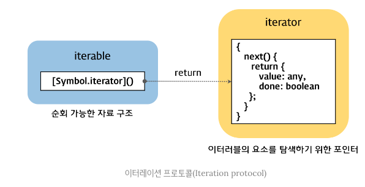
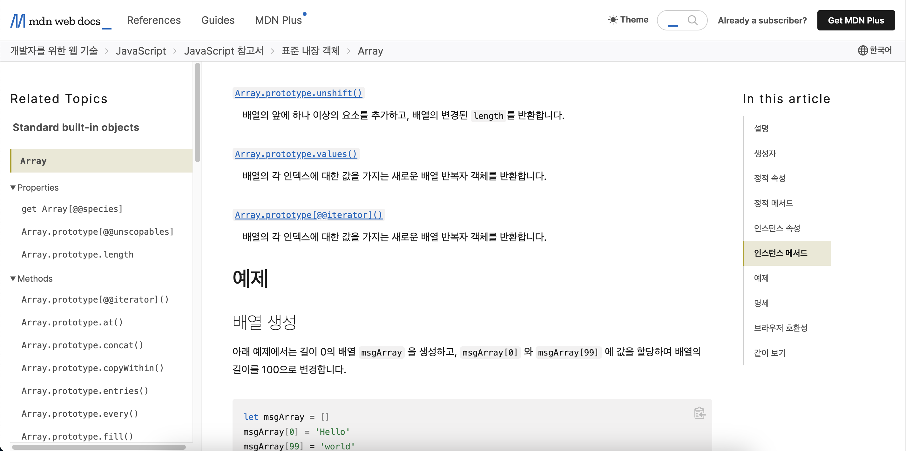
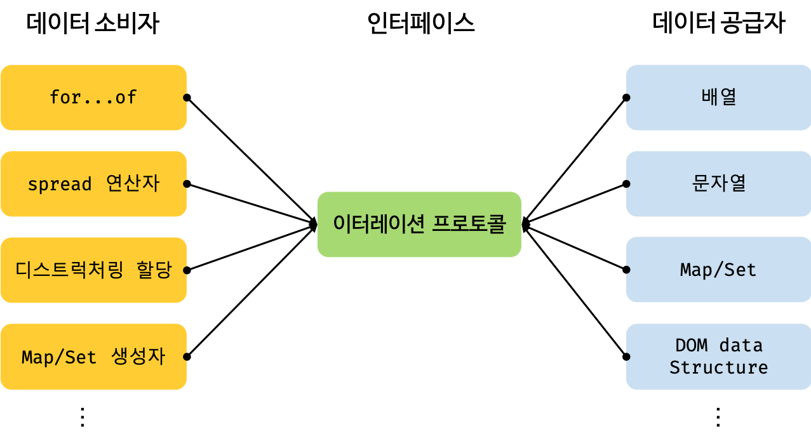

# 34장 이터러블

## 34.1 이터레이션 프로토콜

- ES6에서 도입된 이터레이션 프로토콜(iteration protocol)은 순회 가능한(iterable) 데이터 컬렉션을 만들기 위해 ECMAScript 사양에 정의하여 미리 약속한 규칙이다.
- [https://262.ecma-international.org/13.0/#sec-iteration](https://262.ecma-international.org/13.0/#sec-iteration)
- EC6 이전의 순회 가능한 데이터 컬렉션(array, string, array-like, DOM collection 등)은 통일된 규약(protocol)없이 각자 나름의 구조를 가지고 `for`문, `for…in`문, `forEach` 메서드 등 다양한 방법으로 순회할 수 있었다.
- 순회 가능한 데이터 컬렉션을 **이터레이션 프로토콜**을 준수하는 **이터러블**로 통일하였다.
- ⭐️ **이터러블**은 **`for…of` 문, 스프레드 문법, 디스트럭처링의 대상**으로 사용 가능하다.

- 이터러블 프로토콜(iterable protocol)
  - `Symbol.iterator`를 프로퍼티 키로 사용하는 메서드를 직접 구현하거나 프로토타입 체인으로 상속받은 `Symbol.iterator` 메서드를 호출하면 **이터레이터 프로토콜을 준수한 이터레이터(iterator)를 반환한다.**(뒤에 예제에서 살펴볼 예정)
  - 이러한 규약을 **이터러블 프로토콜**이라고 한다.
    
- 이터레이터 프로토콜(iterator protocol)
  - 이터러블의 **`Symbol.iterator` 메서드를 호출**하면 이터레이터 프로토콜을 준수한 **이터레이터**를 반환한다.
  - 이터레이터(iterator)는 `next` 메서드를 가지고 있다.
  - `next` 메서드를 호출하면 이터러블을 순회하여 `value`와 `done` 프로퍼티를 갖는 **이터레이터 리절트 객체(iteratorResult)**를 반환한다.
  - 이러한 규약을 **이터레이터 프로토콜**이라고 한다.
  - 이터레이터 프로토콜을 준수한 객체를 이터레이터라고 한다.
    
    



### 34.1.1 이터러블

- 이터러블 객체 = 이터러블 프로토콜을 준수한 객체
- 어떤 객체가 이터러블인지 확인하는 방법: `Symbol.iterator` 프로퍼티 키를 가지고 있는지 확인한다

  ```jsx
  const isIterable = (v) =>
    v !== null && typeof v[Symbol.iterator] === 'function';

  isIterable([]); // true
  isIterable(''); // true
  isIterable(new Set()); // true
  isIterable(new Map()); // true
  isIterable({}); // false

  Symbol.iterator in []; // true
  Symbol.iterator in {}; // false

  const obj = { a: 1, b: 2 };
  for (const item of obj) {
  } // TypeError: obj is not iterable

  // 일반 객체는 iterable하지 않지만
  // 객체 리터럴 내부에서 스프레드 문법을 허용한다.
  const clonedObj = { ...obj };
  ```

### 34.1.2 이터레이터

- 이터러블의 `Symbol.iterator` 을 호출하면 이터레이터 프로토콜을 준수한 이터레이터가 반환된다.
- 반환된 이터레이터는 `next` 메서드를 갖는다.

  ```jsx
  const iterator = [][Symbol.iterator]();
  console.log('next' in iterator); // true
  ```

- **`next` 메서드는 이터러블의 각 요소를 순회하기 위한 포인터 역할을 한다.**
- 즉, `next` 메서드를 호출할 때마다 이터러블을 순회하며 순회 결과로 이터레이터 리절트 객체(iterator result object)를 반환한다.

  ```jsx
  const array = [1, 2, 3];

  const iterator = array[Symbol.iterator]();

  console.log(iterator.next()); // {value: 1, done: false}
  console.log(iterator.next()); // {value: 2, done: false}
  console.log(iterator.next()); // {value: 3, done: false}
  console.log(iterator.next()); // {value: undefined, done: true}

  // 문자열은 이터러블이다.
  const string = 'hi';

  // Symbol.iterator 메소드는 이터레이터를 반환한다.
  const stringIter = string[Symbol.iterator]();

  // 이터레이터는 next 메소드를 소유한다.
  // next 메소드는 이터레이터 리절트 객체를 반환한다.
  console.log(stringIter.next()); // {value: "h", done: false}
  console.log(stringIter.next()); // {value: "i", done: false}
  console.log(stringIter.next()); // {value: undefined, done: true}

  // 이터러블은 for...of 문으로 순회 가능하다.
  for (const letter of string) {
    console.log(letter);
  }
  ```

## 34.2 빌트인 이터러블

- 자바스크립트는 이터레이션 프로토콜을 준수하는 객체인 빌트인 이터러블을 제공한다.

| 빌트인 이터러블 | Symbol.iterator 메서드                    |
| --------------- | ----------------------------------------- |
| Array           | Array.prototype[Symbol.iterator]          |
| String          | String.prototype[Symbol.iterator]         |
| Map             | Map.prototype[Symbol.iterator]            |
| Set             | Set.prototype[Symbol.iterator]            |
| TypedArray      | TypedArray.prototype[Symbol.iterator]     |
| arguments       | arguments[Symbol.iterator]                |
| DOM 컬렉션      | NodeList.prototype[Symbol.iterator]       |
|                 | HTMLCollection.prototype[Symbol.iterator] |



[https://developer.mozilla.org/ko/docs/Web/JavaScript/Reference/Global_Objects/Array/@@iterator](https://developer.mozilla.org/ko/docs/Web/JavaScript/Reference/Global_Objects/Array/@@iterator)

## 34.3 for...of 문

- `for … of` 문은 이터러블을 순회하면서 이터러블 요소를 변수에 할당한다.

```jsx
for(변수선언문 of 이터러블) { ... }
```

- `for … in` 문은 객체의 프로토타입 체인 상에 존재하는 모든 프로토타입의 프로퍼티 중에서 프로퍼티 어트리뷰트 `[[Enumerable]]`의 값이 `true` 인 프로퍼티를 순회하며 열거(enumeration)한다. 프로퍼티키가 symbol인 프로퍼티는 열거하지 않는다.

```jsx
for(변서선언문 in 객체) { ... }
```

```jsx
const obj = { a: 1, b: 10 };
for (const item in obj) {
  console.log(item);
} // a b
```

- `for … of` 문 내부적으로 이터레이터의 `next` 메서드를 호출하여 이터러블을 순회한다.

  - `next` 메서드가 반환하는 이터레이터 리절트 객체의 `value` 값을 변수에 할당한다.
  - `done` 값이 `false`이면 순회하고 `true`이면 순회를 중단한다.

  ```jsx
  const array = [1, 2, 3];

  // item에 이터레이터 리절트 객체의 value 값이 할당된다.
  for (const item of array) {
    // 이터레이터 리절트 객체의 done 값이 true이면 순회를 중단한다.
    console.log(item); // 1 2 3
  }
  ```

## 34.4 이터러블과 유사 배열 객체

- 유사 배열 객체: 배열처럼 인덱스로 프로퍼티 값에 접근할 수 있고 `length` 프로퍼티를 갖는 객체

  - 아래 예제의 `arrayLike`와 같이 유사 배열 객체는 이터러블이 아니기 때문에 `for … of` 문을 사용할 수 없다.

  ```jsx
  const arrayLike = {
    0: 10,
    1: 20,
    2: 30,
    length: 3,
  };

  for (const item of arrayLike) {
    console.log(item);
  }
  // TypeError: arrayLike is not iterable
  ```

- `Array.from` 메서드를 사용해 배열로 간단하게 변환할 수 있다. (⭐️정말 유용함)
  - “**`Array.from()`** 메서드는 **유사 배열 객체(array-like object)나 순회 가능한 객체(iterable object)**를 얕게 복사해 새로운`Array` 객체를 만듭니다.”
  - [https://developer.mozilla.org/ko/docs/Web/JavaScript/Reference/Global_Objects/Array/from](https://developer.mozilla.org/ko/docs/Web/JavaScript/Reference/Global_Objects/Array/from)
  ```jsx
  console.log(Array.from(arrayLike)); // [10, 20, 30]
  ```
  - `Array.from` 사용 예시
  ```tsx
  // Array(1024).keys()는 iterator이기 때문에
  // map과 같은 배열 메서드를 사용할 수 없다.
  // Array.from을 통해 iterator 객체를 배열로 만들 수 있다.
  // 그러면 배열 메서드를 사용할 수 있게 된다.
  const users = Array.from(Array(1024).keys()).map(
    (id): User => ({
      id,
      name: `denis${id}`,
    })
  );
  ```

## 34.5 이터레이션 프로토콜의 필요성

> 이터레이션 프로토콜을 준수하는 이터러블

Array, String, Map, Set, TypedArray(Int8Array, Uint8Array, Uint8ClampedArray, Int16Array, Uint16Array, Int32Array, Uint32Array, Float32Array, Float64Array), DOM data structure(NodeList, HTMLCollection), Arguments

>



- 다양한 **데이터 공급자(Data provider)**가 각자의 순회 방식을 갖는다면 **데이터 소비자(Data consumer)**는 다양한 데이터 소스의 순회 방식을 모두 지원해야 한다.
- 이는 효율적이지 않다. 하지만 다양한 데이터 공급자가 이터레이션 프로토콜을 준수하도록 규정하면 데이터 소비자는 이터레이션 프로토콜만을 지원하도록 구현하면 된다.
- **이터레이션 프로토콜은 데이터 소비자와 데이터 공급자를 연결하는 인터페이스의 역할을 한다.**

## 34.6 사용자 정의 이터러블

### 34.6.1 사용자 정의 이터러블 구현

- 주석을 하나씩 보면서 이터러블 객체를 어떻게 구현하는지 확인할 수 있다.
- 이터러블 객체는 `for … of` 문, 스프레드 문법, 디스트럭처링 할당에서 사용할 수 있다.

```jsx
let range = {
  from: 1,
  to: 10,
};

// Symbol.iterator 메서드를 구현하여 이터러블 프로토콜을 준수한다.
range[Symbol.iterator] = function () {
  let [current, last] = [this.from, this.to];

  // Symbol.iterator 메서드는 next 메서드를 소유한 이터레이터를 반환한다.
  // next 메서드는 이터레이터 리절트 객체를 반환한다.
  return {
    next() {
      if (current <= last) {
        return { done: false, value: current++ };
      } else {
        return { done: true };
      }
    },
  };
};

// for ... of 문에서 이터러블을 순회할 수 있다.
// 이터러블인 range 객체를 순회할 때마다 next 메서드가 호출된다.
for (let num of range) {
  console.log(num);
}

// 스프레드 문법 가능
const arr = [...range];
console.log(arr);

// 디스트럭처링 할당 가능
const [first, second, ...rest] = range;
console.log(first, second, rest);
```

### 34.6.2 이터러블을 생성하는 함수

- 위 예제를 보면 `range` 객체의 `from`과 `to` 프로퍼티 값이 1과 10으로 각각 고정되어 있다.
- `range`의 `from`과 `to` 값을 외부에서 전달받아 반환하는 함수를 만들면 된다.

```jsx
const range = function (from, to) {
  let [current, last] = [from, to];

  // 이터러블을 반환한다.
  return {
    [Symbol.iterator]() {
      return {
        next() {
          if (current <= last) {
            return { done: false, value: current++ };
          } else {
            return { done: true };
          }
        },
      };
    },
  };
};

for (let num of range(3, 10)) {
  console.log(num);
}
```

### 34.6.3 이터러블이면서 이터레이터인 객체를 생성하는 함수

- 앞서 살펴본 range 함수는 이터러블을 반환한다.
- 이터레이터를 생성하려면 이터러블의 Symbol.iterator 메서드를 호출해야 한다.

```tsx
const iterable = range(3, 10);

// 이터레이터를 얻기 위해 이터러블의 Symbol.iterator 메서드를 호출한다.
const iterator = iterable[Symbol.iterator]();

console.log(iterator.next()); // {done: false, value: 3}
console.log(iterator.next()); // {done: false, value: 4}
console.log(iterator.next()); // {done: false, value: 5}
console.log(iterator.next()); // {done: false, value: 6}
```

- **이터러블이면서 이터레이터인 객체를 생성하면 `Symbol.iterator` 메서드를 호출하지 않아도 된다.**

```jsx
const range = function (from, to) {
  let [current, last] = [from, to];

  // Symbol.iterator 메서드와 next 메서드를 소유한
  // 이터러블이면서 이터레이터인 객체 반환
  return {
    [Symbol.iterator]() {
      return this;
    },
    // next 메서드는 이터레이터 리절트 객체 반환
    next() {
      if (current <= last) {
        return { done: false, value: current++ };
      } else {
        return { done: true };
      }
    },
  };
};

for (let num of range(3, 10)) {
  console.log(num);
}

// range 함수는 이터러블이면서 이터레이터인 객체를 생성한다.
let iter = range(3, 10);

console.log(iter.next()); // {done: false, value: 3}
console.log(iter.next()); // {done: false, value: 4}
console.log(iter.next()); // {done: false, value: 5}
console.log(iter.next()); // {done: false, value: 6}
```

### 34.6.4 무한 이터러블과 지연 평가

- 무한 수열 구현 가능

```jsx
const range = function () {
  let current = 1;

  // 이터러블을 반환한다.
  return {
    [Symbol.iterator]() {
      return {
        next() {
          return { value: current++ };
        },
      };
    },
  };
};

for (let num of range()) {
  if (num > 100) break;
  console.log(num); // 1 2 3 ... 99 100
}

const [a1, a2, a3] = range();
console.log(a1, a2, a3); // 1 2 3
```

- 이터러블은 데이터 공급자의 역할을 한다.
- 배열이나 문자열 등은 모든 데이터를 메모리에 미리 확보한 다음 데이터를 공급한다.
- 하지만 이터러블은 **지연 평가(lazy evaluation)**을 통해 데이터를 생성한다.
- **즉, 필요한 데이터를 필요한 순간에 생성하므로 빠른 실행 속도를 기대할 수 있고, 불필요한 메모리 소비를 하지 않는다.**
