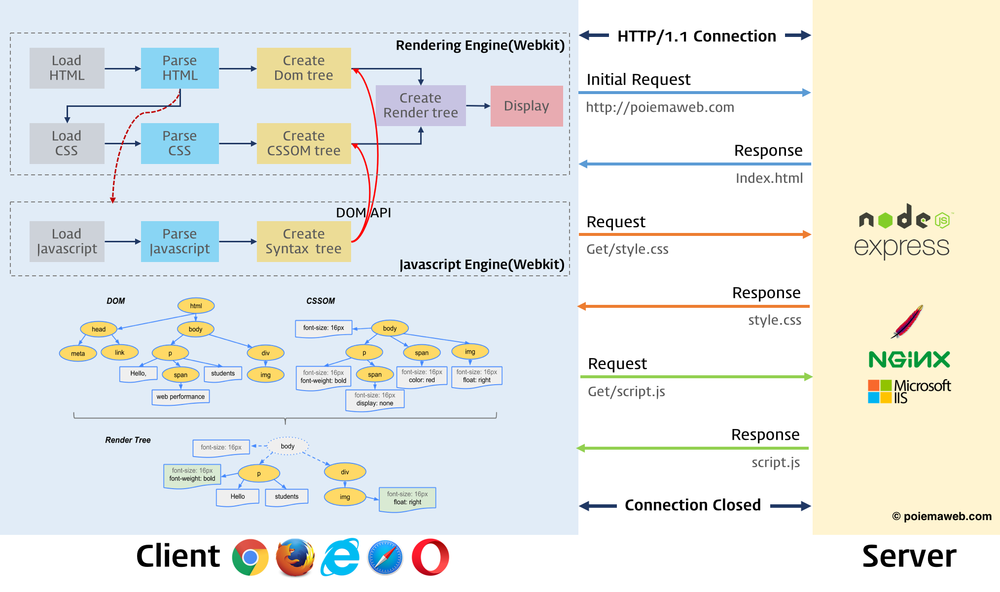
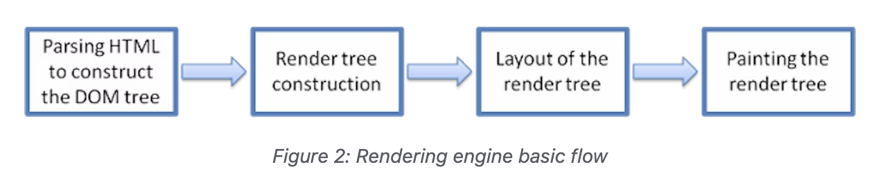
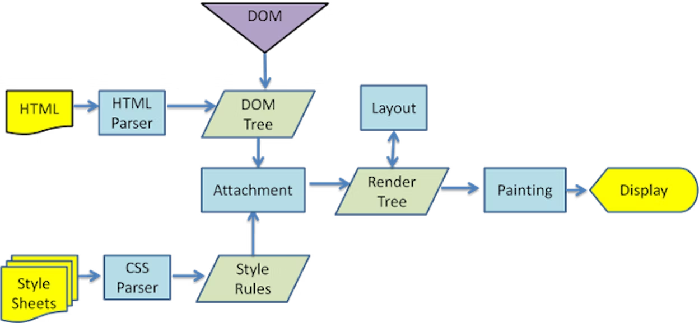
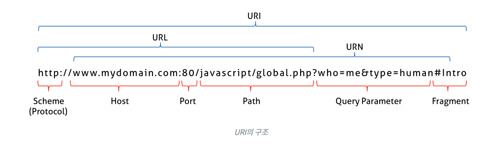
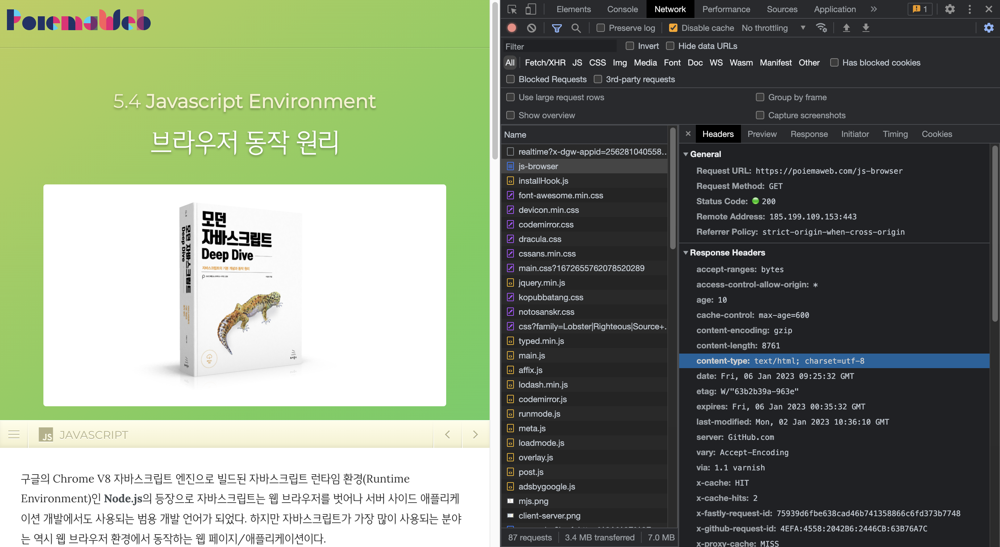
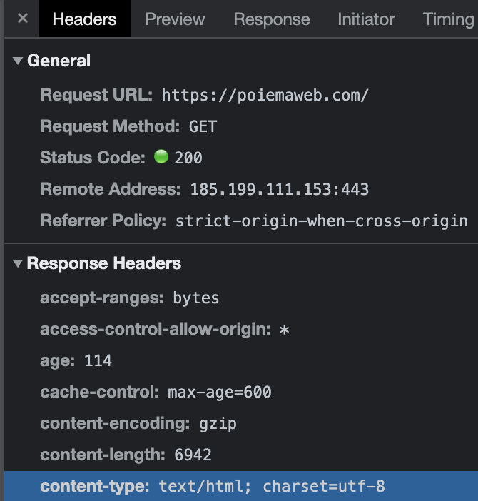
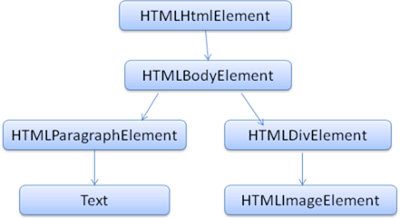
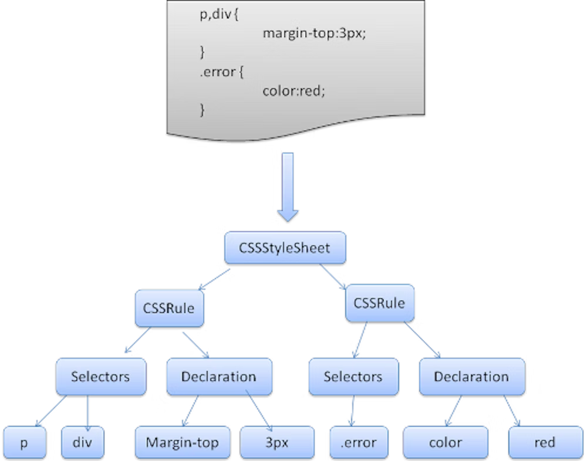
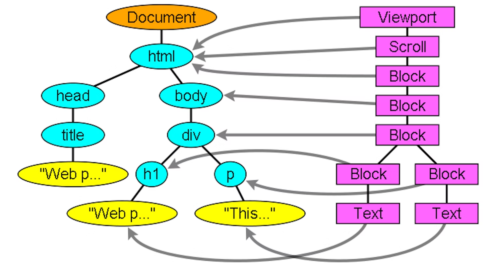
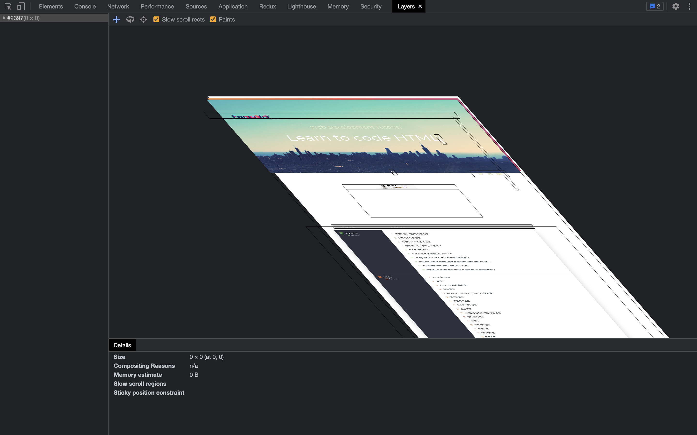

# 38장-브라우저의 렌더링 과정

> 브라우저가 어떻게 HTML, CSS, 자바스크립트로 작성된 텍스트 문서를 어떻게 파싱하여 브라우저에 렌더링하는지 살펴보자

- 파싱(parsing)
  - HTML, CSS, 자바스크립트 문서를 읽어 의미 단위로 토큰화(Tokenization)하고 토큰에 문법적 의미와 구조를 반영하여 트리구조의 자료구조인 파스 트리(parse tree/syntax tree)를 생성하는 과정
  - 파싱 이후에는 파스 트리 기반으로 바이트 코드(중간 언어)를 생성하고 실행함
- 렌더링(rendering)
  - HTML, CSS, 자바스크립트로 작성된 텍스트 문서를 파싱하여 브라우저에 시각적으로 보여주는 것
- **Critical Rendering Path**⭐️
  
  
  
  [https://web.dev/howbrowserswork/#main-flow-examples](https://web.dev/howbrowserswork/#main-flow-examples)
  1. 브라우저는 HTML, CSS, 자바스크립트, 이미지, 폰트 등 렌더링에 필요한 리소스를 서버에 요청하고 서버는 응답한다.
  2. 브라우저의 렌더링 엔진은 서버로 부터 응답된 HTML, CSS를 파싱하여 **DOM, CSSOM**을 생성한다.
  3. DOM, CSSOM을 결합하여 **렌더 트리**를 생성한다.
  4. 브라우저의 자바스크립트 엔진은 서버로부터 응답된 **자바스크립트를 파싱**하여 AST(Abstract Syntax Tree)를 생성하고 바이트코드로 변환하여 실행한다.
     1. 이때 DOM API를 통해 DOM, CSSOM이 변경될 수 있다
     2. 변경된 DOM, CSSOM은 다시 렌더트리로 결합된다.
  5. 렌더트리를 기반으로 HTML 요소의 **레이아웃을 계산**하고 브라우저 화면에 HTML 요소를 **페인팅**한다.

## 38.1 요청과 응답

- 브라우저는 **필요한 리소스**(HTML, CSS, 자바스크립트, 이미지, 폰트 등 정적파일 + 서버가 동적으로 생성한 데이터)를 **서버에 요청(request)하고 서버로부터 응답(response)받는다.**
- 그리고 브라우저에 렌더링한다.
- 브라우저의 주소창에 `URL`을 입력하면 `URL`의 `hostname`이 `DNS`를 통해 `IP`주소로 변환되고 해당 `IP` 주소를 갖는 서버에 리소스를 요청한다.
  

- 개발자 도구의 Network 패널을 확인하면 여러 리소스를 서버에 요청하고 있는 것을 확인할 수 있다.
  

## 38.2 HTTP 1.1과 HTTP 2.0

- HTTP(HyperText Transfer Protocol): 웹에서 브라우저와 서버가 통신하기 위한 프로토콜
- 1989년 Tim Berners-Lee에 의해이 고안한 HTTP는 1991년 최초로 문서화되었고, 1996년 HTTP/1.0, 1999년 HTTP/1.1, 2015년 HTTP/2.0이 발표되었다.
- **[HTTP 1.1과 HTTP 2.0의 차이](https://developer.mozilla.org/ko/docs/Web/HTTP/Basics_of_HTTP/Evolution_of_HTTP#http2_%E2%80%93_%EB%8D%94_%EB%82%98%EC%9D%80_%EC%84%B1%EB%8A%A5%EC%9D%84_%EC%9C%84%ED%95%9C_%ED%94%84%EB%A1%9C%ED%86%A0%EC%BD%9C)**
  - HTTP 2.0은 텍스트 프로토콜이 아닌 **이진 프로토콜**이다. 따라서 새로운 최적화 기법을 적용할 수 있다.
  - HTTP 1.1은 일반적으로 하나의 커넥션당 하나의 요청/응답을 처리한다. 반면에 HTTP 2.0은 동일한 커넥션 상에서 다중 요청/응답이 가능하다.
  - 전송된 데이터의 중복과 그런 데이터로부터 생기는 오버헤드를 제거하고, 연속된 요청 사이의 유사한 내용의 헤더를 압축한다.
  - 서버로 하여금 클라이언트 캐시를 서버 푸시라는 매커니즘을 통해 필요한 데이터로 채워넣도록 허용한다.

## 38.3 HTML 파싱과 DOM 생성

- 브라우저의 요청에 의해 서버가 응답한 HTML 문서는 문자열로 이루어진 순수한 텍스트이다.
- 순수 텍스트인 HTML 문서를 브라우저에 렌더링 하기 위해서는 HTML 문서를 브라우저가 이해할 수 있는 자료구조(객체)로 변환해 메모리에 저장해야 한다.

```html
<html>
  <body>
    <p>Hello World</p>
    <div></div>
  </body>
</html>
```

- 렌더링 엔진은 다음과 같은 과정을 통해 HTML을 파싱하고 DOM을 생성한다.
  - HTML 파일이 브라우저의 요청에 응답된다.
  - 브라우저는 바이트(2진수) 형태로 HTML 문서를 응답받는다.
    - 응답받는 바이트 형태의 HTML문서를 meta 태그의 charset 어트리뷰트에 의해 지정된 인코딩 방식(ex.UTF-8)을 기준으로 인코딩된다.
      ```html
      <meta charset="utf-8" />
      ```
      
    - meta 태그의 charset 어트리뷰트에 선언된 인코딩 방식은 응답 헤더(response header) 내 `content-type: text/html; charset=utf-8` 과 같이 담겨 응답에 포함된다.
    - 브라우저는 이를 확인하고 문자열로 변환한다.
  - 문자열로 변환된 HTML문서를 읽어 토큰화한다.
  - 토큰을 객체로 변환하여 노드(node)를 생성한다. 토큰에 따라 문서 노드, 요소 노드, 어트리뷰트 노드, 텍스트 노드가 생성된다.
  - 위에서 생성된 노드들은 부모-자식 관계를 가질 수 있다. 즉, HTML 요소 간 중첩관계에 의해 노드간 중첩관계(부모-자식)가 형성된다. 이런 노드들을 트리 구조로 구성하는데, 이 트리 구조를 **DOM(Document Object Model)**이라고 부른다.
    

> 정리
>
> 1.  바이트 → 문자 → 토큰 → 노드 → DOM 과정으로 HTML을 파싱한다.
> 2.  DOM은 HTML 문서를 파싱한 결과물이다.

## 38.4 CSS 파싱과 CSSOM 생성

- 렌더링 엔진은 HTML을 처음부터 한 줄씩 순차적으로 파싱하여 DOM을 생성해 나간다.
- 이때 **DOM을 생성해나가다가 CSS를 로드하는 태그(`link` 태그나 `style` 태그)를 만나면 DOM 생성을 중단한**다.
- CSS도 HTML과 동일한 파싱 과정(바이트 → 문자 → 토큰 → 노드 → CSSOM)을 거치며 CSSOM(CSS Object Model)을 생성한다.
  

## 38.5 렌더 트리 생성

- 렌더링 엔진은 서버로부터 응답된 HTML 과 CSS를 파싱하여 각각 DOM과 CSSOM을 생성한다.
- 그리고 DOM과 CSSOM을 렌더링하기 위해 렌더 트리(render tree)를 구성한다.
- 렌더트리는 시각적으로 보이는 요소들만 포함된다. `head`, `meta`, `script`, `display: none`인 요소는 제외된다.



왼쪽이 DOM 트리, 오른쪽이 Render 트리

- 완성된 렌더 트리를 기반으로 각 요소가 위치할 자리를 계산(Layout)하고, 화면을 그린다.(Painting)
  - 개발자도구의 Layers 패널에서 Paint된 것을 확인할 수 있다.
    

## 38.6 자바스크립트 파싱과 실행

- HTML 문서를 파싱한 결과로 얻은 DOM은 HTML의 구조와 정보 뿐만 아니라 HTML 요소를 조작할 수 있는 DOM API를 제공한다. 즉, 자바스크립트로 DOM API를 이용하면 이미 생성된 DOM을 조작할 수 있는 것이다.
- HTML을 한 줄씩 파싱하며 DOM을 생성하다 script 태그나 자바스크립트 코드를 담는 script 태그를 만나면 DOM 생성을 중단한다.
- 이때 자바스크립트를 파싱하기 위해 자바스크립트 코드로 제어권을 넘긴다. 자바스크립트 파싱과 실행이 종료하면 렌더링 엔진으로 다시 제어권을 넘겨 HTML 파싱이 중단된 지점부터 다시 파싱을 하기 시작한다.
- HTML과 CSS의 파싱 결과로 DOM과 CSSOM이 생성되듯, 자바스크립트 엔진은 자바스크립트를 해석해 AST(추상 구문 트리)를 생성한다.
- 그리고 이 AST를 기반으로 인터프리터가 실행할 수 있는 중간 코드인 바이트 코드를 생성하여 실행한다.

## 38.7 리플로우와 리페인트

- 자바스크립트로 DOM이라 CSSOM을 조작한다면 DOM, CSSOM을 변경하여 다시 렌더 트리로 결합하고 변경된 렌더트리를 기반으로 레이아웃(계산) 과 페인트 과정을 거쳐 브라우저에 렌더링하게 된다.
- 이를 리플로우(reflow)와 리페인트(repaint)라 한다.
- 리플로우
  - 레이아웃을 다시 계산하는 과정
  - 노드 추가/삭제, 요소 크기/위치 변경, 윈도우 리사이징(resize) 등 레이아웃에 영향을 줄 때 발생한다.
- 리페인트
  - 재결합된 렌더 트리를 기반으로 다시 페인트 하는 과정

## 38.8 자바스크립트 파싱에 의한 HTML 파싱 중단

- 브라우저는 동기적으로, 즉 위에서 아래 방향으로 순차적으로 HTML, CSS, 자바스크립트를 파싱하고 실행한다.
- script 태그에 의해 HTML 파싱이 블로킹되어 DOM 생성이 지연될 수 있다는 것을 의미한다.

  ```html
  <!DOCTYPE html>
  <html lang="en">
    <head>
      <meta charset="UTF-8" />
      <title>Document</title>
      <script src="./index.js">
        const apple = document.getElementById('apple');

        apple.style.color = 'red'; // TypeError: Cannot read properties of null (reading 'style')
      </script>
    </head>
    <body>
      <ul>
        <li id="apple">apple</li>
        <li id="banana">banana</li>
        <li id="orange">orange</li>
      </ul>
    </body>
  </html>
  ```

- HTML 문서를 위에서 아래로 순차적으로 파싱하면서 DOM을 생성하다 script 태그를 만나면 DOM 생성을 중단한다.
- 위 예제 코드에서 DOM에서 id가 apple인 요소를 취득한다.
  - 하지만 document.getElementById('apple') 실행 시점에는 아직 id가 apple인 HTML 요소를 파싱하지 않았기 때문에 DOM에서 id가 apple인 요소가 없는 상태이다.
  - 따라서 위 예제는 정상적으로 동작하지 않는다.
- 이런 문제를 회피하기 위해 body 요소 가장 아래 자바스크립트 코드를 위치하는 것이 좋은 아이디어다.
  ```html
  <!DOCTYPE html>
  <html lang="en">
    <head>
      <meta charset="UTF-8" />
      <title>Document</title>
    </head>
    <body>
      <ul>
        <li id="apple">apple</li>
        <li id="banana">banana</li>
        <li id="orange">orange</li>
      </ul>
      <script>
        const apple = document.getElementById('apple');
        apple.style.color = 'red';
      </script>
    </body>
  </html>
  ```

## 38.9 script 태그의 async/defer 어트리뷰트

1. Module script is deferred(지연실행)
   - 외부 모듈을 다운로드할 때 브라우저의 HTML 처리가 멈추지 않음. 브라우저는 다른 리소스와 병렬적으로 불러옴
   - 모듈 스크립트는 HTML 문서가 완전히 준비될 때까지 기다렸다가, HTML이 완전히 만들어진 후 실행됨
     → 모듈 스크립트는 항상 HTML에 접근할 수 있음
   - 위쪽 스크립트부터 차례대로 실행됨
2. Async works on inline scripts

   - `async` 속성을 이용함
   - `./analytics.js` 를 가져오는 작업이 끝나면 HTML 파싱이나 다른 스크립트가 대기상태더라고 모듈을 바로 실행함
   - 어디에도 종속되지 않는 기능을 구현할 때 유용

   ```jsx
   <script async type='module'>
     import {counter} from './analytics.js'; counter.count();
   </script>
   ```
