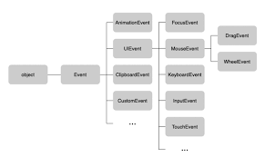
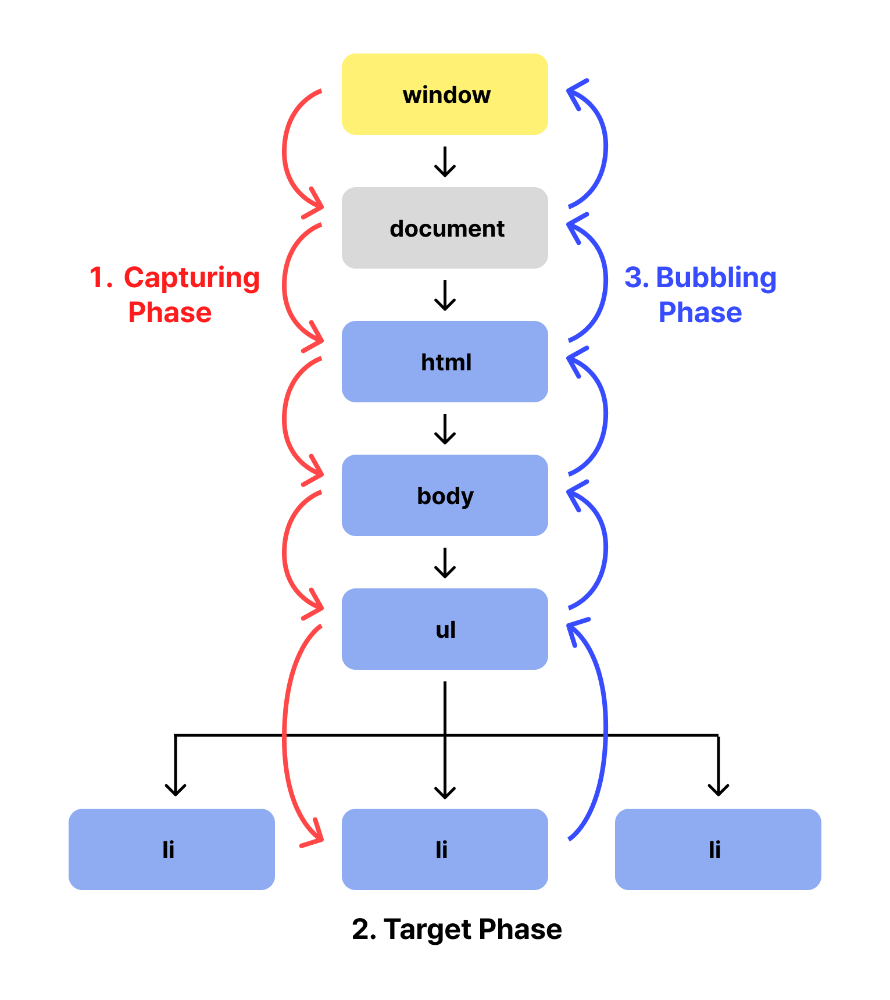
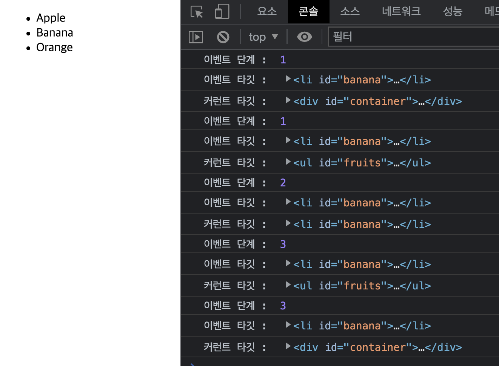

# 40장 이벤트

## 40.1 이벤트 드리븐 프로그래밍

사용자가 버튼을 클릭했을 때, 함수를 호출하여 어떤 처리를 하고싶다고 가정해보자, 이때 이 함수는 언제 호출해야 하는가? 사용자가 언제 버튼을 클릭할지 알 수 없으므로, 우리는 이 함수를 호출하는 시점을 정해둘 수 없다.

다행히 브라우저는 처리해야 할 특정 사건이 발생하면, 이를 감지하여 이벤트를 발생시킬 수 있다(event trigger). 마우스 클릭, 키보드 입력, 마우스 이동 등이 일어나면 브라우저는 이를 감지하여 특정 타입의 이벤트를 발생시킨다.

이러한 이벤트에 대응하는 함수를 **이벤트 핸들러**(event handler)라고 하고, 이벤트의 발생에 함수 호출을 위임하는 것을 **이벤트 핸들러 등록** 이라고 한다.
이벤트와 그에 대응하는 함수, 즉 이벤트 핸들러를 통해 사용자와 애플리케이션은 상호작용 할 수 있다. 프로그램의 흐름을 이벤트 중심으로 제어하는 프로그래밍 방식을 **이벤트 드리븐 프로그래밍이라고** 한다.

## 40.2 이벤트 타입

> 이벤트 타입은 약 200여가지가 있다...

https://developer.mozilla.org/ko/docs/Web/Events

### 사용 빈도 높은 이벤트

- 마우스 이벤트
- 키보드 이벤트
- 포커스 이벤트
- 값 변경 이벤트
- DOM 뮤테이션 이벤트
- 뷰 이벤트
- 리소스 이벤트
  등등..

기기를 통한 상호작용 (마우스, 키보드, 심지어 게임패드) 들 뿐만 아니라 리소스 로드, 소켓 연결이 수립됐을때 같은 상태와 관련된 이벤트, css 애니메이션 종료, 반복등에 대한 이벤트 등 광범위하고 디테일한 이벤트들이 많다.

## 40.3 이벤트 핸들러 등록

이벤트 핸들러 등록이란, 이벤트 발생시 호출 하는 함수인 이벤트 핸들러를 브라우저에 등록하여, 호출을 위임하는 것이다.

> 3가지 방법이 있다.
>
> 1. 이벤트 핸들러 어트리뷰트 방식 (HTML, 어트리뷰트)
> 2. 이벤트 핸들러 프로퍼티 방식 (JS, DOM 프로퍼티)
> 3. addEventListener 메서드 이용 방식(JS, 빌트인 메서드)

## 40.3.1 이벤트 핸들러 어트리뷰트 방식

> 익숙한 그것들, \<div> 태그 내에 onClick, onSubmit, onMouseMove에 호출할 함수 할당.  
> DOM Level 0이라고 불리는 고전 이벤트 모델이다.

```javascript
  <!DOCTYPE html>
  <html>
    <body>
      <button onclick="sayHi('Lee')">Click me!</button>
      <script>
        function sayHi(name){
          console.log(name);
        }
      </script>
    </body>
  </html>

```

HTML 요소의 어트리뷰트 중에는 이벤트에 대응하는 이벤트 핸들러 어트리뷰트가 있다. 어트리뷰트 이름은 on 접두사와 이벤트타입(click,keydown)으로 이루어져 있는데, 이 어트리뷰트에 문을 할당하면 이벤트 핸들러가 등록된다.

- 특이점  
  이벤트 핸들러 어트리뷰트 값으로 함수참조가 아닌 함수 호출문 등의 문을 할당한다는 것이다.

  > onclick="sayHi" ❌  
  > onclick="sayHi('Lee')" //✅

  이벤트 핸들러 어트리뷰트 값은 암묵적으로 생성될 이벤트 핸들러의 함수 몸체를 의미하기 때문에, 함수 참조를 전달하는게 아니라, 함수 호출문을 할당해야 한다.
  어트리뷰트는 파싱되어

  ```javascript
  function onclick(event) {
    sayHi("Lee"); //HTML 요소 onclick 어트리뷰트에 할당해준 값, onclick="sayHi('Lee')"처럼 할당된 호출문이 암묵적으로 생성되는 함수 몸체에 할당된다.
  }
  ```

  함수를 암묵적으로 생성하고, 이벤트 핸들러 어트리뷰트 이름과 동일한 onclick 이벤트 핸들러 프로퍼티에 할당한다.
  이유는 이벤트 핸들러에 인수를 전달해야 하기 때문이다.

  따라서 이벤트 핸들러 어트리뷰트 값으로 여러개의 문을 할당할 수 있다.

  ```HTML
    <div onclick="console.log("hello"); console.log("myNameIs Lee");
    "> </div>
  ```

- 알아둘점
  - 이벤트 핸들러 어트리뷰트 방식은, 오래된 코드에서 이 방식을 사용하고 있기 때문에 알아둘 필요는 있지만, 더는 사용하지 않는게 좋다  
    👉🏻 HTML과 자바스크립트의 관심사는 다르므로 혼재하는것보다 분리하는게 좋기때문
  - Component Based Development(CBD) 방식의 Angular/react/Svelte/Vue.js 같은 경우 이러한 이벤트핸들러 어트리뷰트 방식으로 이벤트를 처리한다.  
    👉🏻 CBD에서는 HTML, CSS, JS를 관심사가 다른 개별적 요소가 아닌, 뷰를 구성하는 요소로 보기 때문에 관심사가 다르다고 생각하지 않기 때문에

### 40.3.2 이벤트 핸들러 프로퍼티 방식

window객체와 Document, HTMLElement 타입의 DOM 노드 객체는 이벤트에 대응하는 이벤트 핸들러 프로퍼티를 가지고있다.
이벤트 핸들러 어트리뷰트처럼, 이벤트 핸들러 프로퍼티의 키는 on + 이벤트 타입 이름으로 이루어져 있다. 이 이벤트 핸들러 프로퍼티에 함수를 바인딩하면 이벤트 핸들러가 등록된다.

```html
<!DOCTYPE html>
<html>
  <body>
    <button onclick="sayHi('Lee')">Click me!</button>
    <script>
      const $button = document.querySelector("button");
      $button.onclick = function (name) {
        console.log(name);
      };
    </script>
  </body>
</html>
```

- 알아둘점

  - 위 코드에서 이벤트 타깃은 $button이다. 이벤트 핸들러 대부분은 이벤트를 발생시킬 이벤트 타깃에 바인딩하지만, 반드시 이벤트 타겟에 이벤트 핸들러를 바인딩할 필요는 없다. 이벤트 핸들러는 이벤트 타깃 또는 전파되는 이벤트를 캐치할 DOM 노드에 바인딩한다. (40.6 이벤트 전파와 40.7 이벤트 위임에서 살펴볼 내용)

- 어트리뷰트 방식 과 프로퍼티 방식  
   앞서 살펴본 이벤트 핸들러 어트리뷰트 방식은 결국 DOM 노드 객체의 이벤트 핸들러 프로퍼티로 변환되는 것이므로 이벤트 핸들러 프로퍼티 방식과 동일하다고 할 수 있다.
  - 차이점 :  
    html / JS 코드를 나누어 관심사 구분 가능이 가능하다.
  - 한계점 :  
    이벤트핸들러 프로퍼티에 하나의 핸들러만 등록이 가능하다는 점.
    ```html
    <script>
      const $button = document.querySelector("button");
      //첫번째로 바인딩 된 핸들러
      $button.onclick = function (name) {
        console.log(name);
      };
      //두번째로 바인딩 된 핸들러
      $button.onclick = function () {
        console.log("hihihi");
      };
      // 첫번째로 바인딩 된 핸들러는 두번째 핸들러가 프로퍼티에 재할당되며 동작하지 않는다.
    </script>
    ```

### 40.3.3 addEventListener 메서드 방식

앞의 이벤트 핸들러 어트리뷰트 방식과 이벤트 핸들러 방식은 DOM Level 0부터 제공되던 방식이다. addEventListener 메서드는 DOM Level 2에서 도입되었다.

```javascript
EventTarget.addEventListener(eventType, functionName, [, useCapture]);
```

위의 예제 코드를 addEventListener로 구현하면

```html
<!DOCTYPE html>
<html>
  <body>
    <button>Click me!</button>
    <script>
      const $button = document.querySelector("button");

      function sayHi(name) {
        console.log(name);
      }
      $button.addEventListener("click", sayHi, false);
    </script>
  </body>
</html>
```

### 이벤트 핸들러 등록의 여러가지 케이스

- 이벤트 핸들러 프로퍼티 방식과, addEventListener 방식 모두를 사용하면 결과는 ??  
  ✅ 둘다 동작함

  ```html
  <!DOCTYPE html>
  <html>
    <body>
      <button>Click me!</button>
      <script>
        const $button = document.querySelector("button");
        $button.onclick = () => {
          console.log("property button Click");
        };
        function sayHi() {
          console.log("addEventListener Click");
        }
        $button.addEventListener("click", sayHi);
      </script>
    </body>
  </html>
  ```

- addEventListener로 여러개의 이벤트 핸들러를 등록하면??  
  ✅ 순서대로 동작함

  ```html
  <!DOCTYPE html>
  <html>
    <body>
      <button>Click me!</button>
      <script>
        const $button = document.querySelector("button");
        $button.addEventListener("click", function () {
          console.log("first Handler");
        });
        $button.addEventListener("click", function () {
          console.log("second Handler");
        });
      </script>
    </body>
  </html>
  ```

- 같은 함수를 참조하는 이벤트 핸들러를 여러번 등록하면?
  ✅ 하나만 등록됨
  ```html
  <!DOCTYPE html>
  <html>
    <body>
      <button>Click me!</button>
      <script>
        const $button = document.querySelector("button");
        function handleClick() {
          console.log("button Clicked");
        }
        $button.addEventListener("click", handleClick);
        $button.addEventListener("click", handleClick);
      </script>
    </body>
  </html>
  ```

## 40.4 이벤트 핸들러 제거

### addEventListener 메서드로 등록된 이벤트 핸들러 제거

removeEventListener 메서드를 사용한다.

> EventTarget.removeEventListener(functionName);으로 제거  
> ❗️단 addEventListener 메서드로 전달해준 인수와 동일했을경우에만 제거된다.

```html
<!DOCTYPE html>
<html>
  <body>
    <button>Click me!</button>
    <script>
      const $button = document.querySelector("button");
      function handleClick() {
        console.log("button Clicked");
      }

      $button.addEventListener("click", handleClick);
      $button.removeEventListener("click", handleClick, true); //실패
      $button.removeEventListener("click", handleClick); //성공
    </script>
  </body>
</html>
```

- 주의할 점

  - 무명함수로 등록된 이벤트 핸들러는 제거할 수 없다.
    ```javascript
    $button.addEventListener("click", () => {
      console.log("click");
    });
    //등록한 이벤트 핸들러를 참조할 수 없으므로 제거할수 없다
    ```
  - 핸들러 내부에서 이벤트 핸들러 제거도 가능하다

    ```javascript
    $button.addEventListener("click", function foo() {
      console.log("click");

      $button.removeEventListener("click", foo);
      // 이벤트 발생시 foo 함수를 한번 호출하고, 핸들러를 제거함으로써 등록된 이벤트 핸들러는 한번만 호출된다.
    });
    ```

  - 무명 함수로 전달되는 이벤트 핸들러도 내부에서 제거는 가능하다.
    하지만 arguments.callee는 strict 모드에서 사용이 불가하므로, 함수 핸들러의 참조를 변수에 저장하여 제거하는게 좋다

    ```javascript
    $button.addEventListener("click", function () {
      console.log("click");

      $button.removeEventListener("click", arguments.callee);
      //arguments.callee는 호출된 함수, 즉 자신을 가리킨다.
    });
    ```

### 이벤트 핸들러 프로퍼티 방식의 이벤트 핸들러 제거하기

> 이벤트 핸들러 프로퍼티에 null 할당하기

```javascript
$button.onclick = () => {
  console.log("click");
};
//핸들러 제거
$button.onclick = null;
```

## 40.5 이벤트 객체

이벤트 발생 시 이벤트에 관련된 다양한 정보를 담고있는 이벤트 객체가 동적으로 생성된다, 이 객체는 이벤트 핸들러의 첫번째 인수로 전달된다.

- 이벤트 등록 방식에 따라 다르게 이벤트 객체를 받는 법이 다르다

  - addeventListener 메서드, 이벤트 핸들러 프로퍼티 방식
    메서드에 전달되는 함수 참조에 첫번째 인수로 event 객체를 전달받으니 어떤 이름을 써도 상관 없다.

    ```javascript
      //<html> 코드 생략

      function eventHandler(e){ //e 든 event 든 obj든 이름은 상관 없다
        ...
      }
      $target.addEventListener('click', eventHandler);
      $target.onclick = eventHandler;
      // 두 방식 모두 참조로 전달된 함수의 첫번째 인수로 event객체를 전달함

    ```

  - 이벤트 핸들러 어트리뷰트
    반드시 event라는 이름을 사용해야 한다.
    암묵적으로 이벤트 핸들러 함수를 생성하여 프로퍼티에 할당하기 때문.

    ```html
    <!-- 반드시 event 라는 이름으로 사용, -->
    <button onclick="sayHello(event)"></button>
    ```

    ```javascript
    //암묵적으로 아래와 같은 함수를 생성하여 onclick 프로퍼티에 할당
    function onclick(event) {
      sayHello(event); // 반드시 event라는 이름으로 사용
    }
    ```

### 40.5.1 이벤트 객체의 상속 구조

이벤트가 발생하면, 이벤트 타입에 맞는 다양한 이벤트 객체가 생성된다. 그 이벤트 객체는 다음과 같은 상속 구조를 갖는다


이벤트가 발생하면 암묵적으로 생성되는 이벤트 객체는 생성자 함수에 의해 생성된다.
생성된 이벤트 객체는 위와 같은 상속 구조에 맞게 프로토타입 체인의 일원이 된다.

> ex) 상속구조 Event - UIEvent - MouseEvent
> MouseEvent 객체는 프로토타입 체인을 통해 Event와 UIEvent 객체의 프로토타입을 상속받는다.

- 하위 인터페이스는 이벤트 타입에 따라 고유한 프로퍼티를 정의함으로써 각 이벤트 타입에 맞는 이벤트 객체를 전달해 줄 수 있다.

### 40.5.2 이벤트 객체의 공통 프로퍼티

Event 인터페이스, 이벤트 객체들의 가장 상위 인터페이스는 모든 파생 이벤트 객체에 상속된다.
따라서 모든 이벤트 객체는 Event.prototype 안의 프로퍼티는 모든 이벤트 객체의 공통 프로퍼티이다.

https://developer.mozilla.org/ko/docs/Web/API/Event //Instace Properties 항목에 있음

> 40.5.3, 40.5.4 생략

## 40.6 이벤트 전파

❗️ DOM 요소 노드에서 발생한 이벤트는 DOM트리를 통해 전파된다. 이를 이벤트 전파(event Propagation)이라고 한다!

### 이벤트 전파 3단계

다음 예제를 살펴보자

```html
<!DOCTYPE html>
<html>
  <body>
    <ul id="fruits">
      <li id="apple">Apple</li>
      <li id="banana" onclick="console.log('banana')">Banana</li>
      <li id="orange">Orange</li>
    </ul>
  </body>
</html>
```

**이벤트 발생과 전파 과정**

- 이벤트 발생  
  ul 요소인 두번째 자식 요소를 클릭하면 클릭 이벤트가 발생한다. 이 때 생성된 이벤트 객체는 이벤트 타깃을 중심으로 **DOM 트리를 통해 전파**된다.
- 이벤트 전파 단계  
   이벤트는 객체가 전파되는 방향에 따라 3단계로 구분된다

  1.  캡쳐링 단계  
      이벤트가 DOM 상위 요소에서 하위 요소 방향으로 전파되는 단계이다
  2.  타깃 단계  
      상위 요소에서 전파되는 이벤트가 타겟에 도달한 단계이다
  3.  버블링 단계  
      이벤트가 하위 요소에서 상위 요소 방향으로 전파되는 단계이다

  

  - 이벤트 핸들러 호출 타이밍  
    이벤트 핸들러 어트리뷰트/프로퍼티 방식으로 등록된 이벤트 핸들러는 타겟 단계와 버블링 단계의 이벤트만 캐치할 수 있다.
    addEventListener 메서드 방식으로 등록된 이벤트는 3번째 인수의 값에 따라 타겟 단계 뿐만 아니라 캡쳐링 단계의 이벤트를 캐치할 수 있다.

- 이벤트 전파 과정 확인  
  예시 코드

  ```html
  <!DOCTYPE html>
  <html>
    <body>
      <div id="container">
        <ul id="fruits">
          <li id="apple">Apple</li>
          <li id="banana">Banana</li>
          <li id="orange">Orange</li>
        </ul>
      </div>
    </body>
    <script>
      const $container = document.getElementById("container");
      const $fruits = document.getElementById("fruits");
      const $banana = document.getElementById("banana");

      function handleClick(e) {
        console.log("이벤트 단계 : ", e.eventPhase); // 1 캡쳐링, 2 타겟, 3 버블링
        console.log("이벤트 타깃 : ", e.target); //
        console.log("커런트 타깃 : ", e.currentTarget); //이벤트를 캐치한 DOM요소
      }

      $banana.addEventListener("click", handleClick); // 3. 타겟 단계 이벤트 캐치
      $fruits.addEventListener("click", handleClick, true); //2. 캡쳐링 단계 이벤트 캐치
      $fruits.addEventListener("click", handleClick); // 4. 버블링 단계 이벤트 캐치
      $container.addEventListener("click", handleClick, true); // 1. 캡쳐링 단계 이밴트 캐치
      $container.addEventListener("click", handleClick); // 5. 버블링 단계 이벤트 캐치
    </script>
  </html>
  ```

  

  **캡쳐링 단계에서** 가장 상위 요소부터 container - fruits 순으로 이벤트 캐치  
  **타겟 단계에서** 타겟 요소인 banana 에서 이벤트 캐치  
  **버블링 단계에서** 타겟부터 상위 요소까지 frutis - container 순으로 이벤트를 캐치하는 것을 볼 수 있다.

- 정리

  1. 이벤트 전파는 캡쳐링 - 타겟 - 버블링 3단계에 거쳐서 일어난다
  2. 이벤트는 이벤트를 발생시킨 타깃 뿐만 아니라 상위 DOM 요소에서도 캐치할 수 있다.
  3. addEventListener메서드를 사용하는 경우 옵션을 통해 원하는 호출 단계에서 이벤트를 캐치할 수 있다.

- 알아둘 점

  - 버블링을 통해 전파되지 않는 이벤트가 존재한다

        포커스 이벤트 : focus / blur
        리소스 이벤트 : load /unload / error
        마우스 이벤트 : mouseenter / mouseleave

    💡 이 이벤트들은 이벤트 객체들이 모두 상속받는 Event 인터페이스의 event.bubble 값이 모두 false이다

## 40.7 이벤트 위임

> 여러개의 하위 DOM 요소에 각각 이벤트를 등록하는 대신 상위 DOM 요소에 이벤트 핸들러를 등록해 사용하는 방법을 말한다!  
> 💡 상위 DOM 요소는 이벤트를 캐치 할 수 있는 원리를 이용

- 예제
  클릭된 li 요소에 토글 기능이 있는 코드

```html
<!DOCTYPE html>
<html>
  <style>
    .toggled {
      font-weight: bold;
    }
  </style>

  <body>
    <div id="container">
      <ul id="fruits">
        <li id="apple">Apple</li>
        <li id="banana">Banana</li>
        <li id="orange">Orange</li>
      </ul>
    </div>
  </body>
  <script>
    const $fruits = document.getElementById("fruits");

    function activate(e) {
      const { target } = e;

      if (!target.matches("#fruits > li")) return;
      [...$fruits.children].forEach(($fruit) => {
        if ($fruit !== target) return;
        if ($fruit.classList.contains("toggled")) {
          $fruit.classList.remove("toggled");
        } else {
          $fruit.classList.add("toggled");
        }
      });
    }

    $fruits.addEventListener("click", activate);
  </script>
</html>
```

위 코드처럼 상위 DOM 요소인 fruit에 이벤트 리스너를 등록해서 하위 DOM 요소들을 다루는 것을 이벤트 위임이라고 한다.

## 40.8 DOM 요소의 기본 동작 조작

### 40.8.1 DOM 요소의 기본 동작 중단

DOM 요소에 기본적으로 등록되어있는 동작이 있다. a 요소를 클릭하면 href에 저장되어있는 링크로 이동하고, checkbox 또는 radio 요소를 클릭하면 체크 또는 해제된다

> e.preventDefault();

e.preventDefault(); 를 핸들러 안에 작성하여 기본 동작을 중단할 수 있다.

```javascript
$atag.addEventListener("click", function (e) {
  e.preventDefault(); //a 태그의 기본 동작을 중단한다.
});
```

### 40.8.2 이벤트 전파 방지

> e.stopPropagation();
> 이후 단계의 이벤트 전파를 중단한다

```javascript
$element.addEventListener("click", function (e) {
  e.stopPropagation(); //이후의 이벤트 전파를 중단한다.
});
```

## 40.9 이벤트 핸들러 내부의 this

### 40.9.1 이벤트 핸들러 어트리뷰트 방식

> 이벤트 핸들러 어트리뷰트 방식에서 핸들러는 암묵적으로 생성된다, 따라서 호출되는 함수 안의 this는 window 객체를 가리킨다.

```html
<!-- 생략 -->
<button onclick="handleClick()">
  <script>
    function handleClick() {
      console.log(this); //윈도우
    }
  </script>
</button>
```

암묵적으로 아래와 같은 함수를 생성한다.

```javascript
function onclick(event) {
  handleClick();
}
```

- 호출할 때 this를 전달한다면?

  ```html
  <!-- 생략 -->
  <button onclick="handleClick(this)">
    <script>
      function handleClick(arg) {
        console.log(arg); //button
      }
    </script>
  </button>
  ```

이떄는 바인딩한 DOM 요소를 가리킨다.

> 👉🏻 handleClick 함수에 전달된 this는 암묵적으로 생성된 이벤트 핸들러 내부의 this이다.  
> 따라서 이벤트 핸들러 내부의 this는 이벤트를 바인딩한 DOM 요소를 가리킨다. 이는 이벤트 핸들러 프로퍼티 방식과 동일하다.

### 40.9.2 이벤트 핸들러 프로퍼티 방식과 addEventListener 메서드 방식

- function 키워드를 사용한 함수를 사용할 때
  > 이벤트 핸들러 내부의 this,  
  > 이벤트를 바인딩한 DOM 요소를 가리킨다,  
  > currentTarget과 동일한 DOM 요소
- 화살표 함수를 사용할 떄

  > 화살표 함수는 함수 자체의 this를 가지지 않는
  > 상위 스코프의 this를 가리킨다

  ```html
  <!DOCTYPE html>
  <html>
    <body>
      <button id="btn1">button1</button>
      <button id="btn2">button2</button>
    </body>
    <script>
      const $button1 = document.getElementById("btn1");
      const $button2 = document.getElementById("btn2");

      const handelClick = (e) => {
        console.log(e.currentTarget.innerText);
        console.log("this : ", this);
        console.log("currentTarget : ", e.currentTarget);
        console.log(this === e.currentTarget);
      };

      $button1.onclick = handelClick;
      $button2.addEventListener("click", handelClick);
    </script>
  </html>
  ```

  

- class를 사용할 때

  ```html
  <!DOCTYPE html>
  <html>
    <body>
      <button id="btn">button</button>
    </body>
    <script>
      class App {
        constructor() {
          this.$button = document.getElementById("btn");
          this.count = 0;

          // increase 메서드를 이벤트 핸들러로 등록
          this.$button.onclick = this.increase;
        }

        increase() {
          // increase 메서드 안의 this는 클래스가 생성하는 인스턴스를 가리키지 않는다!!!
          this.$button.textContent = ++this.count; //TypeError : Cannot set property 'textContet' of undefined
        }
      }
      new App();
    </script>
  </html>
  ```

  클래스 constructor에서 이벤트를 등록할 때, 인스턴스를 등록하는게 아니라 increase 메서드에 구현된 함수를 이벤트 핸들러로 등록하기 때문에, 이 메서드 안에서의 this는 핸들러를 등록한 DOM요소를 가리키게 된다!!  
   👉🏻 increase를 인스턴스 메서드로써 전달하려면 increase 메서드 내부의 this가 생성되는 인스턴스를 가리키게 해야한다.

* 올바르게 작성한 코드
  bind 또는 화살표 함수를 통해서 클래스의 인스턴스 메서드를 이벤트 핸들러로 등록할 수 있다.

  ```html
  <!DOCTYPE html>
  <html>
    <body>
      <button id="btn">button</button>
    </body>
    <script>
      class App {
        constructor() {
          this.$button = document.getElementById("btn");
          this.count = 0;

          // increase 메서드 내부 this가 인스턴스를 가리키게 함.
          this.$button.onclick = this.increase.bind(this);
        }

        increase() {
          this.$button.textContent = ++this.count;
        }
      }
      new App();
    </script>
  </html>
  ```

  ```html
  <!DOCTYPE html>
  <html>
    <body>
      <button id="btn">button</button>
    </body>
    <script>
      class App {
        constructor() {
          this.$button = document.getElementById("btn");
          this.count = 0;

          // increase 메서드 내부 this가 인스턴스를 가리키게 함.
          this.$button.onclick = this.increase;
        }

        increase = () => {
          this.$button.textContent = ++this.count;
        };
      }
      new App();
    </script>
  </html>
  ```

## 40.10 이벤트 핸들러에 인수 전달

> 이벤트 핸들러 내부에서 함수를 호출하면서 인수를 전달해줄 수 있다.
> 또는 이벤트 핸들러를 반환하는 함수를 호출하며 인수를 전달할 수 있다.

```html
<!DOCTYPE html>
<html>
  <body>
    <input id="input" />
    <p id="msg"></p>
  </body>
  <script>
    //인풋 안의 value 스트링의 길이가 5 이상일때만 p 태그의 text로 넣어주고 싶을때
    const $input = document.getElementById("input");
    const $msg = document.getElementById("msg");
    const MIN_INPUT_LENGTH = 5;

    //실제 이벤트에 따른 로직이 발생하는 곳
    //min이라는 값을 인수로 받고싶다.
    function checkInputLength(min) {
      const { value } = $input;
      if (value.length >= min) {
        $msg.innerText = value;
      } else {
        $msg.innerText = "";
      }
    }
    // 이벤트 핸들러 내부에서 함수를 호출,
    // 함수를 호출할 때 필요한 인수 전달
    function inputHandeler(e) {
      checkInputLength(MIN_INPUT_LENGTH);
    }

    $input.addEventListener("input", inputHandeler);
  </script>
</html>
```

```html
<!DOCTYPE html>
<html>
  <body>
    <input id="input" />
    <p id="msg"></p>
  </body>
  <script>
    //인풋 안의 value 스트링의 길이가 5 이상일때만 p 태그의 text로 넣어주고 싶을때
    const $input = document.getElementById("input");
    const $msg = document.getElementById("msg");
    const MIN_INPUT_LENGTH = 5;

    //실제 이벤트에 따른 로직이 발생하는 곳
    //min이라는 값을 인수로 받고싶다
    //이벤트 핸들러를 반환하는 함수를 호출
    const inputHandler = (min) => (e) => {
      const { value } = $input;
      if (value.length >= min) {
        $msg.innerText = value;
      } else {
        $msg.innerText = "";
      }
    };

    //inputHandler(param) 은 함수를 반환한다.
    //inputHandler(MIN_INPUT_LENGTH) 리턴값으로 (e)=>{ ... } 함수가 리턴되므로, 해당함수 안의 로직이 실행된다
    $input.oninput = inputHandler(MIN_INPUT_LENGTH);
  </script>
</html>
```

## 40.11 커스텀 이벤트

### 40.11.1 커스텀 이벤트 생성

> 이벤트 객체 생성자 함수를 통해 생성

```javascript
//keyup 타입의 키보드 이벤트 생성
const newKeyboardEvent = new KeyboardEvent("keyup");
//foo 타입의 커스텀 이벤트 생성
const customEvent = new CustomEvent("foo", {
  // properties...
  // 이벤트 고유의 프로퍼티는 두번째 인수로 전달
});
```

> 💡 이벤트 생성자 함수로 생성한 커스텀 이벤트는 isTrusted 프로퍼티 값이 언제나 false이다!!

### 40.11.2 커스텀 이벤트 디스패치

> 위에서 만든 커스텀 이벤트를 원하는 타겟에 dispatchEvent 메서드로 이벤트 핸들러를 동작시킬수 있다.

> ❗️ 일반적으로 이벤트 핸들러는 비동기 방식으로 동작하지만, dispatchEvent를 사용할 경우 동기처리 방식으로 호출한다

> ✅ 반드시 addEventListener 메서드로 구현해야 함  
> DOM 요소에 on + 커스텀 이벤트 타입 프로퍼티가 노드에 존재하지 않기 떄문에!

- 커스텀 이벤트 dispatch하기

  ```html
  <!DOCTYPE html>
  <html>
    <body>
      <button id="btn">커스텀 이벤트 발생 버튼</button>
      <p id="msg"></p>
      <p id="prop"></p>
      <script>
        const $button = document.getElementById("btn");
        const $msg = document.getElementById("msg");
        const $prop = document.getElementById("prop");

        //custom 이벤트 생성
        const customEvent = new Event("myEvent", {
          customProperty: "lee",
        });

        //핸들러
        const clickHandler = (e) => {
          document.dispatchEvent(customEvent);
        };
        const myEventHandler = (e) => {
          $msg.innerText = "커스텀 이벤트 타입" + e.type;
          $prop.innerText = "커스텀 속성 : " + e.customProperty;
        };

        // addEventListener 등록
        //customEvent 이벤트를 캐치하는곳
        document.addEventListener("myEvent", myEventHandler);
        //버튼에서 click 이벤트 캐치
        $button.addEventListener("click", clickHandler);
      </script>
    </body>
  </html>
  ```
