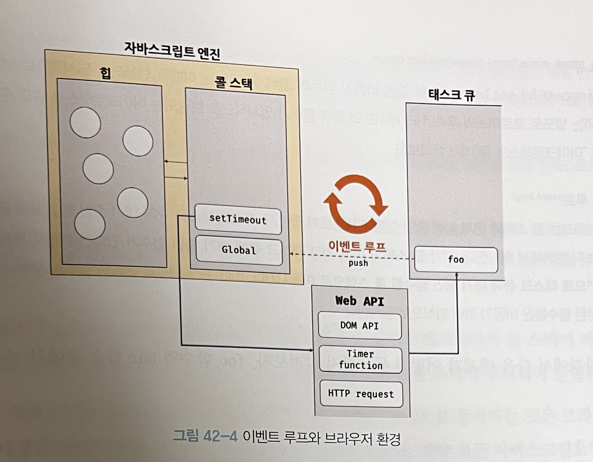

# 42장-비동기 프로그래밍

## 42.1 동기 처리와 비동기 처리

- 함수를 호출하면 함수 코드가 평가 되어 함수 실행 컨텍스트가 생성된다.
- 이때 생성된 함수 실행 컨텍스트는 실행 컨텍스트 스택(콜 스택이라고 부름)에 푸시되고 함수코드가 실행된다.
- 함수 코드의 실행이 종료되면 콜 스택에서 팝되어 제거된다.

```jsx
function add(a, b) {
  return a + b;
}

function average(a, b) {
  return add(a, b) / 2;
}

let x = average(10, 20);
```


- 함수가 실행되려면 함수 실행 컨텍스트가 콜 스택에 푸시되어야 한다.
- **함수가 호출된 순서대로 순차적으로 실행되는 이유는 함수가 호출된 순서대로 함수 실행 컨텍스트가 콜 스택에 푸시되기 때문이다.**
- **함수의 실행 순서는 콜 스택이 관리한다.**
- **자바스크립트 엔진은 단 하나의 콜 스택을 가진다.** 즉, 함수를 실행할 수 있는 창구가 하나이며 동시에 2개의 함수를 실행할 수 없음을 의미한다.
- 콜 스택 최상단(Top)의 “실행 중인 실행 컨택스트(running execution context)”를 제외하곤 나머지는 대기 중인 태스크(task)인 것이다.
- **이처럼 자바스크립트 엔진은 한번에 하나의 태스크만 실행할 수 있는 싱글 스래드(single thread)방식으로 동작한다.**
- 한번에 하나의 태스크만 실행할 수 있기 때문에 무거운 작업(시간이 오래걸리는 작업)으로 인해 블로킹(blocking)이 발생할 수 있다.

```jsx
function sleep(func, delay) {
  const delayUntil = Date.now() + delay;

  while (Date.now() < delayUntil);

  func();
}

function foo() {
  console.log('foo');
}

function bar() {
  console.log('bar');
}

sleep(foo, 3000);

// blocking 발생
// 3초 뒤에 bar함수가 실행된다.
bar();
```

- `sleep` 함수는 3초 후에 foo 함수를 호출한다. 이때 bar 함수는 sleep 함수가 종료된 이후에 호출되므로 3초 이상(3초 + foo 함수 실행시간) 호출되지 못한다.
  

```jsx
function foo() {
  console.log('foo');
}

function bar() {
  console.log('bar');
}

// setTimeout 함수는 bar함수를 블로킹하지 않는다.
setTimeout(foo, 3000);

bar();
```

- `setTimeout` 함수는 다른 태스크를 블로킹하지 않는다.
- 이처럼 현재 실행중인 태스크가 종료되지 않은 상태라 해도 다음 태스크를 곧바로 실행하는 방식을 비동기 처리(Asynchronous)라고 한다.

  

| 동기                   | 비동기                        |
| ---------------------- | ----------------------------- |
| 실행 순서가 보장됨     | 실행 순서가 보장되지 않음     |
| 다음 태스크를 블로킹함 | 다음 태스크를 블로킹하지 않음 |

## 42.2 이벤트 루프와 태스크 큐

- 자바스크립트는 싱글 스레드이다. 하지만 브라우저가 동작하는 것을 잘 살펴보면 여러 태스크가 동시에 처리되는 것처럼 느껴진다.
- 예를 들어, HTML 요소가 애니메이션 효과를 통해 움직이면서 이벤트를 처리하기도 하고, HTTP 요청을 통해 데이터를 가져오면서 렌더링을 처리한다.
- **자바스크립트의 동시성(concurrency)을 지원하는 이벤트 루프(event loop)라는 것이 있다.**
- 이벤트 루프는 브라우저에 내장된 기능 중 하나이다.
- 자바스크립트 엔진 구조
  
  - **콜 스택**
    - 함수의 실행 순서는 콜 스택이 관리한다.
    - 자바스크립트 엔진은 단 하나의 콜 스택을 가진다.
  - **힙**
    - 힙은 객체를 저장하는 메모리 공간이다. 콜 스택의 요소인 실행 컨텍스트는 힙에 저장된 객체를 참조한다.
    - 메모리에 값을 저장하려면 먼저 값을 저장할 메모리 공간의 크기를 미리 정해야한다. 객체는 크기가 정해져있지 않아 할당할 메모리 공간의 크기를 런타임에 결정해야한다.
  - 비동기 처리에서 소스코드의 평가와 실행을 제외한 모든 처리는 자바스크립트 엔진이 구동하는 환경인 브라우저 또는 Node.js가 담당한다.
    - `setTimeout`의 콜백 함수의 평가와 실행은 자바스크립트 엔진이 담당하지만,
    - **호출 스케줄링을 위한 타이머 설정과 콜백 함수 등록은 브라우저 또는 Node.js가 담당한다.**
    - **이를 위해 브라우저는 태스크 큐와 이벤트 루프를 제공한다.**
  - **태스크 큐(task queue / event queue / callback queue)**
    - FIFO(First In First Out) 구조이다.
    - `setTimeout`, `setInterval`과 같은 비동기 함수의 콜백 함수 또는 이벤트 핸들러가 일시적으로 보관되는 영역
    - `마이크로태스크 큐`라는 것도 있는데, 프로미스의 후속처리(`then`, `catch`, `finally`)를 위한 콜백 함수가 등록되는 곳이다.
  - **이벤트 루프(event loop)**
    - 콜 스택에 실행중인 실행 컨텍스트가 있는지, 태스크 큐에 대기 중인 함수가 있는지 반복적으로 확인한다.
    - **콜 스택이 비어있고 태스크 큐에 대기 중인 함수가 있다면, 이벤트 루프는 순차적으로 태스크 큐에 대기 중인 함수를 콜 스택으로 이동시킨다.**

### 예제

> 참고
> [https://dev.to/lydiahallie/javascript-visualized-event-loop-3dif](https://dev.to/lydiahallie/javascript-visualized-event-loop-3dif)

```jsx
function greet() {
  return 'Hello';
}

function respond() {
  return setTimeout(() => {
    return 'Hey!';
  }, 1000);
}

greet();
respond();
```

1. 함수를 호출하면 콜스택에 추가된다.

- `greet` 함수가 호출 및 종료하면서 콜 스택에 푸시/팝 된다.
- `respond` 함수가 호출되고, `setTimeout` 함수를 반환환다. 이때, `setTimeout` 함수를 위한 실행 컨텍스트가 콜 스택에 추가된다. Web API인 타이머 함수도 함수이므로 실행 컨택스트를 생성한다.
  

2. `setTimeout` 함수에 전달한 콜백 함수인 화살표 함수 `() ⇒ { return “Hey!”}` 가 Web API에 의해 호출 스케출링된다.

   - 이때 두번째 인자로 전달한 값에 따라, 해당 콜백 함수는 일정 시간 그 작업이 지연된 후 실행된다.
   - `setTimeout` 함수와 `respond` 함수는 콜 스택에서 팝된다.

   

3. 타이머가 만료되면(두번째 인자로 전달한 delay동안 타이머가 돌아감) 콜백 함수는 콜 스택 대신에 **태스크 큐라는 곳에 전달된다.**

   - 여기서 주의해야 할 점은 1000ms 뒤에 콜 스택에 추가되지 않는다는 점이다.
   - 1000ms 후에 콜 스택이 아닌 태스크 큐에 추가된다.
   - 이는 `setTimeout` 함수에 전달한 콜백함수가 정확히 1000ms 이후에 실행되지 않음을 의미한다.
   - **콜 스택이 비어있기를 기다렸다가 태스크 큐의 대기 중인 콜백 함수가 콜 스택에 추가되기 때문이다.**

   

4. 이벤트 루프는 콜백 함수가 담긴 큐를 콜 스택에 연결한다.

   - 콜 **스택이 비어있다면, 이벤트 루프는 큐에서 콜백 함수를 꺼내와 콜 스택에 추가한다.**

   

5. 콜백 함수가 콜 스택에 추가되어 호출되고 결과를 반환한 뒤 콜 스택에서 팝된다.

   
