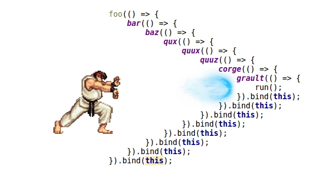
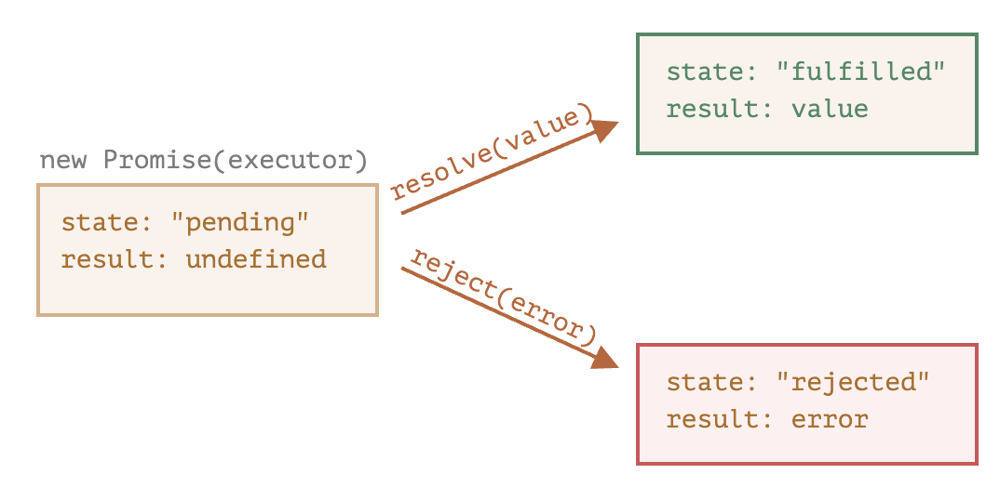
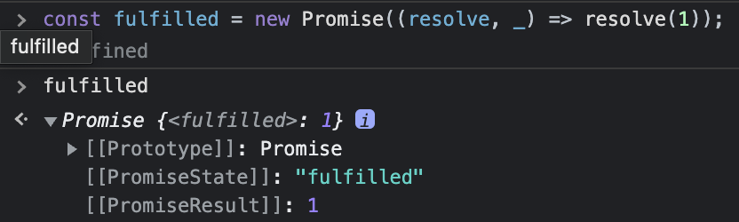
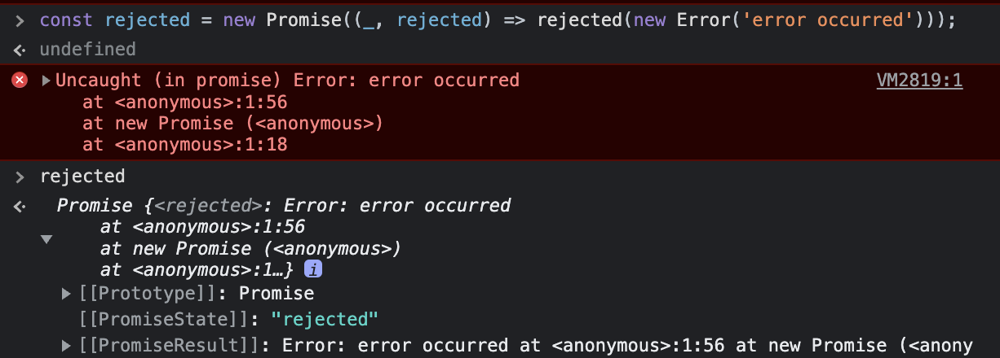
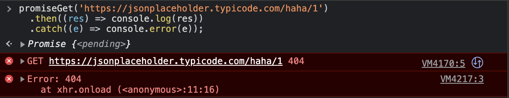
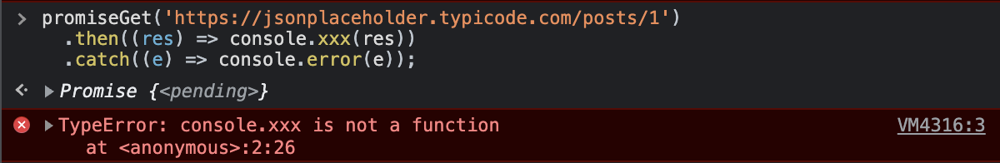
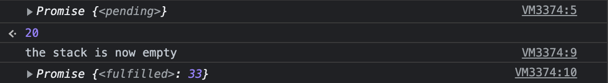
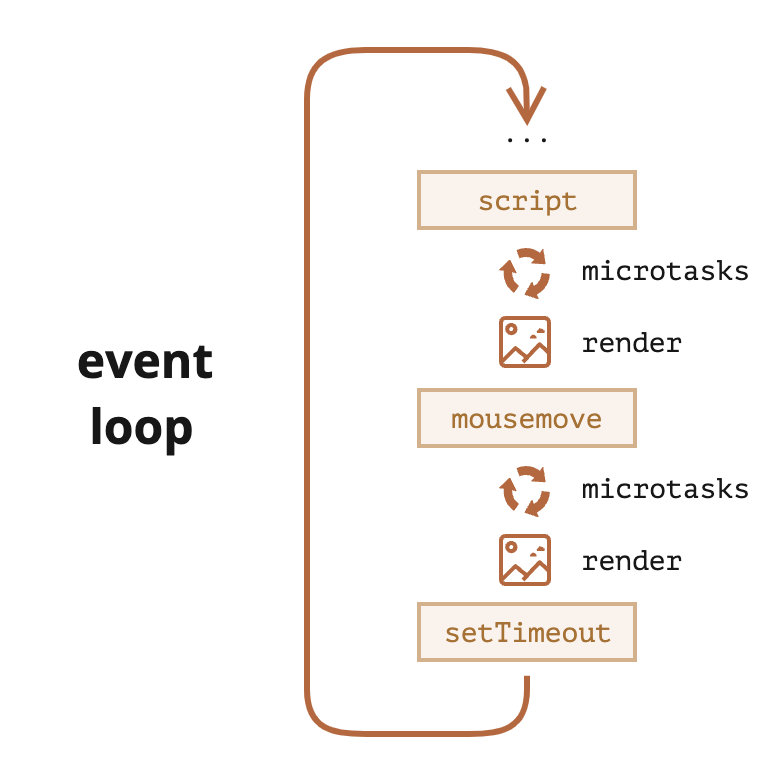

# 45장-프로미스

- 자바스크립트는 비동기 처리를 위한 패턴으로 콜백 함수를 사용한다
- 콜백 패턴의 단점

  - 콜백 헬로 인해 가독성이 나쁘다

    

  - 비동기 처리 중 발생한 에러의 처리가 곤한하다
  - 여러 개의 비동기 처리를 한번에 처리하는데도 한계가 있다.

- ES6에서는 비동기 처리를 위한 패턴으로 프로미스(promise)를 도입했다
  - 콜백 패턴의 단점을 보완하며 비동기 처리 시점을 명확하게 표현할 수 있다는 장점이 있다

## 45.1 비동기 처리를 위한 콜백 패턴의 단점

### 45.1.1 콜백 헬

```jsx
const get = (url) => {
  const xhr = new XMLHttpRequest();
  xhr.open('GET', url);
  xhr.send();

  // onload 이벤트핸들러는 비동기로 동작한다
  xhr.onload = () => {
    if (xhr.status === 200) {
      console.log(JSON.parse(xhr.response));
    } else {
      console.error(`${xhr.status} ${xhr.statusText}`);
    }
  };
};

get('https://jsonplaceholder.typicode.com/posts/1');
```

- get 함수가 서버의 응답 결과를 반환(return)하려면 어떻게 해야하는가?
- get 함수는 비동기 함수다
  - 비동기 함수란 함수 내부에서 비동기로 동작하는 코드를 포함한 함수
  - ⭐️**비동기 함수를 호출하면 함수 내부의 비동기로 동작하는 코드가 완료되지 않았다 해도 기다리지 않고 즉시 종료된다**
  - 즉, 비동기 함수 내부의 비동기로 동작하는 코드는 비동기 함수가 종료된 이후에 완료된다.
  - **따라서 비동기 함수 내부의 비동기로 동작하는 코드에서 처리 결과를 외부로 반환하거나 상위 스코프의 변수에 할당하면 기대한 대로 동작하지 않는다.**

```jsx
let g = 0;

setTimeout(() => {
  g = 100;
}, 0);
console.log(g); // 0
```

- setTimeout 함수는 비동기 함수다.
  - setTimeout 함수의 콜백 함수의 호출이 비동기로 동작하기 때문이다.
  - 즉, 비동기로 동작하는 콜백 함수는 setTimeout 함수가 종료된 이후에 호출된다.
  - **따라서 비동기로 동작하는 콜백함수에서 값을 반환하거나 상위 스코프의 변수에 할당하는 것은 무의미하다.**

```jsx
let todos;

const get = (url) => {
  const xhr = new XMLHttpRequest();
  xhr.open('GET', url);
  xhr.send();

  xhr.onload = () => {
    if (xhr.status === 200) {
      // 1) 상위 스코프의 변수에 응답값을 할당한다
      todos = JSON.parse(xhr.response);
    } else {
      console.error(`${xhr.status} ${xhr.statusText}`);
    }
  };
};

get('https://jsonplaceholder.typicode.com/posts/1');
console.log(todos); // 2) undefined
```

- onload 이벤트 핸들러는 2) `console.log` 가 종료한 후에 동작한다
- 즉, xhr.onload 이벤트 핸들러에서 서버의 응답을 상위 스코프의 변수에 할당하면 처리 순서가 보장되지 않는다.
- 실행 순서를 보장하기 위해 콜백 패턴을 사용한다

```jsx
const get = (url, callback) => {
  const xhr = new XMLHttpRequest();
  xhr.open('GET', url);
  xhr.send();

  xhr.onload = () => {
    if (xhr.status === 200) {
      // 1) 상위 스코프의 변수에 응답값을 할당한다
      callback(JSON.parse(xhr.response));
    } else {
      console.error(`${xhr.status} ${xhr.statusText}`);
    }
  };
};

const url = 'https://jsonplaceholder.typicode.com';
get(`${url}/posts/1`, ({ userId }) => {
  console.log(userId);

  get(`${url}/users/${userId}`, (userInfo) => {
    console.log(userInfo);
  });
});
```

### 45.1.2 에러 처리의 한계

```jsx
try {
  setTimeout(() => {
    throw new Error('error');
  }, 1000);
} catch (e) {
  console.error(e);
}
```

- catch 에서 에러를 잡지 못한다.
- 에러는 호출자 방향으로 전파된다.
  - 즉, 콜 스택의 아래방향(실행중인 실행컨텍스트가 푸시되기 직전에 푸시된 실행 컨텍스트 방향)으로 전파된다.
  - setTimeout 함수의 콜백 함수는 setTimeout 이 호출한 함수가 아니다.

## 45.2 프로미스의 생성

```jsx
const promise = new Promise((resolve, reject) => {
  // 비동기 처리 수행
  if (/* 비동기 처리 성공 */) {
    resolve();
  } else {
    /* 비동기 처리 실패 */
    reject();
  }
});
```

- 프로미스의 상태

| 상태      | 의미                                  | 상태 변경 조건                   |
| --------- | ------------------------------------- | -------------------------------- |
| pending   | 비동기 처리가 아직 수행되지 않은 상태 | 프로미스가 생성된 직후 기본 상태 |
| fulfilled | 비동기 처리가 수행된 상태(성공)       | resolve 함수 호출                |
| rejected  | 비동기 처리가 수행된 상태(실패)       | reject 함수 호출                 |



- fulfilled 상태

```jsx
const fulfilled = new Promise((resolve, _) => resolve(1));
```



- rejected 상태

```jsx
const rejected = new Promise((_, rejected) => rejected(new Error('error occurred'));
```



> 프로미스는 비동기 처리 상태와 처리 결과를 관리하는 객체다

## 45.3 프로미스의 후속 처리 메서드

- 프로미스의 비동기 처리 상태가 변화하면 이에 따른 후속 처리를 해야한다.
- fulfilled 상태면 그 처리결과를 가지고 무언가를 해야하고, rejected 상태면 에러처리를 해야한다.
- 이를 위해 프로미스는 후속처리 메서드를 제공한다.
- 프로미스는 비동기 처리 상태가 변화하면 후속 처리 메서드에 인수로 전달된 콜백함수가 선택적으로 호출된다.

### 45.3.1 Promise.prototype.then

- then은 언제나 프로미스를 반환한다.
- then 메서드의 인자
  - 첫번째: 프로미스가 fulfilled 상태가 되면 호출되는 콜백함수
  - 두번째: 프로미스가 rejected 상태가 되면 호출되는 콜백함수

```jsx
new Promise((resolve) => resolve('fulfilled')).then(
  (v) => console.log(v),
  (e) => console.log(e)
); // fulfilled

new Promise((_, rejected) => rejected(new Error('rejected'))).then(
  (v) => console.log(v),
  (e) => console.error(e)
); // rejected
```

### 45.3.2 Promise.prototype.catch

- catch도 언제나 프로미스를 반환한다
- **rejected 상태인 경우에만 호출되는 콜백함수를 인자로 받는다**
  - `then(undefined, onRejected)` 과 동일하게 동작한다.

```jsx
new Promise((_, rejected) => rejected(new Error('rejected'))).catch((e) =>
  console.error(e)
); // rejected
```

### 45.3.3 Promise.prototype.finally

- finally도 언제나 프로미스를 반환한다
- 프로미스가 fulfilled 하든 rejected 하든 상관없이 무조건 한번은 호출된다.

```jsx
new Promise(() => {}).finally(() => console.error('finally')); // finally
```

## 45.4 프로미스의 에러 처리

```jsx
const promiseGet = (url) => {
  return new Promise((resolve, reject) => {
    const xhr = new XMLHttpRequest();
    xhr.open('GET', url);
    xhr.send();

    xhr.onload = () => {
      if (xhr.status === 200) {
        resolve(JSON.parse(xhr.response));
      } else {
        reject(new Error(xhr.status));
      }
    };
  });
};

promiseGet('https://jsonplaceholder.typicode.com/posts/1')
  .then((res) => console.log(res))
  .catch((e) => console.error(e));
```

- 에러처리
  - 예시 1
    ```jsx
    promiseGet('https://jsonplaceholder.typicode.com/haha/1')
      .then((res) => console.log(res))
      .catch((e) => console.error(e));
    ```
    
  - 예시2
    ```jsx
    promiseGet('https://jsonplaceholder.typicode.com/posts/1')
      .then((res) => console.xxx(res))
      .catch((e) => console.error(e));
    ```
    

## 45.5 프로미스 체이닝

- 비동기 처리를 위해 콜백 패턴을 사용하면 콜백 헬이 발생하는 문제가 있다.
- 아래 예제를 프로미스를 사용해 다시 구현해보면,

  - AS-IS

    ```jsx
    get(`${url}/posts/1`, ({ userId }) => {
      console.log(userId);

      get(`${url}/users/${userId}`, (userInfo) => {
        console.log(userInfo);
      });
    });
    ```

  - TO-BE

    - `then` → `then` → `catch` 순으로 프로미스 후속 처리를 진행할 수 있다.
    - 이를 **프로미스 체이닝** 이라고 한다.

      ```jsx
      const url = 'https://jsonplaceholder.typicode.com';

      promiseGet(`${url}/posts/1`)
        .then(({ userId }) => promiseGet(`${url}/users/${userId}`))
        .then((userInfo) => console.log(userInfo))
        .catch((e) => console.error(e));
      ```

- 프로미스는 프로미스 체이닝을 이용해 비동기 처리 결과를 받아 후속 처리를 하므로 기존 콜백 패턴에서 발생하던 콜백 헬은 발생하지 않는다.
- 다만 프로미스도 콜백 패턴을 사용하므로 콜백 함수를 사용하지 않는 것은 아니다.
- 콜백 패턴은 가독성이 좋지 않다. ES8 에 도입된 `async/await` 를 통해 해결할 수 있다.
  - `async/await`를 사용하면 프로미스의 후속 처리 메서드 없이 마치 동기 처리처럼 프로미스가 처리 결과를 반환하도록 구현할 수 있다.

```jsx
const url = 'https://jsonplaceholder.typicode.com';

(async () => {
  const { userId } = await promiseGet(`${url}/posts/1`);

  const userInfo = await promiseGet(`${url}/users/${userId}`);

  console.log(userInfo);
})();
```

## 45.6 프로미스의 정적 메서드

### 45.6.1 Promise.resolve / Promise.reject

- `Promise.resolve`와 `Promise.reject` 메서드는 **이미 존재하는 값을 래핑하여 프로미스를 생성하기 위해 사용한다.**
- `Promise.resolve`
  ```jsx
  const resolvedPromise = Promise.resolve([1, 2, 3]);
  resolvedPromise.then(console.log); // [1, 2, 3]
  ```
  위 예제와 아래 예제는 동일하게 동작한다.
  ```jsx
  const resolvedPromise = new Promise((resolve) => resolve([1, 2, 3]));
  resolvedPromise.then(console.log); // [1, 2, 3]
  ```
- `Promise.reject`
  ```jsx
  const rejectedPromise = Promise.reject(new Error('Error!'));
  rejectedPromise.catch(console.log); // Error: Error!
  ```
  위 예제와 아래 예제는 동일하게 동작한다.
  ```jsx
  const rejectedPromise = new Promise((_, reject) =>
    reject(new Error('Error!'))
  );
  rejectedPromise.catch(console.log); // Error: Error!
  ```

### 45.6.2 Promise.all

- `Promise.all` 메서드는 여러 개의 비동기 처리를 모두 병렬(parallel) 처리할 때 사용한다.

```jsx
const requestData1 = () =>
  new Promise((resolve) => setTimeout(() => resolve(1), 3000));
const requestData2 = () =>
  new Promise((resolve) => setTimeout(() => resolve(2), 2000));
const requestData3 = () =>
  new Promise((resolve) => setTimeout(() => resolve(3), 1000));

const res = [];

requestData1()
  .then((data) => {
    res.push(data);
    return requestData2();
  })
  .then((data) => {
    res.push(data);
    return requestData3();
  })
  .then((data) => {
    res.push(data);
    console.log(res); // [1,2,3] => 약 6초 소요
  })
  .catch(console.error);
```

- 위 예제는 새 개의 비동기 처리를 순차적으로 처리한다. 즉, 앞선 비동기 처리가 완료하면 다음 비동기 처리를 수행한다.(1 + 2 + 3 = 6초 소모)
- 위 비동기 처리는 서로 의존하지 않고 개별적으로 수행된다. 즉, 앞선 비동기 처리 결과를 다음 비동기 처리가 사용하지 않는다. 따라서 순차적으로 비동기 처리를 할 필요가 없다.
- `Promise.all` 메서드는 여러 개의 비동기 처리를 모두 병렬 처리할 때 사용한다.

```jsx
const requestData1 = () =>
  new Promise((resolve) => setTimeout(() => resolve(1), 3000));
const requestData2 = () =>
  new Promise((resolve) => setTimeout(() => resolve(2), 2000));
const requestData3 = () =>
  new Promise((resolve) => setTimeout(() => resolve(3), 1000));

Promise.all([requestData1(), requestData2(), requestData3()])
  .then(console.log) // [1,2,3] => 약 3초 소모
  .catch(console.error);
```

- `Promise.all` 메서드는 프로미스를 요소로 갖는 배열 등의 이터러블을 인수로 받는다
  - 전달 받은 모든 프로미스가 fulfilled 상태가 되면 모든 처리 결과를 배열에 저장해 새로운 프로미스를 반환한다.
  - 모든 프로미스가 fulfilled 상태가 되면 `Promise.all` 메서드는 종료한다.
  - 즉, 위 예제에서는 약 3초정도(제일 오래 걸리는 비동기 처리 시간을 따라감)가 소모한다.
- 프로미스 중 하나라도 rejected 상태가 되면 나머지 프로미스가 fulfilled 상태가 되는 것을 기다리지 않고 즉시 종료한다.

  - 3번째 프로미스가 가장 먼저 rejected 상태가 되므로 3번째 프로미스가 reject한 에러가 catch 메서드로 전달된다.

  ```jsx
  Promise.all([
    new Promise((_, rejected) =>
      setTimeout(() => rejected(new Error('Error 1')), 3000)
    ),
    new Promise((_, rejected) =>
      setTimeout(() => rejected(new Error('Error 2')), 2000)
    ),
    new Promise((_, rejected) =>
      setTimeout(() => rejected(new Error('Error 3')), 1000)
    ),
  ])
    .then(console.log)
    .catch(console.error); // Error: Error 3
  ```

- `Promise.all` 메서드는 인수로 전달받는 이터러블 요소가 프로미스가 아닌 경우 `Promise.resolve` 메서드를 통해 프로미스로 래핑한다.

```jsx
Promise.all([
  1, // -> Promise.resolve(1)
  2, // -> Promise.resolve(2)
  3, // -> Promise.resolve(3)
])
  .then(console.log) // [1,2,3]
  .catch(console.error);
```

### 45.6.3 Promise.race

- 참고 [MDN `Promise.race`](https://developer.mozilla.org/en-US/docs/Web/JavaScript/Reference/Global_Objects/Promise/race)
- `Promise.race` 메서드는 `Promise.all` 메서드와 동일하게 프로미스를 요소로 갖는 배열 등의 이터러블을 인수로 전달받는다.
- 인수로 전달받은 이터러블 중 settled 상태의 프로미스를 반환한다. 즉, settled된 첫번째 프로미스가 fulfilled 상태면 fulfilled 상태의 프로미스를, 첫번째 프로미스가 rejected 상태면 rejected 상태의 프로미스를 반환한다.
- 이터러블이 비어있다면(empty) 반환된 프로미스는 영원히 pending 상태다.
- 비어있는 이터러블이 아니고 pending 프로미스가 없다면 반환되는 프로미스는 비동기적으로 settled 된다.

  - 아래 예제에서 첫번째 `p` 출력에서는 pending이었다가 `setTimeout` 메서드의 콜백함수에서 `p`를 출력하면 fulfilled 상태의 프로미스가 출력된다.(asynchronicity of `Promise.race`)

  ```jsx
  const resolvedPromisesArray = [Promise.resolve(33), Promise.resolve(44)];

  const p = Promise.race(resolvedPromisesArray);
  // Immediately logging the value of p
  console.log(p);

  // Using setTimeout, we can execute code after the stack is empty
  setTimeout(() => {
    console.log('the stack is now empty');
    console.log(p);
  });
  ```

  

```jsx
// 프로미스들 중 fulfilled든 rejected든 상관없이 먼저 settled 상태의 프로미스가 반환된다
Promise.race([
  new Promise((resolve) => setTimeout(() => resolve(1), 3000)),
  new Promise((resolve) => setTimeout(() => resolve(2), 2000)),
  new Promise((_, reject) =>
    setTimeout(() => reject(new Error('Error!')), 1000)
  ),
])
  .then(console.log)
  .catch(console.error); // Error: Error!

Promise.race([
  new Promise((_, reject) =>
    setTimeout(() => reject(new Error('Error!')), 3000)
  ),
  new Promise((resolve) => setTimeout(() => resolve(2), 2000)),
  new Promise((resolve) => setTimeout(() => resolve(3), 1000)),
])
  .then(console.log) // 3
  .catch(console.error);
```

- 프로미스가 rejected 상태가 되면 `Promise.all` 메서드와 동일하게 처리된다.

```jsx
Promise.race([
  new Promise((_, rejected) =>
    setTimeout(() => rejected(new Error('Error 1')), 3000)
  ),
  new Promise((_, rejected) =>
    setTimeout(() => rejected(new Error('Error 2')), 2000)
  ),
  new Promise((_, rejected) =>
    setTimeout(() => rejected(new Error('Error 3')), 1000)
  ),
])
  .then(console.log)
  .catch(console.error); // Error: Error 3
```

### 보충 Promise.any

- 참고 [MDN `Promise.any`](https://developer.mozilla.org/en-US/docs/Web/JavaScript/Reference/Global_Objects/Promise/any)
- `Promise.any` 메서드는 프로미스를 요소로 갖는 배열 등의 이터러블을 인수로 전달받는다
- `Promise.race` 메서드와 달리 fulfilled 상태의 프로미스만 반환한다.

  - 프로미스들 중 fulfilled 상태의 프로미스가 나올 때까지 rejected 프로미스를 무시한다

  ```jsx
  const promises = [
    new Promise((resolve) => setTimeout(() => resolve(1), 3000)),
    new Promise((resolve) => setTimeout(() => resolve(2), 2000)),
    new Promise((_, reject) =>
      setTimeout(() => reject(new Error('Error!')), 1000)
    ),
  ];

  // 먼저 settled 상태의 프로미스가 반환된다
  Promise.race(promises).then(console.log).catch(console.error); // Error: Error!

  // 먼저 fulfilled 상태의 프로미스가 반환된다
  Promise.any(promises)
    .then(console.log) // 2
    .catch(console.error);
  ```

- 인수로 들어오는 이터러블이 비어있거나(empty) 모두 rejected 프로미스라면 `AggregateError` 에러가 발생한다.

  ```jsx
  Promise.any([]).catch(console.log);
  // AggregateError: All promises were rejected

  const failure = new Promise((resolve, reject) => {
    reject('Always fails');
  });

  Promise.any([failure]).catch((err) => {
    console.log(err);
  });
  // AggregateError: All promises were rejected
  ```

### 45.6.4 Promise allSettled

- ES11(ECMAScript 2020)에 도입된 메서드
- `Promise.allSettled` 메서드는 프로미스를 요소로 갖는 배열 등의 이터러블을 인수로 전달받는다.
- 전달받은 프로미스가 모두 settled 상태(비동기 처리가 수행된 상태, fulfilled 또는 rejected 상태)가 되면 처리 결과를 배열로 반환한다.
  - fulfilled 또는 rejected 상태와는 상관없이 Promise.allSettled 메서드가 인수로 전달받은 모든 프로미스들의 처리 결과가 담겨있다
  - fulfilled 상태인 경우 status 프로퍼티와 처리결과인 value 프로퍼티를 갖는다.
  - rejected 상태인 경우 status 프로퍼티와 에러를 나타내는 reason 프로퍼티를 갖는다.

```jsx
Promise.allSettled([
  new Promise((resolve) => setTimeout(() => resolve(1), 2000)),
  new Promise((_, reject) =>
    setTimeout(() => reject(new Error('Error!')), 1000)
  ),
]).then(console.log);

/*
[
	{status: 'fulfilled', value: 1},
	{status: 'rejected', reason: Error: Error! at <anonymous>:3:53}
]
*/
```

## 45.7 마이크로태스크 큐

```jsx
setTimeout(() => console.log(1), 0);

Promise.resolve()
  .then(() => console.log(2))
  .then(() => console.log(3));

// 1 -> 2 -> 3 일까? 2 -> 3 -> 1 일까?
```

- 처리 결과가 `2 → 3 → 1` 순서로 출력되는 것을 볼 수 있다.
- 프로미스의 후속 처리 메서드의 콜백 함수는 태스크 큐가 아닌 **마이크로태스크 큐(microtask queue/job queue)에 저장되기 때문이다.**
- 마이크로태스크 큐에는 프로미스의 후속 처리 메서드의 콜백 함수가 일시 저장되고, 그 외의 미동기 함수의 콜백 함수나 이벤트 핸들러는 태스크 큐에 일시 저장된다.
- **마이크로태스크 큐는 태스크 큐보다 우선순위가 높다.**

  - 즉, 이벤트 루프는 콜 스택이 비면 먼저 마이크로태스크 큐에서 대기하고 있는 함수를 가져와 실행한다.
  - 이후 마이크로태스크 큐가 비면 태스크 큐에서 대기하고 있는 함수를 가져와 실행한다.

    
